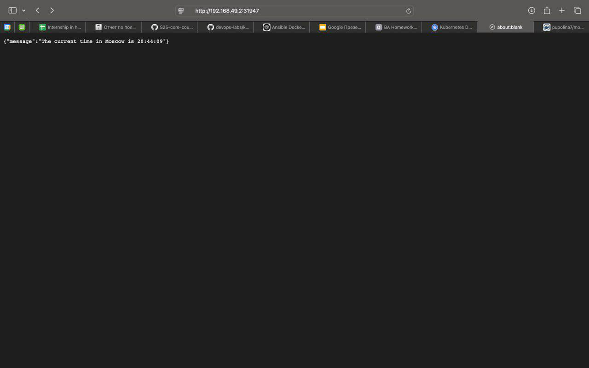

# Kubernetes Setup and Basic Deployment

```bash
kubectl get pods,svc
```

**Output of the command:**

```bash
NAME                                         READY   STATUS    RESTARTS   AGE
pod/python-app-deployment-7b4664f997-4fm4g   1/1     Running   0          21s

NAME                 TYPE        CLUSTER-IP   EXTERNAL-IP   PORT(S)   AGE
service/kubernetes   ClusterIP   10.96.0.1    <none>        443/TCP   70m
```

# Declarative Kubernetes Manifests

```bash
kubectl get pods,svc
```

**Output of the command:**

```bash
NAME                                          READY   STATUS             RESTARTS   AGE
pod/moscow-time-deployment-7c9b9789b9-drpm4   1/1     Running   0          62s
pod/moscow-time-deployment-7c9b9789b9-fn8qc   1/1     Running   0          62s
pod/moscow-time-deployment-7c9b9789b9-r6t8b   1/1     Running   0          62s

NAME                 TYPE        CLUSTER-IP   EXTERNAL-IP   PORT(S)   AGE
service/kubernetes            ClusterIP   10.96.0.1        <none>        443/TCP          80m
service/moscow-time-service   NodePort    10.109.212.140   <none>        8000:31947/TCP   28s
```

```bash
minikube service --all
```

**Output of the command:**

```bash
|-----------|------------|-------------|--------------|
| NAMESPACE |    NAME    | TARGET PORT |     URL      |
|-----------|------------|-------------|--------------|
| default   | kubernetes |             | No node port |
|-----------|------------|-------------|--------------|
😿  service default/kubernetes has no node port
|-----------|---------------------|--------------------------|---------------------------|
| NAMESPACE |        NAME         |       TARGET PORT        |            URL            |
|-----------|---------------------|--------------------------|---------------------------|
| default   | moscow-time-service |                     8000 | http://192.168.49.2:31947 |
|-----------|---------------------|--------------------------|---------------------------|
❗  Services [default/kubernetes] have type "ClusterIP" not meant to be exposed, however for local development minikube allows you to access this !
🏃  Starting tunnel for service kubernetes.
🏃  Starting tunnel for service moscow-time-service.
|-----------|---------------------|-------------|------------------------|
| NAMESPACE |        NAME         | TARGET PORT |          URL           |
|-----------|---------------------|-------------|------------------------|
| default   | kubernetes          |             | http://127.0.0.1:61306 |
| default   | moscow-time-service |             | http://127.0.0.1:61308 |
|-----------|---------------------|-------------|------------------------|
🎉  Opening service default/kubernetes in default browser...
🎉  Opening service default/moscow-time-service in default browser...
❗  Because you are using a Docker driver on darwin, the terminal needs to be open to run it.
```

  
*Figure 1: Screenshot demonstrating that the IP matches the output of ```minikube service --all```.*
