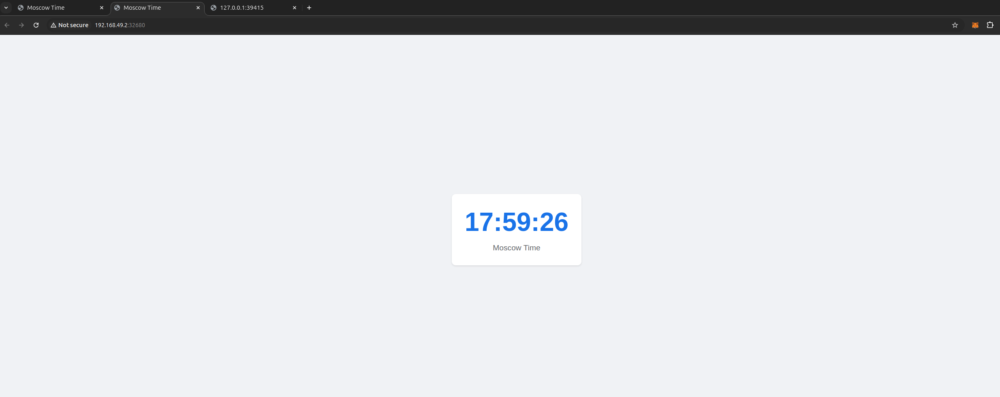

# Kubernetes Deployment

## Moscow Time App

### Status:

```bash
# Output of kubectl get pods,svc
$ kubectl get pods,svc
NAME                                  READY   STATUS    RESTARTS   AGE
pod/moscow-time-app-96dcd97cf-tbxkw   1/1     Running   0          4m17s

NAME                      TYPE           CLUSTER-IP     EXTERNAL-IP   PORT(S)          AGE
service/kubernetes        ClusterIP      10.96.0.1      <none>        443/TCP          45m
service/moscow-time-app   LoadBalancer   10.98.94.193   <pending>     8000:32680/TCP   4m17s
```

The Moscow Time application has been successfully deployed in the Kubernetes cluster and is accessible via a LoadBalancer type service

### Resources Used

**Deployment**: manages application pods

**Service**: provides access to the application from outside the cluster via LoadBalancer

### Accessing the Application

```bash
minikube service moscow-time-app
```

This command opens time application, showing the current Moscow time

## Minikube Service Output

```bash
$ minikube service --all
|-----------|-----------------|-------------|---------------------------|
| NAMESPACE |      NAME       | TARGET PORT |            URL            |
|-----------|-----------------|-------------|---------------------------|
| default   | moscow-time-app | http/8000   | http://192.168.49.2:32680 |
|-----------|-----------------|-------------|---------------------------|
```

### Setup Steps

1. Created a Kubernetes deployment using the Docker image: dexnight/moscow-time-app:latest
2. Set proper environment variables and working directory for the application
3. Created a LoadBalancer service to expose the application
4. Verified the application is working correctly by accessing it through the minikube service

### Files

- deployment.yaml: Configuration for application deployment
- service.yaml: Configuration for exposing the application


### Deployment Features

- High Availability: 3 replicas ensure the application remains available even if some pods fail
- Resource Management: CPU and memory limits/requests for optimal resource allocation
- Health Checks: Readiness and liveness probes to ensure the application is functioning properly
- Scalability: The deployment can be scaled up or down as needed

### Service Configuration

- Type: LoadBalancer for external access
- Port Mapping: Maps service port 8000 to container port 8000

