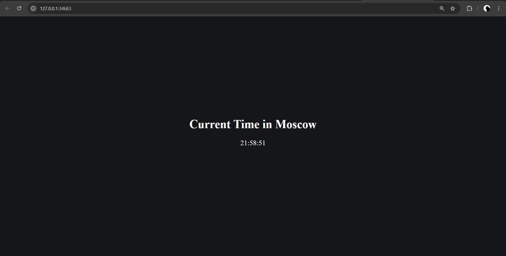

# Kubernetes

## Running the minikube

To run minikube, I used the command

```bash
minikube start
```

## Creating the deployment

To create the deployment I have used

```bash
kubectl create deployment time-app --image=mishablin/devops-labs:latest
```

And exposed this application's port using

```bash
kubectl expose deployment time-app --type=LoadBalancer --port=5000
```

## Creating the service

Using the command to create the service

```bash
minikube service time-app
```

Which allows to access the app locally.

### Outputs

The output of the command `kubectl get pods,svc`

```text
NAME                            READY   STATUS    RESTARTS   AGE
pod/time-app-76c55c48df-c7pvx   1/1     Running   0          9m25s

NAME                 TYPE           CLUSTER-IP      EXTERNAL-IP   PORT(S)          AGE
service/kubernetes   ClusterIP      10.96.0.1       <none>        443/TCP          20m
service/time-app     LoadBalancer   10.98.249.103   <pending>     5000:30982/TCP   7m27s
```

### Cleanup

To clean the deployments and services I use these commands:

```bash
kubectl delete service time-app
kubectl delete deployment time-app
```

Output:

```text
service "time-app" deleted
deployment.apps "time-app" deleted
```

### Task 2

Two files were created: `deployment.yml` and `service.yml`. These files were used to create deployment and service
using `kubectl apply` command.

#### Task 2 Outputs

```bash
kubectl get pods,svc
```

```text
NAME                                   READY   STATUS    RESTARTS   AGE
pod/python-time-app-84b48cc94b-78rvc   1/1     Running   0          5m25s
pod/python-time-app-84b48cc94b-dp2h5   1/1     Running   0          5m25s
pod/python-time-app-84b48cc94b-nwbpm   1/1     Running   0          5m25s

NAME                              TYPE        CLUSTER-IP      EXTERNAL-IP   PORT(S)    AGE
service/kubernetes                ClusterIP   10.96.0.1       <none>        443/TCP    3h31m
service/python-time-app-service   ClusterIP   10.101.172.20   <none>        8080/TCP   3m17s
```

```bash
minikube service --all
```

```text
|-----------|------------|-------------|--------------|
| NAMESPACE |    NAME    | TARGET PORT |     URL      |
|-----------|------------|-------------|--------------|
| default   | kubernetes |             | No node port |
|-----------|------------|-------------|--------------|
😿  service default/kubernetes has no node port
|-----------|-------------------------|------------------------------|---------------------------|
| NAMESPACE |          NAME           |         TARGET PORT          |            URL            |
|-----------|-------------------------|------------------------------|---------------------------|
| default   | python-time-app-service | python-time-app-service/8080 | http://192.168.49.2:30007 |
|-----------|-------------------------|------------------------------|---------------------------|
❗  Services [default/kubernetes] have type "ClusterIP" not meant to be exposed, however for local development minikube allows you to access this !
🏃  Starting tunnel for service kubernetes.
🏃  Starting tunnel for service python-time-app-service.
|-----------|-------------------------|-------------|------------------------|
| NAMESPACE |          NAME           | TARGET PORT |          URL           |
|-----------|-------------------------|-------------|------------------------|
| default   | kubernetes              |             | http://127.0.0.1:40517 |
| default   | python-time-app-service |             | http://127.0.0.1:34683 |
|-----------|-------------------------|-------------|------------------------|
🎉  Opening service default/kubernetes in default browser...
👉  http://127.0.0.1:40517
🎉  Opening service default/python-time-app-service in default browser...
👉  http://127.0.0.1:34683
❗  Because you are using a Docker driver on linux, the terminal needs to be open to run it.
```

#### Screenshot


