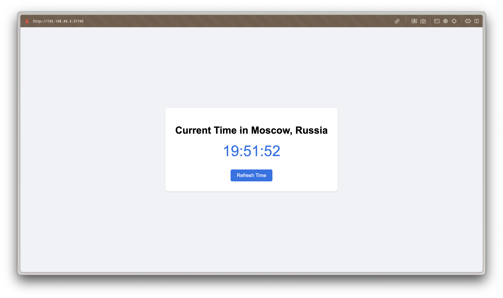

# Kubernetes Deployment

This folder contains Kubernetes manifests for deploying the applications.

## Task 1: Kubernetes Setup and Basic Deployment

### Output of `kubectl get pods,svc`

```
NAME                              READY   STATUS    RESTARTS   AGE
pod/python-app-5bf5cc5b74-rncvc   1/1     Running   0          6s

NAME                 TYPE        CLUSTER-IP       EXTERNAL-IP   PORT(S)          AGE
service/kubernetes   ClusterIP   10.96.0.1        <none>        443/TCP          6m54s
service/python-app   NodePort    10.104.218.145   <none>        8000:31926/TCP   3s
```

## Task 2: Declarative Kubernetes Manifests

### Output of `kubectl get pods,svc`

```
NAME                             READY   STATUS    RESTARTS   AGE
pod/js-app-7c9644bbbd-p2ltl      1/1     Running   0          70s
pod/js-app-7c9644bbbd-rpsz6      1/1     Running   0          55s
pod/js-app-7c9644bbbd-wq8j2      1/1     Running   0          62s
pod/python-app-6589d9468-57vzw   1/1     Running   0          2m17s
pod/python-app-6589d9468-hmp7c   1/1     Running   0          2m17s
pod/python-app-6589d9468-rrn9g   1/1     Running   0          2m17s

NAME                 TYPE        CLUSTER-IP       EXTERNAL-IP   PORT(S)          AGE
service/js-app       NodePort    10.107.88.63     <none>        3000:30245/TCP   2m14s
service/kubernetes   ClusterIP   10.96.0.1        <none>        443/TCP          10m
service/python-app   NodePort    10.110.215.222   <none>        8000:31745/TCP   2m17s
```

### Output of `minikube service --all`

```
|-----------|--------|-------------|---------------------------|
| NAMESPACE |  NAME  | TARGET PORT |            URL            |
|-----------|--------|-------------|---------------------------|
| default   | js-app | http/3000   | http://192.168.49.2:30245 |
|-----------|--------|-------------|---------------------------|
|-----------|------------|-------------|--------------|
| NAMESPACE |    NAME    | TARGET PORT |     URL      |
|-----------|------------|-------------|--------------|
| default   | kubernetes |             | No node port |
|-----------|------------|-------------|--------------|
😿  service default/kubernetes has no node port
|-----------|------------|-------------|---------------------------|
| NAMESPACE |    NAME    | TARGET PORT |            URL            |
|-----------|------------|-------------|---------------------------|
| default   | python-app | http/8000   | http://192.168.49.2:31745 |
|-----------|------------|-------------|---------------------------|
❗  Services [default/kubernetes] have type "ClusterIP" not meant to be exposed, however for local development minikube allows you to access this !
🏃  Starting tunnel for service js-app.
🏃  Starting tunnel for service kubernetes.
🏃  Starting tunnel for service python-app.
|-----------|------------|-------------|------------------------|
| NAMESPACE |    NAME    | TARGET PORT |          URL           |
|-----------|------------|-------------|------------------------|
| default   | js-app     |             | http://127.0.0.1:59986 |
| default   | kubernetes |             | http://127.0.0.1:59988 |
| default   | python-app |             | http://127.0.0.1:59990 |
|-----------|------------|-------------|------------------------|
```

### Service URLs

- Python App: http://192.168.49.2:31745
- JavaScript App: http://192.168.49.2:30245

To access these services, you can use the `minikube service` command:

```
minikube service python-app
minikube service js-app
```

This will open the services in the default browser.

### Browser Screenshots


