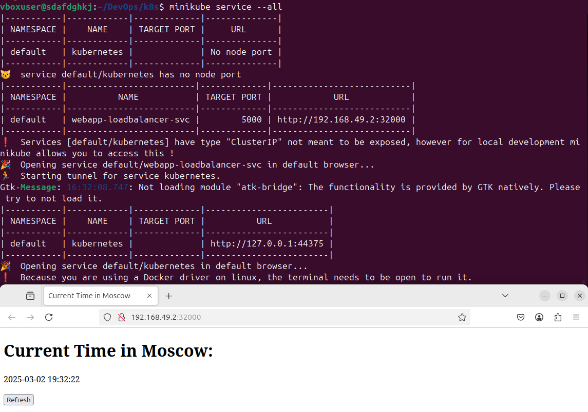
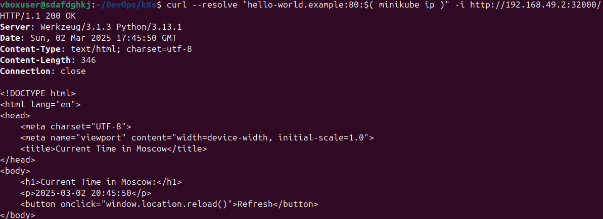

### Here is the command and the output
```bash
 minikube kubectl -- get pods,svc
 ```
```bash
NAME                          READY   STATUS    RESTARTS   AGE
pod/webapp-75b9bc8fb6-5vcxf   1/1     Running   0          2m18s

NAME                 TYPE           CLUSTER-IP      EXTERNAL-IP   PORT(S)          AGE
service/kubernetes   ClusterIP      10.96.0.1       <none>        443/TCP          2m36s
service/webapp       LoadBalancer   10.105.234.28   <pending>     5000:31989/TCP   117s
```

### Now, with the manifests

```bash
minikube kubectl get pods,svc
```
```bash
NAME                          READY   STATUS    RESTARTS   AGE
pod/webapp-7bb74b9d97-4gfx7   1/1     Running   0          2m13s
pod/webapp-7bb74b9d97-gpwdz   1/1     Running   0          2m13s
pod/webapp-7bb74b9d97-q57mk   1/1     Running   0          2m13s

NAME                              TYPE           CLUSTER-IP     EXTERNAL-IP   PORT(S)          AGE
service/kubernetes                ClusterIP      10.96.0.1      <none>        443/TCP          5m23s
service/webapp-loadbalancer-svc   LoadBalancer   10.109.80.53   <pending>     5000:32000/TCP   2m13s
```

Here is the photo of ip synchronization:




### Curl of ingressed python application

