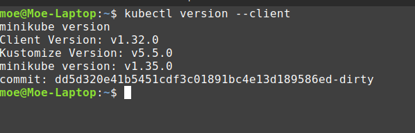

# Lab 9: Introduction to Kubernetes

Mohammad Jaafar - CBS-01

---

## **Overview**

In this lab, I explored Kubernetes, set up a local development environment, and deployed my application using both imperative commands and declarative manifests. I documented each step taken, including debugging issues related to networking and process conflicts.

---

## **Task 1: Kubernetes Setup and Basic Deployment**

### **1. Learning About Kubernetes**

To gain a solid understanding of Kubernetes, I reviewed the following concepts:

- **What is Kubernetes?** Kubernetes is a container orchestration platform that automates deployment, scaling, and management of containerized applications.
- **Kubernetes Components:** I studied the roles of key components, including Pods, Deployments, Services, and Ingress controllers.

### **2. Installing Kubernetes Tools**

To set up my Kubernetes environment, I installed the following tools:

- `kubectl`: Kubernetes CLI tool for managing cluster resources.
- `minikube`: A lightweight Kubernetes cluster for local development.

I verified the installations using:

```bash
kubectl version --client
minikube version

```



### **3. Initializing Minikube**

I started a local Kubernetes cluster using:

```bash
minikube start

```


This ensured that my environment was ready for application deployment.

### **4. Deploying My Application**

Since I had already built a Docker container for my Flask-based application (`em1999jay/python-app:latest`), I deployed it using:

```bash
kubectl create deployment python-app --image=em1999jay/python-app:latest

```


I verified that the deployment was successful using:

```bash
kubectl get deployments
kubectl get pods

```


### **5. Exposing My Application**

To make my application accessible outside the Kubernetes cluster, I created a Service:

```bash
kubectl expose deployment python-app --type=NodePort --port=80 --target-port=5000

```


I checked the Service details:

```bash
kubectl get svc

```


### **6. Accessing My Application**

To retrieve the correct external link to access my application, I ran:

```bash
minikube service python-app-service --url

```


I retrieved the IP and accessed my application at:

```sh
http://192.168.49.2:30637

```


### **7. Cleanup**

To maintain a clean environment, I deleted my Deployment and Service:

```bash
kubectl delete deployment python-app
kubectl delete svc python-app

```


---

## **Task 2: Declarative Kubernetes Manifests**

Instead of creating resources using imperative commands, I implemented declarative YAML files.

### **1. Creating the Deployment Manifest**

I created `k8s/deployment.yml` with the following content:

```yaml
apiVersion: apps/v1
kind: Deployment
metadata:
  name: python-app
  labels:
    app: python-app
spec:
  replicas: 3
  selector:
    matchLabels:
      app: python-app
  template:
    metadata:
      labels:
        app: python-app
    spec:
      containers:
      - name: python-app
        image: em1999jay/python-app:latest
        ports:
        - containerPort: 5000
```

### **2. Creating the Service Manifest**

I created `k8s/service.yml`:

```yaml
apiVersion: v1
kind: Service
metadata:
  name: python-app
spec:
  type: NodePort
  selector:
    app: python-app
  ports:
  - port: 80
    targetPort: 5000
    nodePort: 30000

```

### **3. Deploying via YAML Manifests**

I applied the configuration using:

```bash
kubectl apply -f k8s/deployment.yml
kubectl apply -f k8s/service.yml

```


### **4. Verifying the Deployment**

After deployment, I confirmed that my pods and service were running:

```bash
kubectl get pods
kubectl get svc

```


### **5. Accessing My Application**

I retrieved the correct URL:

```bash
minikube service python-app --url

```


Then, I accessed my application in a browser and verified its availability.


### **6. Collecting Outputs**

I documented the following outputs in this report:

- The result of `kubectl get pods,svc`:

    ```sh
    $ kubectl get pods
    NAME                          READY   STATUS    RESTARTS   AGE
    python-app-846c987c87-hsmhm   1/1     Running   0          2m19s
    python-app-846c987c87-jr99q   1/1     Running   0          2m19s
    python-app-846c987c87-zj6ld   1/1     Running   0          2m19s
    
    $ kubectl get svc
    NAME         TYPE        CLUSTER-IP     EXTERNAL-IP   PORT(S)        AGE
    kubernetes   ClusterIP   10.96.0.1      <none>        443/TCP        43m
    python-app   NodePort    10.111.251.4   <none>        80:30000/TCP   5m14s
    ```

- The result of `minikube service --all` showing the correct external access.

    ```yaml
     minikube service --all
    |-----------|------------|-------------|--------------|
    | NAMESPACE |    NAME    | TARGET PORT |     URL      |
    |-----------|------------|-------------|--------------|
    | default   | kubernetes |             | No node port |
    |-----------|------------|-------------|--------------|
    😿  service default/kubernetes has no node port
    |-----------|------------|-------------|---------------------------|
    | NAMESPACE |    NAME    | TARGET PORT |            URL            |
    |-----------|------------|-------------|---------------------------|
    | default   | python-app |          80 | http://192.168.49.2:30000 |
    |-----------|------------|-------------|---------------------------|
    ❗  Services [default/kubernetes] have type "ClusterIP" not meant to be exposed, however for local development minikube allows you to access this !
    🎉  Opening service default/python-app in default browser...
    🏃  Starting tunnel for service kubernetes.
    Opening in existing browser session.
    |-----------|------------|-------------|------------------------|
    | NAMESPACE |    NAME    | TARGET PORT |          URL           |
    |-----------|------------|-------------|------------------------|
    | default   | kubernetes |             | http://127.0.0.1:38443 |
    |-----------|------------|-------------|------------------------|
    🎉  Opening service default/kubernetes in default browser...
    ❗  Because you are using a Docker driver on linux, the terminal needs to be open to run it.
    Opening in existing browser session.
    
    ```

- A **screenshot** of the application running in my browser, demonstrating that the IP matches the output from `minikube service --all`.

    

    

---

## **Bonus Task: Additional Configuration and Ingress**

To extend my Kubernetes setup, I deployed an additional application and configured an Ingress resource to route traffic efficiently.

### **1. Deploying an Additional Application (`node-app`)**

Since I had another containerized application, `em1999jay/node-moscow-time`, I created a separate Deployment and Service for it.

### **Deployment Manifest for `node-app`**

I created `k8s/node-deployment.yml`:

```yaml
apiVersion: apps/v1
kind: Deployment
metadata:
  name: node-app
  labels:
    app: node-app
spec:
  replicas: 3
  selector:
    matchLabels:
      app: node-app
  template:
    metadata:
      labels:
        app: node-app
    spec:
      containers:
      - name: node-app-container
        image: em1999jay/node-moscow-time:latest
        ports:
        - containerPort: 3000

```

### **Service Manifest for `node-app`**

I created `k8s/node-service.yml`:

```yaml
apiVersion: v1
kind: Service
metadata:
  name: node-app-service
spec:
  type: NodePort
  selector:
    app: node-app
  ports:
  - port: 80
    targetPort: 3000
    nodePort: 30001

```

### **Applying the Configuration**

I deployed `node-app` in Kubernetes:

```bash
kubectl apply -f k8s/node-deployment.yml
kubectl apply -f k8s/node-service.yml

```


After deployment, I verified that both applications were running:

```bash
kubectl get pods
kubectl get svc

```


---

### **2. Configuring Ingress**

To simplify access, I created an **Ingress resource** that routes traffic to both applications based on the hostname.

### **Ingress Manifest (`ingress.yml`)**

I created `k8s/ingress.yml`:

```yaml
yamlapiVersion: networking.k8s.io/v1
kind: Ingress
metadata:
  name: my-ingress
spec:
  rules:
  - host: python-app.local
    http:
      paths:
      - path: /
        pathType: Prefix
        backend:
          service:
            name: python-app
            port:
              number: 80
  - host: node-app.local
    http:
      paths:
      - path: /
        pathType: Prefix
        backend:
          service:
            name: node-app-service
            port:
              number: 80

```

### **Enabling Ingress Controller**

Since Minikube does not enable Ingress by default, I enabled it:

```bash
minikube addons enable ingress

```


Then, I applied the Ingress configuration:

```bash
kubectl apply -f k8s/ingress.yml

```


### **Updating `/etc/hosts`**

To resolve the custom hostnames (`python-app.local` and `node-app.local`), I modified my system’s **hosts file**:

```bash
sudo nano /etc/hosts

```

And added:

```sh
192.168.49.2 python-app.local
192.168.49.2 node-app.local

```


I saved and exited (`CTRL+X`, then `Y` and `Enter`).

---

### **3. Application Availability Check**

To confirm that both applications were running correctly, I used `curl`:

```bash
curl -H "Host: python-app.local" http://192.168.49.2/
curl -H "Host: node-app.local" http://192.168.49.2/

```


Both returned the expected responses.

I also opened a browser and tested:

- `http://python-app.local`
- `http://node-app.local`

The pages loaded successfully.

---

## **Bonus Task Summary**

- ✅ Deployed a **second application (`node-app`)** using a Deployment and Service.
- ✅ Configured **Ingress** to route requests based on hostnames.
- ✅ Verified that both applications were accessible via **curl** and a web browser.

### **Screenshots & Outputs**

I documented:

- The output of `kubectl get pods,svc` after deploying both applications.

    

- The output of `minikube service --all`.


- Screenshots of `python-app.local` and `node-app.local` in the browser, proving successful deployment.

    

    

---

## **Conclusion**

Through this bonus task, I learned how to:

1. Deploy multiple applications in Kubernetes.
2. Use **Ingress** for efficient routing.
3. Configure local DNS resolution to access services by hostname.
