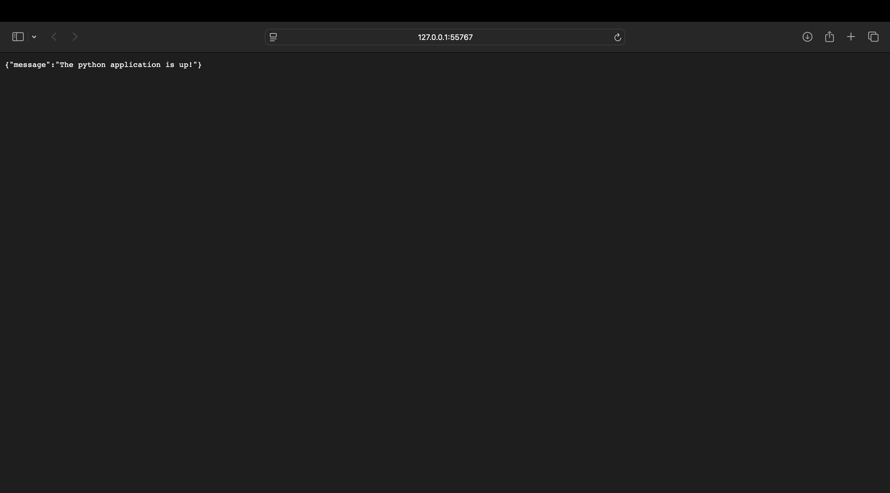
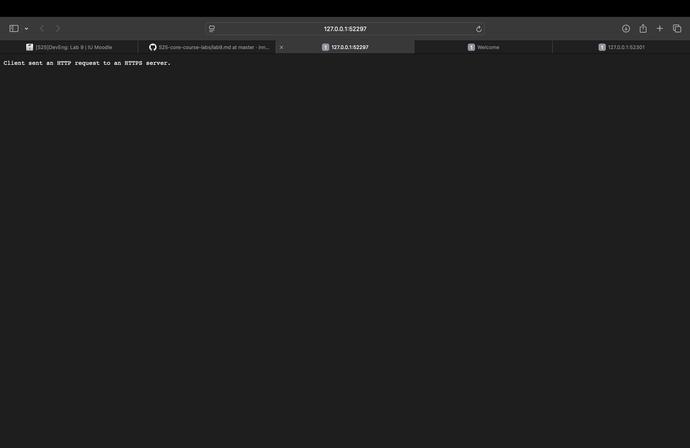
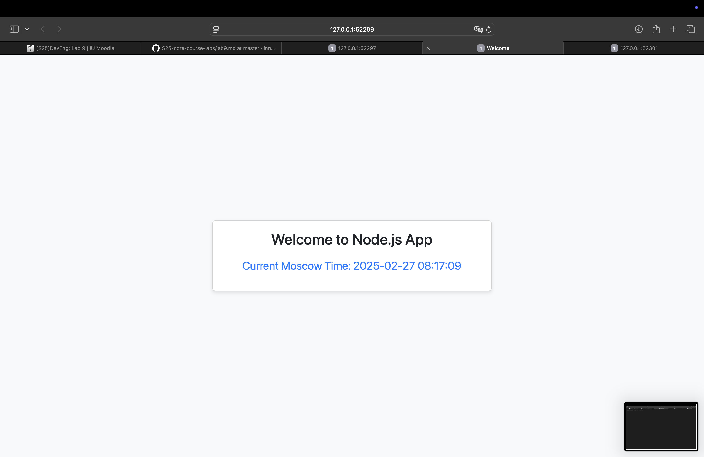
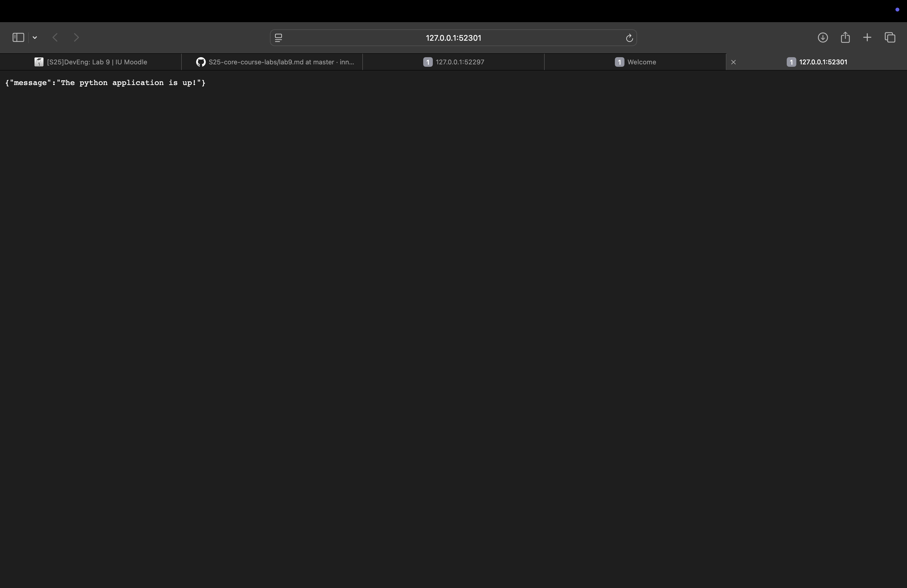

This document provides a concise overview of how we deployed our FastAPI and Node.js apps to a local Minikube cluster. It covers both the **imperative** (Task 1) and **declarative** (Task 2) approaches, plus the Ingress setup.

## 1. Minikube Setup & Basic Deployment (Task 1)

1. **Install** `kubectl` and `minikube`.
2. **Start** Minikube:
   ```minikube start```
3. **Imperative Deployment**: Create a Deployment for the FastAPI app:
```
   kubectl create deployment timezone-python-app-imp --image=louayfarah/timezone_app_python:latest
```
Make sure that the docker image is built and pushed to Docker Hub before running the command above.
4. **Expose** the Deployment with a Service:
```
   kubectl expose deployment timezone-python-app-imp --type=NodePort --port=8000
```
5. **Check** status:
```
   kubectl get pods,svc
```
Output:
```
NAME                                           READY   STATUS    RESTARTS   AGE
pod/timezone-python-app-imp-64d6459469-c298x   1/1     Running   0          13s

NAME                              TYPE        CLUSTER-IP    EXTERNAL-IP   PORT(S)          AGE
service/kubernetes                ClusterIP   10.96.0.1     <none>        443/TCP          115m
service/timezone-python-app-imp   NodePort    10.108.7.89   <none>        8000:32089/TCP   6s
```
6. **Access** the app via:
```
   minikube service timezone-python-app-imp --url
```

Output:
```
http://127.0.0.1:55767
❗  Because you are using a Docker driver on darwin, the terminal needs to be open to run it.
```

Screenshot:


7. **Cleanup** if needed:
```
   kubectl delete svc timezone-python-app-imp
   kubectl delete deployment timezone-python-app-imp
```

Output:
```
(venv) louayfarah@Louays-MacBook-Pro S25-core-course-labs % kubectl delete svc timezone-python-app-imp 
service "timezone-python-app-imp" deleted
(venv) louayfarah@Louays-MacBook-Pro S25-core-course-labs % kubectl delete deployments.apps timezone-python-app-imp 
deployment.apps "timezone-python-app-imp" deleted
```

## 2. Declarative Manifests (Task 2)

We place our YAML files under `k8s/`:

### 2.1 deployment.yml

### 2.2 service.yml

**Apply**:
```
kubectl apply -f k8s/deployment.yml
kubectl apply -f k8s/service.yml
```

Check again:
```
kubectl get pods,svc
```

Output:
```
NAME                                       READY   STATUS    RESTARTS   AGE
pod/timezone-python-app-74bd957bf6-824rw   1/1     Running   0          29s
pod/timezone-python-app-74bd957bf6-jlfp8   1/1     Running   0          29s
pod/timezone-python-app-74bd957bf6-q6rqk   1/1     Running   0          29s

NAME                          TYPE        CLUSTER-IP       EXTERNAL-IP   PORT(S)          AGE
service/kubernetes            ClusterIP   10.96.0.1        <none>        443/TCP          137m
service/timezone-python-app   NodePort    10.101.151.215   <none>        8000:32002/TCP   25s
```

## 3. Ingress Setup & Fix

### 3.1 Enabling Ingress
```
minikube addons enable ingress
```

Verify the controller is running:
```
kubectl get pods -n ingress-nginx
```

Apply:
```
kubectl apply -f k8s/ingress.yml
```

### 3.3 Using minikube tunnel
If ```curl http://<MINIKUBE_IP>/fastapi``` fails on port 80, run:
```
minikube tunnel
```
Then:
```
curl http://<MINIKUBE_IP>/fastapi
```
should succeed.

You can get MINIKUBE_IP by running:
```
minikube ip
```

## 4. Kubernetes Folder & README

In the `k8s` folder:
- deployment.yml
- service.yml
- ingress.yml
- README.md 


## 5. Bonus Task

- Created separate deployment and service manifests for Node.js (nodejs_deployment.yml, nodejs_service.yml).
- Extended the ingress.yml with an additional path /nodejs.

Output of:
```
kubectl get pods,svc
```

```
NAME                                       READY   STATUS    RESTARTS   AGE
pod/timezone-nodejs-app-546bbb79cd-bzsbv   1/1     Running   0          3h22m
pod/timezone-nodejs-app-546bbb79cd-qgpbp   1/1     Running   0          3h22m
pod/timezone-python-app-74bd957bf6-824rw   1/1     Running   0          3h24m
pod/timezone-python-app-74bd957bf6-jlfp8   1/1     Running   0          3h24m
pod/timezone-python-app-74bd957bf6-q6rqk   1/1     Running   0          3h24m

NAME                          TYPE        CLUSTER-IP       EXTERNAL-IP   PORT(S)          AGE
service/kubernetes            ClusterIP   10.96.0.1        <none>        443/TCP          5h41m
service/timezone-nodejs-app   NodePort    10.108.204.113   <none>        3000:31912/TCP   3h22m
service/timezone-python-app   NodePort    10.101.151.215   <none>        8000:32002/TCP   3h24m
```


Running
```
minikube service --all
```

Output:
```
(venv) louayfarah@Louays-MacBook-Pro S25-core-course-labs % minikube service --all

|-----------|------------|-------------|--------------|
| NAMESPACE |    NAME    | TARGET PORT |     URL      |
|-----------|------------|-------------|--------------|
| default   | kubernetes |             | No node port |
|-----------|------------|-------------|--------------|
😿  service default/kubernetes has no node port
|-----------|---------------------|-------------|---------------------------|
| NAMESPACE |        NAME         | TARGET PORT |            URL            |
|-----------|---------------------|-------------|---------------------------|
| default   | timezone-nodejs-app |        3000 | http://192.168.49.2:31912 |
|-----------|---------------------|-------------|---------------------------|
|-----------|---------------------|-------------|---------------------------|
| NAMESPACE |        NAME         | TARGET PORT |            URL            |
|-----------|---------------------|-------------|---------------------------|
| default   | timezone-python-app |        8000 | http://192.168.49.2:32002 |
|-----------|---------------------|-------------|---------------------------|
❗  Services [default/kubernetes] have type "ClusterIP" not meant to be exposed, however for local development minikube allows you to access this !
🏃  Starting tunnel for service kubernetes.
🏃  Starting tunnel for service timezone-nodejs-app.
🏃  Starting tunnel for service timezone-python-app.
|-----------|---------------------|-------------|------------------------|
| NAMESPACE |        NAME         | TARGET PORT |          URL           |
|-----------|---------------------|-------------|------------------------|
| default   | kubernetes          |             | http://127.0.0.1:52297 |
| default   | timezone-nodejs-app |             | http://127.0.0.1:52299 |
| default   | timezone-python-app |             | http://127.0.0.1:52301 |
|-----------|---------------------|-------------|------------------------|
🎉  Opening service default/kubernetes in default browser...
🎉  Opening service default/timezone-nodejs-app in default browser...
🎉  Opening service default/timezone-python-app in default browser...
❗  Because you are using a Docker driver on darwin, the terminal needs to be open to run it.
```

Screenshots:



