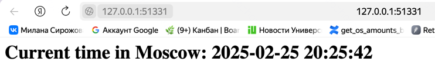

# Kubernetes

## Deploy

```bash
> kubectl create deployment app-python --image=milanamilana/python-distroless-web-app:latest
deployment.apps/app-python created

> kubectl get deployments
NAME         READY   UP-TO-DATE   AVAILABLE   AGE
app-python   1/1     1            1           4s

> kubectl get pods
NAME                          READY   STATUS    RESTARTS   AGE
app-python-7f8ff999c5-znrt7   1/1     Running   0          8s

> kubectl get events

LAST SEEN   TYPE      REASON                    OBJECT                             MESSAGE
3m15s       Normal    Scheduled                 pod/app-python-5964dcdc99-zw6xr    Successfully assigned default/app-python-5964dcdc99-zw6xr to minikube
85s         Normal    Pulling                   pod/app-python-5964dcdc99-zw6xr    Pulling image "milanamilana/python-distroless-web-app:latest"
2m52s       Normal    Pulled                    pod/app-python-5964dcdc99-zw6xr    Successfully pulled image "milanamilana/python-distroless-web-app:latest" in 22.262s (22.262s including waiting). Image size: 117950623 bytes.
84s         Normal    Created                   pod/app-python-5964dcdc99-zw6xr    Created container: python-distroless-web-app
84s         Warning   Failed                    pod/app-python-5964dcdc99-zw6xr    Error: failed to start container "python-distroless-web-app": Error response from daemon: failed to create task for container: failed to create shim task: OCI runtime create failed: runc create failed: unable to start container process: error during container init: exec: "/agnhost": stat /agnhost: no such file or directory: unknown
2m50s       Normal    Pulled                    pod/app-python-5964dcdc99-zw6xr    Successfully pulled image "milanamilana/python-distroless-web-app:latest" in 1.606s (1.607s including waiting). Image size: 117950623 bytes.
2m34s       Normal    Pulled                    pod/app-python-5964dcdc99-zw6xr    Successfully pulled image "milanamilana/python-distroless-web-app:latest" in 1.714s (1.714s including waiting). Image size: 117950623 bytes.
27s         Warning   BackOff                   pod/app-python-5964dcdc99-zw6xr    Back-off restarting failed container python-distroless-web-app in pod app-python-5964dcdc99-zw6xr_default(9369a68d-b93d-4364-a1b9-580a1f2d10d3)
2m6s        Normal    Pulled                    pod/app-python-5964dcdc99-zw6xr    Successfully pulled image "milanamilana/python-distroless-web-app:latest" in 1.64s (1.64s including waiting). Image size: 117950623 bytes.
84s         Normal    Pulled                    pod/app-python-5964dcdc99-zw6xr    Successfully pulled image "milanamilana/python-distroless-web-app:latest" in 1.651s (1.651s including waiting). Image size: 117950623 bytes.
3m15s       Normal    SuccessfulCreate          replicaset/app-python-5964dcdc99   Created pod: app-python-5964dcdc99-zw6xr
14s         Normal    Scheduled                 pod/app-python-7f8ff999c5-znrt7    Successfully assigned default/app-python-7f8ff999c5-znrt7 to minikube
14s         Normal    Pulling                   pod/app-python-7f8ff999c5-znrt7    Pulling image "milanamilana/python-distroless-web-app:latest"
12s         Normal    Pulled                    pod/app-python-7f8ff999c5-znrt7    Successfully pulled image "milanamilana/python-distroless-web-app:latest" in 1.902s (1.902s including waiting). Image size: 117950623 bytes.
12s         Normal    Created                   pod/app-python-7f8ff999c5-znrt7    Created container: python-distroless-web-app
12s         Normal    Started                   pod/app-python-7f8ff999c5-znrt7    Started container python-distroless-web-app
14s         Normal    SuccessfulCreate          replicaset/app-python-7f8ff999c5   Created pod: app-python-7f8ff999c5-znrt7
3m15s       Normal    ScalingReplicaSet         deployment/app-python              Scaled up replica set app-python-5964dcdc99 from 0 to 1
14s         Normal    ScalingReplicaSet         deployment/app-python              Scaled up replica set app-python-7f8ff999c5 from 0 to 1
11m         Normal    Starting                  node/minikube                      Starting kubelet.
11m         Normal    NodeAllocatableEnforced   node/minikube                      Updated Node Allocatable limit across pods
11m         Normal    NodeHasSufficientMemory   node/minikube                      Node minikube status is now: NodeHasSufficientMemory
11m         Normal    NodeHasNoDiskPressure     node/minikube                      Node minikube status is now: NodeHasNoDiskPressure
11m         Normal    NodeHasSufficientPID      node/minikube                      Node minikube status is now: NodeHasSufficientPID
11m         Normal    RegisteredNode            node/minikube                      Node minikube event: Registered Node minikube in Controller
11m         Normal    Starting                  node/minikube
```

## Access

```bash
> kubectl expose deployment app-python --type=LoadBalancer --port=5000
service/app-python exposed

> minikube service app-python
|-----------|------------|-------------|---------------------------|
| NAMESPACE |    NAME    | TARGET PORT |            URL            |
|-----------|------------|-------------|---------------------------|
| default   | app-python |        5000 | http://192.168.49.2:32156 |
|-----------|------------|-------------|---------------------------|
🏃  Starting tunnel for service app-python.
|-----------|------------|-------------|------------------------|
| NAMESPACE |    NAME    | TARGET PORT |          URL           |
|-----------|------------|-------------|------------------------|
| default   | app-python |             | http://127.0.0.1:53526 |
|-----------|------------|-------------|------------------------|
🎉  Opening service default/app-python in default browser...
❗  Because you are using a Docker driver on darwin, the terminal needs to be open to run it.
```

## Info

```bash
> kubectl get pods,svc
NAME                              READY   STATUS    RESTARTS      AGE
pod/app-python-78769c6457-k4dgf   1/1     Running   1 (25s ago)   30m

NAME                 TYPE           CLUSTER-IP      EXTERNAL-IP   PORT(S)          AGE
service/app-python   LoadBalancer   10.107.11.133   <pending>     5000:32156/TCP   24m
service/kubernetes   ClusterIP      10.96.0.1       <none>        443/TCP          46m
```

## Cleanup

```bash
> kubectl delete deployments app-python
deployment.apps "app-python" deleted

> kubectl delete service app-python
service "app-python" deleted
```

## Manifest

```bash
> kubectl apply -f k8s
deployment.apps/app-python created
service/app-python-service created
```

```bash
> kubectl get pods,svc
NAME                              READY   STATUS    RESTARTS   AGE
pod/app-python-5db6fdbb65-24q77   1/1     Running   0          3m19s
pod/app-python-5db6fdbb65-f22l4   1/1     Running   0          3m19s
pod/app-python-5db6fdbb65-fnrcs   1/1     Running   0          3m19s

NAME                         TYPE        CLUSTER-IP    EXTERNAL-IP   PORT(S)          AGE
service/app-python-service   NodePort    10.97.98.67   <none>        8000:31000/TCP   3m19s
service/kubernetes           ClusterIP   10.96.0.1     <none>        443/TCP          73m
```

```bash
minikube service --all
|-----------|--------------------|-------------|---------------------------|
| NAMESPACE |        NAME        | TARGET PORT |            URL            |
|-----------|--------------------|-------------|---------------------------|
| default   | app-python-service |        5000 | http://192.168.49.2:31000 |
|-----------|--------------------|-------------|---------------------------|
|-----------|------------|-------------|--------------|
| NAMESPACE |    NAME    | TARGET PORT |     URL      |
|-----------|------------|-------------|--------------|
| default   | kubernetes |             | No node port |
|-----------|------------|-------------|--------------|
😿  service default/kubernetes has no node port
❗  Services [default/kubernetes] have type "ClusterIP" not meant to be exposed, however for local development minikube allows you to access this !
🏃  Starting tunnel for service app-python-service.
🏃  Starting tunnel for service kubernetes.
|-----------|--------------------|-------------|------------------------|
| NAMESPACE |        NAME        | TARGET PORT |          URL           |
|-----------|--------------------|-------------|------------------------|
| default   | app-python-service |             | http://127.0.0.1:51331 |
| default   | kubernetes         |             | http://127.0.0.1:51333 |
|-----------|--------------------|-------------|------------------------|
🎉  Opening service default/app-python-service in default browser...
🎉  Opening service default/kubernetes in default browser...
❗  Because you are using a Docker driver on darwin, the terminal needs to be open to run it.
```



## Same for Go app

```bash
> kubectl apply -f k8s
deployment.apps/app-go created
service/app-go-service created
deployment.apps/app-python unchanged
service/app-python-service unchanged
```

## Ingress Manifests

```bash
> minikube addons enable ingress
💡  ingress is an addon maintained by Kubernetes. For any concerns contact minikube on GitHub.
You can view the list of minikube maintainers at: https://github.com/kubernetes/minikube/blob/master/OWNERS
💡  After the addon is enabled, please run "minikube tunnel" and your ingress resources would be available at "127.0.0.1"
    ▪ Используется образ registry.k8s.io/ingress-nginx/kube-webhook-certgen:v1.4.4
    ▪ Используется образ registry.k8s.io/ingress-nginx/kube-webhook-certgen:v1.4.4
    ▪ Используется образ registry.k8s.io/ingress-nginx/controller:v1.11.3
🔎  Verifying ingress addon...
🌟  The 'ingress' addon is enabled
```

## Enable the Ingress controller

```bash
> kubectl get pods -n ingress-nginx
NAME                                        READY   STATUS      RESTARTS   AGE
ingress-nginx-admission-create-7984m        0/1     Completed   0          6m9s
ingress-nginx-admission-patch-sb4l9         0/1     Completed   1          6m9s
ingress-nginx-controller-56d7c84fd4-2sz5x   1/1     Running     0          6m9s
```

## Utilize curl or a similar tool to verify the availability of your applications

### Python

```bash
> curl --resolve "app-python.example:80:127.0.0.1" -i http://app-python.example
HTTP/1.1 200 OK
Date: Tue, 25 Feb 2025 17:59:56 GMT
Content-Type: text/html; charset=utf-8
Content-Length: 52
Connection: keep-alive

<h1>Current time in Moscow: 2025-02-25 20:59:56</h1>%
```

### Go

```bash
curl --resolve "app-go.example:80:127.0.0.1" -i http://app-go.example
HTTP/1.1 200 OK
Date: Tue, 25 Feb 2025 18:02:10 GMT
Content-Type: application/json
Content-Length: 66
Connection: keep-alive

{"prediction":"Today is the perfect day to start something new."}
```
