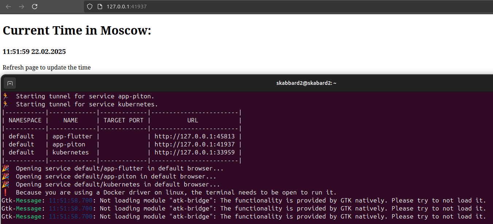
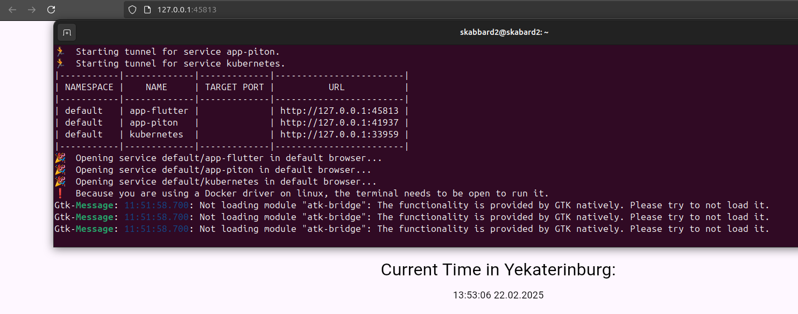
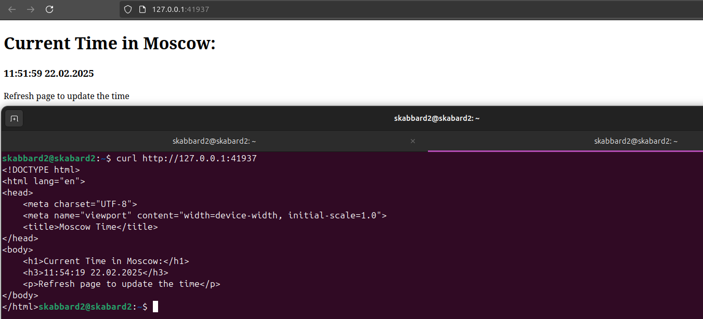
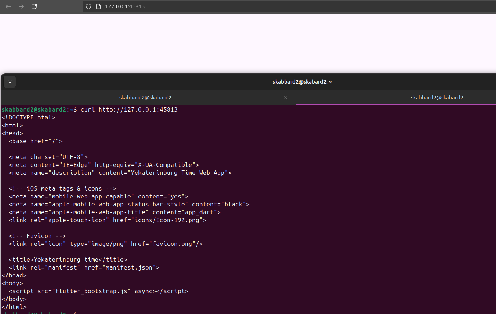
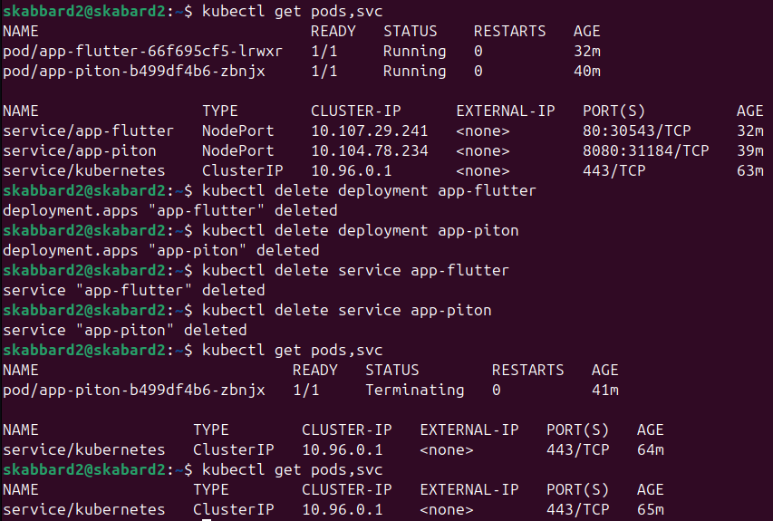

# Kubernetes Setup

## Deployment

Both applications (python and flutter web apps) were deployed. Commands bellow shows the setup for the Flutter app in details, same was done for Python app.

* Create deployment
> kubectl create deployment --image paranid5/app_flutter:latest app-flutter --port 80

* Output
> deployment.apps/app-flutter created

* Expose deployment
> kubectl expose deployment app-flutter --type=NodePort --port=80

* Output
> service/app-flutter exposed

* Checking available pods and services

## Accessing services

> minikube service --all

* Python

* Flutter

* Curl Python app

* Curl Flutter app

## Cleanup

