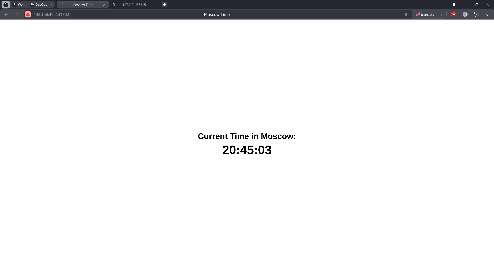
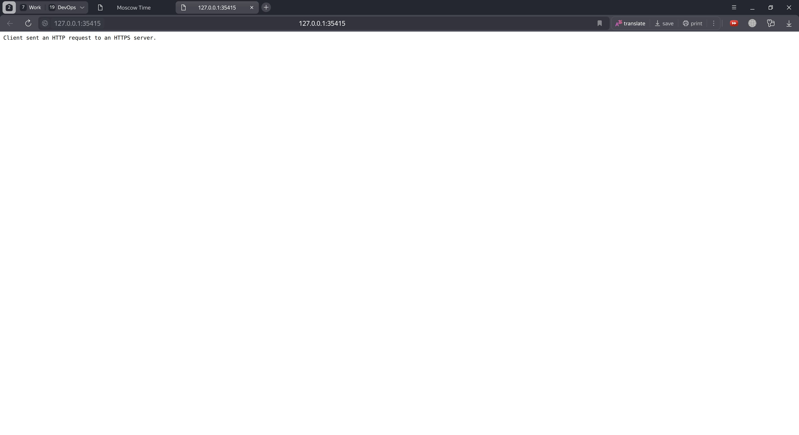
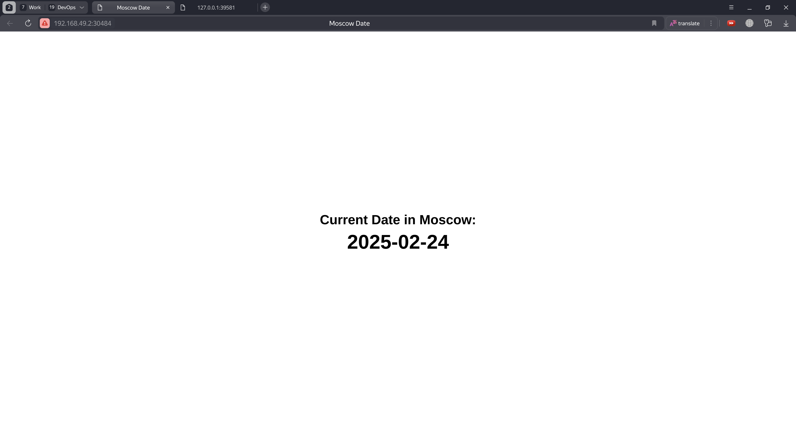
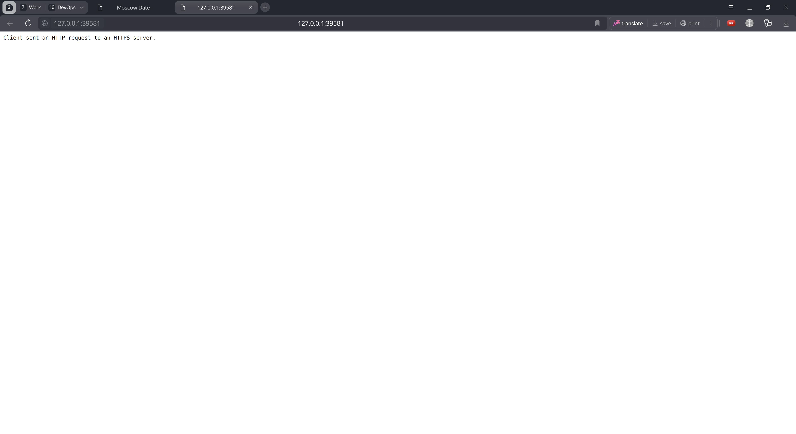
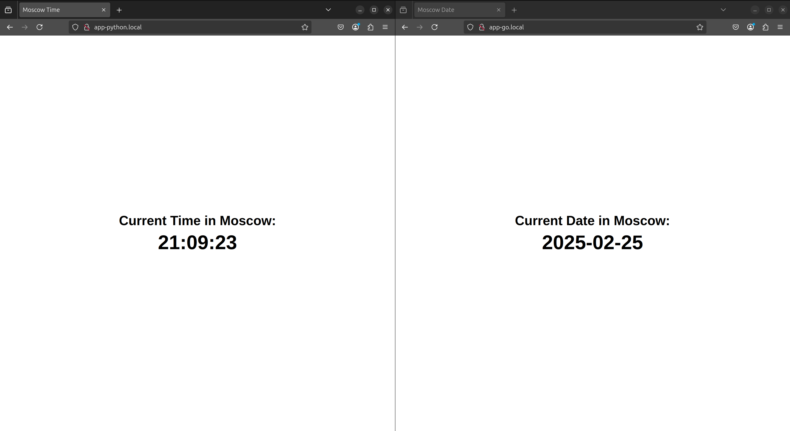

# Kubernetes Deployment

## Installation of `minikube` and `kubectl`

I installed `minikube` and `kubectl` on my local machine.

Then I checked the version of `minikube` and `kubectl`

```bash
minikube version

minikube version: v1.35.0
commit: dd5d320e41b5451cdf3c01891bc4e13d189586ed-dirty
```

```bash
kubectl version

Client Version: v1.31.6
Kustomize Version: v5.4.2
Server Version: v1.32.0
```

## Basic Deployment

Create a deployment

```bash
kubectl create deployment app-python --image=azamatbayramov/s25-devops-py-dl:latest

deployment.apps/app-python created
```

Expose the deployment

```bash
kubectl expose deployment app-python --port=8001 --type=LoadBalancer

service/app-python exposed
```

Get the info about the pods, deployments and services

```bash
kubectl get pods,deployments,svc

NAME                              READY   STATUS    RESTARTS   AGE
pod/app-python-69c6d989d8-ntznl   1/1     Running   0          13s

NAME                         READY   UP-TO-DATE   AVAILABLE   AGE
deployment.apps/app-python   1/1     1            1           13s

NAME                 TYPE           CLUSTER-IP      EXTERNAL-IP   PORT(S)          AGE
service/app-python   LoadBalancer   10.100.59.122   <pending>     8001:31773/TCP   4s
service/kubernetes   ClusterIP      10.96.0.1       <none>        443/TCP          5h17m
```

Start the minikube tunnel (in the other terminal)

```bash
minikube tunnel

Status:	
	machine: minikube
	pid: 201251
	route: 10.96.0.0/12 -> 192.168.49.2
	minikube: Running
	services: [app-python]
    errors: 
		minikube: no errors
		router: no errors
		loadbalancer emulator: no errors
```

Get the info about the pods, deployments and services again

```bash
kubectl get pods,deployments,svc

NAME                              READY   STATUS    RESTARTS   AGE
pod/app-python-69c6d989d8-ntznl   1/1     Running   0          62s

NAME                         READY   UP-TO-DATE   AVAILABLE   AGE
deployment.apps/app-python   1/1     1            1           62s

NAME                 TYPE           CLUSTER-IP      EXTERNAL-IP     PORT(S)          AGE
service/app-python   LoadBalancer   10.100.59.122   10.100.59.122   8001:31773/TCP   53s
service/kubernetes   ClusterIP      10.96.0.1       <none>          443/TCP          5h17m
```

Test the application by curl

```bash
curl 10.100.59.122:8001/api/time

{"time":"20:30:32"}
```

Remove the deployment

```bash
kubectl delete deployment app-python

deployment.apps "app-python" deleted
```

Remove the service

```bash
kubectl delete service app-python

service "app-python" deleted
```

Get the info about the pods, deployments and services again

```bash
kubectl get pods,deployments,svc

NAME                 TYPE        CLUSTER-IP   EXTERNAL-IP   PORT(S)   AGE
service/kubernetes   ClusterIP   10.96.0.1    <none>        443/TCP   5h20m
```

## Declarative Deployment

Create the deployment and service

```bash
kubectl apply -f app_python

deployment.apps/app-python created
service/app-python created
```

Get the info about the pods, deployments and services

```bash
kubectl get pods,deployments,svc

NAME                              READY   STATUS    RESTARTS   AGE
pod/app-python-7bcd4d746f-bg7f2   1/1     Running   0          15s
pod/app-python-7bcd4d746f-cmffr   1/1     Running   0          15s
pod/app-python-7bcd4d746f-g5w8g   1/1     Running   0          15s

NAME                         READY   UP-TO-DATE   AVAILABLE   AGE
deployment.apps/app-python   3/3     3            3           15s

NAME                 TYPE           CLUSTER-IP      EXTERNAL-IP     PORT(S)          AGE
service/app-python   LoadBalancer   10.103.242.98   10.103.242.98   8001:31782/TCP   15s
service/kubernetes   ClusterIP      10.96.0.1       <none>          443/TCP
```

Test the application by curl

```bash
curl 10.103.242.98:8001/api/time

{"time":"20:43:03"}
```

Test the application by `minikube service --all`

```bash
minikube service --all

|-----------|------------|-------------|---------------------------|
| NAMESPACE |    NAME    | TARGET PORT |            URL            |
|-----------|------------|-------------|---------------------------|
| default   | app-python |        8001 | http://192.168.49.2:31782 |
|-----------|------------|-------------|---------------------------|
|-----------|------------|-------------|--------------|
| NAMESPACE |    NAME    | TARGET PORT |     URL      |
|-----------|------------|-------------|--------------|
| default   | kubernetes |             | No node port |
|-----------|------------|-------------|--------------|
😿  service default/kubernetes has no node port
❗  Services [default/kubernetes] have type "ClusterIP" not meant to be exposed, however for local development minikube allows you to access this !
🎉  Opening service default/app-python in default browser...
find_ffmpeg failed, using the integrated library.
🏃  Starting tunnel for service kubernetes.
[0224/204503.060746:ERROR:file_io_posix.cc(153)] open /home/azamat/.config/yandex-browser/Crash Reports/pending/32b801ed-4a00-43df-a12a-4510880194a2.lock: File exists (17)
[0224/204503.060778:ERROR:file_io_posix.cc(153)] open /home/azamat/.config/yandex-browser/Crash Reports/pending/ccce132b-7073-4105-906c-80e535cd6316.lock: File exists (17)
Opening in existing browser session.
|-----------|------------|-------------|------------------------|
| NAMESPACE |    NAME    | TARGET PORT |          URL           |
|-----------|------------|-------------|------------------------|
| default   | kubernetes |             | http://127.0.0.1:35415 |
|-----------|------------|-------------|------------------------|
🎉  Opening service default/kubernetes in default browser...
❗  Because you are using a Docker driver on linux, the terminal needs to be open to run it.
find_ffmpeg failed, using the integrated library.
[0224/204504.081764:ERROR:file_io_posix.cc(153)] open /home/azamat/.config/yandex-browser/Crash Reports/pending/32b801ed-4a00-43df-a12a-4510880194a2.lock: File exists (17)
[0224/204504.081797:ERROR:file_io_posix.cc(153)] open /home/azamat/.config/yandex-browser/Crash Reports/pending/ccce132b-7073-4105-906c-80e535cd6316.lock: File exists (17)
Opening in existing browser session.
```





Remove the deployment

```bash
kubectl delete deployment app-python

deployment.apps "app-python" deleted
```

Remove the service

```bash
kubectl delete service app-python

service "app-python" deleted
```

Get the info about the pods, deployments and services again

```bash
kubectl get pods,deployments,svc

NAME                 TYPE        CLUSTER-IP   EXTERNAL-IP   PORT(S)   AGE
service/kubernetes   ClusterIP   10.96.0.1    <none>        443/TCP   6h26m
```

## Declarative Deployment of Go Application

Create the deployment and service

```bash
kubectl apply -f app_go

deployment.apps/app-go created
service/app-go created
```

Get the info about the pods, deployments and services

```bash
kubectl get pods,deployments,svc

NAME                          READY   STATUS    RESTARTS   AGE
pod/app-go-5555c785f5-bz5rs   1/1     Running   0          19s
pod/app-go-5555c785f5-thsw7   1/1     Running   0          19s
pod/app-go-5555c785f5-vp27f   1/1     Running   0          19s

NAME                     READY   UP-TO-DATE   AVAILABLE   AGE
deployment.apps/app-go   3/3     3            3           19s

NAME                 TYPE           CLUSTER-IP      EXTERNAL-IP     PORT(S)          AGE
service/app-go       LoadBalancer   10.110.115.39   10.110.115.39   8002:30484/TCP   19s
service/kubernetes   ClusterIP      10.96.0.1       <none>          443/TCP
```

Test the application by curl

```bash
curl 10.110.115.39:8002/api/date

{"date":"2025-02-24"}
```

Test the application by `minikube service --all`

```bash
minikube service --all

|-----------|--------|-------------|---------------------------|
| NAMESPACE |  NAME  | TARGET PORT |            URL            |
|-----------|--------|-------------|---------------------------|
| default   | app-go |        8002 | http://192.168.49.2:30484 |
|-----------|--------|-------------|---------------------------|
|-----------|------------|-------------|--------------|
| NAMESPACE |    NAME    | TARGET PORT |     URL      |
|-----------|------------|-------------|--------------|
| default   | kubernetes |             | No node port |
|-----------|------------|-------------|--------------|
😿  service default/kubernetes has no node port
❗  Services [default/kubernetes] have type "ClusterIP" not meant to be exposed, however for local development minikube allows you to access this !
🎉  Opening service default/app-go in default browser...
find_ffmpeg failed, using the integrated library.
🏃  Starting tunnel for service kubernetes.
[0224/213901.483074:ERROR:file_io_posix.cc(153)] open /home/azamat/.config/yandex-browser/Crash Reports/pending/32b801ed-4a00-43df-a12a-4510880194a2.lock: File exists (17)
[0224/213901.483105:ERROR:file_io_posix.cc(153)] open /home/azamat/.config/yandex-browser/Crash Reports/pending/ccce132b-7073-4105-906c-80e535cd6316.lock: File exists (17)
Opening in existing browser session.
|-----------|------------|-------------|------------------------|
| NAMESPACE |    NAME    | TARGET PORT |          URL           |
|-----------|------------|-------------|------------------------|
| default   | kubernetes |             | http://127.0.0.1:39581 |
|-----------|------------|-------------|------------------------|
🎉  Opening service default/kubernetes in default browser...
❗  Because you are using a Docker driver on linux, the terminal needs to be open to run it.
find_ffmpeg failed, using the integrated library.
[0224/213902.505877:ERROR:file_io_posix.cc(153)] open /home/azamat/.config/yandex-browser/Crash Reports/pending/32b801ed-4a00-43df-a12a-4510880194a2.lock: File exists (17)
[0224/213902.505912:ERROR:file_io_posix.cc(153)] open /home/azamat/.config/yandex-browser/Crash Reports/pending/ccce132b-7073-4105-906c-80e535cd6316.lock: File exists (17)
Opening in existing browser session.
```





Remove the deployment

```bash
kubectl delete deployment app-go

deployment.apps "app-go" deleted
```

Remove the service

```bash
kubectl delete service app-go

service "app-go" deleted
```

Get the info about the pods, deployments and services again

```bash
kubectl get pods,deployments,svc

NAME                 TYPE        CLUSTER-IP   EXTERNAL-IP   PORT(S)   AGE
service/kubernetes   ClusterIP   10.96.0.1    <none>        443/TCP   6h30m
```

## Ingress

Enable the ingress addon

```bash
minikube addons enable ingress

💡  ingress is an addon maintained by Kubernetes. For any concerns contact minikube on GitHub.
You can view the list of minikube maintainers at: https://github.com/kubernetes/minikube/blob/master/OWNERS
    ▪ Using image registry.k8s.io/ingress-nginx/kube-webhook-certgen:v1.4.4
    ▪ Using image registry.k8s.io/ingress-nginx/kube-webhook-certgen:v1.4.4
    ▪ Using image registry.k8s.io/ingress-nginx/controller:v1.11.3
🔎  Verifying ingress addon...
🌟  The 'ingress' addon is enabled
```

Get the info about the ingress controller

```bash
kubectl get deployments -n ingress-nginx

NAME                       READY   UP-TO-DATE   AVAILABLE   AGE
ingress-nginx-controller   1/1     1            1           3h58m
```

Get the info about the pods, deployments, services and ingress

```bash
kubectl get pods,deployments,svc,ingress

NAME                 TYPE        CLUSTER-IP   EXTERNAL-IP   PORT(S)   AGE
service/kubernetes   ClusterIP   10.96.0.1    <none>        443/TCP   29h
```

Create the deployment, ingress and service for the python application

```bash
kubectl apply -f app_python

deployment.apps/app-python created
ingress.networking.k8s.io/app-python created
service/app-python created
```

Create the deployment, ingress and service for the go application

```bash
kubectl apply -f app_go

deployment.apps/app-go created
ingress.networking.k8s.io/app-go created
service/app-go created
```

Add the go application ingress to the hosts file

```bash
echo "$(minikube ip) app-go.local" | sudo tee -a /etc/hosts

192.168.49.2 app-go.local
```

Add the python application ingress to the hosts file

```bash
echo "$(minikube ip) app-python.local" | sudo tee -a /etc/hosts

192.168.49.2 app-python.local
```

Get the info about the pods, deployments, services and ingress

```bash
kubectl get pods,deployments,svc,ingress

NAME                              READY   STATUS    RESTARTS   AGE
pod/app-go-5555c785f5-2s49q       1/1     Running   0          8m8s
pod/app-go-5555c785f5-4qnbw       1/1     Running   0          8m8s
pod/app-go-5555c785f5-8crd4       1/1     Running   0          8m8s
pod/app-python-7bcd4d746f-f4qsg   1/1     Running   0          8m22s
pod/app-python-7bcd4d746f-hwqs4   1/1     Running   0          8m22s
pod/app-python-7bcd4d746f-lnbxl   1/1     Running   0          8m22s

NAME                         READY   UP-TO-DATE   AVAILABLE   AGE
deployment.apps/app-go       3/3     3            3           8m8s
deployment.apps/app-python   3/3     3            3           8m22s

NAME                 TYPE           CLUSTER-IP       EXTERNAL-IP      PORT(S)          AGE
service/app-go       LoadBalancer   10.99.101.39     10.99.101.39     8002:30833/TCP   8m8s
service/app-python   LoadBalancer   10.102.127.175   10.102.127.175   8001:30424/TCP   8m22s
service/kubernetes   ClusterIP      10.96.0.1        <none>           443/TCP          30h

NAME                                   CLASS   HOSTS              ADDRESS        PORTS   AGE
ingress.networking.k8s.io/app-go       nginx   app-go.local       192.168.49.2   80      8m8s
ingress.networking.k8s.io/app-python   nginx   app-python.local   192.168.49.2   80      8m22s
```

Test the applications by curl

```bash
curl app-python.local/api/time

{"time":"21:05:45"}
```

```bash
curl app-go.local/api/date

{"date":"2025-02-25"}
```

Test the applications by browser


