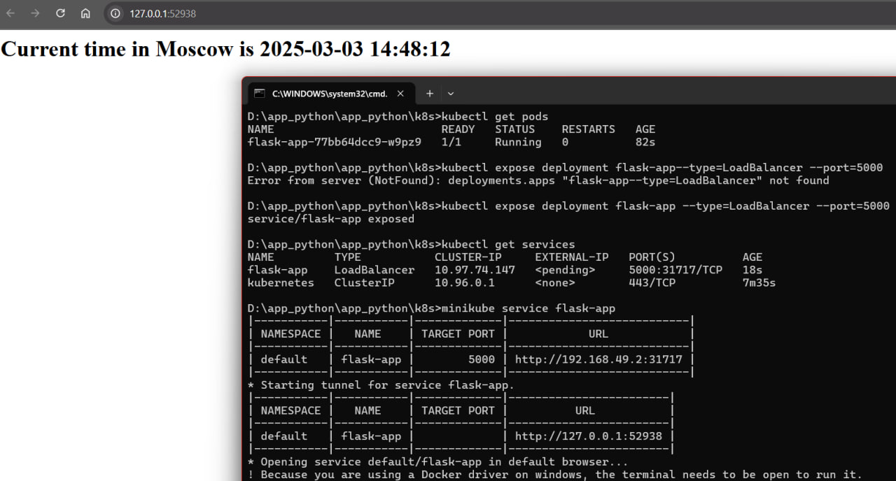
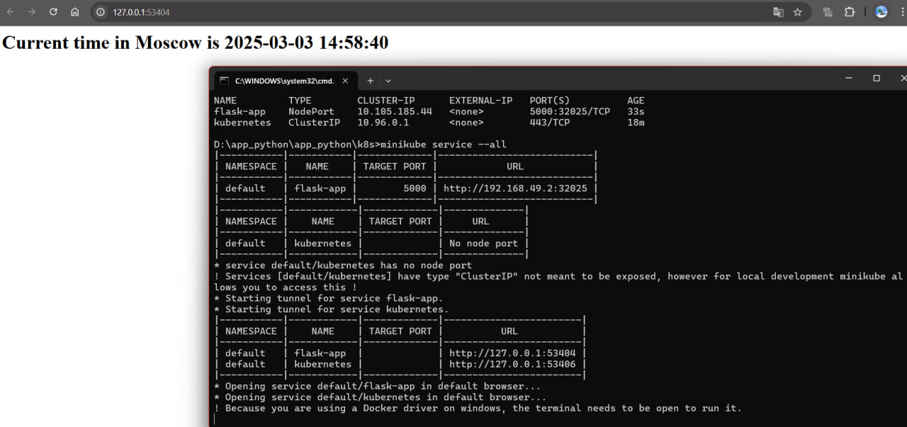

# K8s Lab

## Task 1

### 1. Starting minikube and metrics

```cmd
D:\app_python\app_python\k8s>minikube start --driver=docker
* minikube v1.35.0 на Microsoft Windows 11 Home Single Language 10.0.22631.4890 Build 22631.4890
* Используется драйвер docker на основе существующего профиля
* Starting "minikube" primary control-plane node in "minikube" cluster
* Pulling base image v0.0.46 ...
* docker "minikube" container is missing, will recreate.
* Creating docker container (CPUs=2, Memory=2200MB) ...
! Failing to connect to https://registry.k8s.io/ from inside the minikube container
* To pull new external images, you may need to configure a proxy: https://minikube.sigs.k8s.io/docs/reference/networking/proxy/
* Подготавливается Kubernetes v1.32.0 на Docker 27.4.1 ...
  - Generating certificates and keys ...
  - Booting up control plane ...
  - Configuring RBAC rules ...
* Configuring bridge CNI (Container Networking Interface) ...
* Компоненты Kubernetes проверяются ...
  - Используется образ gcr.io/k8s-minikube/storage-provisioner:v5
* Включенные дополнения: storage-provisioner, default-storageclass
* Готово! kubectl настроен для использования кластера "minikube" и "default" пространства имён по умолчанию
```

```cmd
D:\app_python\app_python\k8s>minikube addons enable metrics-server
* metrics-server is an addon maintained by Kubernetes. For any concerns contact minikube on GitHub.
You can view the list of minikube maintainers at: https://github.com/kubernetes/minikube/blob/master/OWNERS
  - Используется образ registry.k8s.io/metrics-server/metrics-server:v0.7.2
* The 'metrics-server' addon is enabled
```

### 2. Deploying flask-app

```cmd
D:\app_python\app_python\k8s>kubectl create deployment flask-app --image=synavtora/flask-app:latest
deployment.apps/flask-app created

```
```cmd
D:\app_python\app_python\k8s>kubectl get deployments
NAME        READY   UP-TO-DATE   AVAILABLE   AGE
flask-app   1/1     1            1           39s
```

```cmd
D:\app_python\app_python\k8s>kubectl get pods
NAME                         READY   STATUS    RESTARTS   AGE
flask-app-77bb64dcc9-w9pz9   1/1     Running   0          82s
```

### 3. Service creating and checking

```cmd
D:\app_python\app_python\k8s>kubectl expose deployment flask-app --type=LoadBalancer --port=5000
service/flask-app exposed
```

```cmd
D:\app_python\app_python\k8s>kubectl get services
NAME         TYPE           CLUSTER-IP     EXTERNAL-IP   PORT(S)          AGE
flask-app    LoadBalancer   10.97.74.147   <pending>     5000:31717/TCP   18s
kubernetes   ClusterIP      10.96.0.1      <none>        443/TCP          7m35s
```

```cmd
D:\app_python\app_python\k8s>minikube service flask-app
|-----------|-----------|-------------|---------------------------|
| NAMESPACE |   NAME    | TARGET PORT |            URL            |
|-----------|-----------|-------------|---------------------------|
| default   | flask-app |        5000 | http://192.168.49.2:31717 |
|-----------|-----------|-------------|---------------------------|
* Starting tunnel for service flask-app.
|-----------|-----------|-------------|------------------------|
| NAMESPACE |   NAME    | TARGET PORT |          URL           |
|-----------|-----------|-------------|------------------------|
| default   | flask-app |             | http://127.0.0.1:52938 |
|-----------|-----------|-------------|------------------------|
* Opening service default/flask-app in default browser...
! Because you are using a Docker driver on windows, the terminal needs to be open to run it.
* Stopping tunnel for service flask-app.
```


```cmd
D:\app_python\app_python\k8s>kubectl get pods,svc
NAME                             READY   STATUS    RESTARTS   AGE
pod/flask-app-77bb64dcc9-w9pz9   1/1     Running   0          4m28s

NAME                 TYPE           CLUSTER-IP     EXTERNAL-IP   PORT(S)          AGE
service/flask-app    LoadBalancer   10.97.74.147   <pending>     5000:31717/TCP   2m22s
service/kubernetes   ClusterIP      10.96.0.1      <none>        443/TCP          9m39s
```

## Task 2

### 1. Applying yaml-manifests for deploying the flask-app

```cmd
D:\app_python\app_python\k8s>kubectl apply -f deployment.yaml
deployment.apps/flask-app created
```

```cmd
D:\app_python\app_python\k8s>kubectl apply -f service.yaml
service/flask-app created
```

### 2. Verifying that all's good and running

```cmd
D:\app_python\app_python\k8s>kubectl get pods --all-namespaces
NAMESPACE     NAME                               READY   STATUS    RESTARTS   AGE
default       flask-app-776bc6b4fc-7pwrm         1/1     Running   0          50s
default       flask-app-776bc6b4fc-8mvh2         1/1     Running   0          50s
default       flask-app-776bc6b4fc-csht4         1/1     Running   0          50s
kube-system   coredns-668d6bf9bc-lvpff           1/1     Running   0          18m
kube-system   coredns-668d6bf9bc-td6qd           1/1     Running   0          18m
kube-system   etcd-minikube                      1/1     Running   0          18m
kube-system   kube-apiserver-minikube            1/1     Running   0          18m
kube-system   kube-controller-manager-minikube   1/1     Running   0          18m
kube-system   kube-proxy-rcbtf                   1/1     Running   0          18m
kube-system   kube-scheduler-minikube            1/1     Running   0          18m
kube-system   metrics-server-7fbb699795-rschv    1/1     Running   0          17m
kube-system   storage-provisioner                1/1     Running   0          18m
```

```cmd
D:\app_python\app_python\k8s>kubectl get services
NAME         TYPE        CLUSTER-IP      EXTERNAL-IP   PORT(S)          AGE
flask-app    NodePort    10.105.185.44   <none>        5000:32025/TCP   33s
kubernetes   ClusterIP   10.96.0.1       <none>        443/TCP          18m
```

### 3. Checking the result and being happy

```cmd
D:\app_python\app_python\k8s>minikube service --all
|-----------|-----------|-------------|---------------------------|
| NAMESPACE |   NAME    | TARGET PORT |            URL            |
|-----------|-----------|-------------|---------------------------|
| default   | flask-app |        5000 | http://192.168.49.2:32025 |
|-----------|-----------|-------------|---------------------------|
|-----------|------------|-------------|--------------|
| NAMESPACE |    NAME    | TARGET PORT |     URL      |
|-----------|------------|-------------|--------------|
| default   | kubernetes |             | No node port |
|-----------|------------|-------------|--------------|
* service default/kubernetes has no node port
! Services [default/kubernetes] have type "ClusterIP" not meant to be exposed, however for local development minikube allows you to access this !
* Starting tunnel for service flask-app.
* Starting tunnel for service kubernetes.
|-----------|------------|-------------|------------------------|
| NAMESPACE |    NAME    | TARGET PORT |          URL           |
|-----------|------------|-------------|------------------------|
| default   | flask-app  |             | http://127.0.0.1:53404 |
| default   | kubernetes |             | http://127.0.0.1:53406 |
|-----------|------------|-------------|------------------------|
* Opening service default/flask-app in default browser...
* Opening service default/kubernetes in default browser...
! Because you are using a Docker driver on windows, the terminal needs to be open to run it.
* Stopping tunnel for service kubernetes.
* Stopping tunnel for service flask-app.
```
