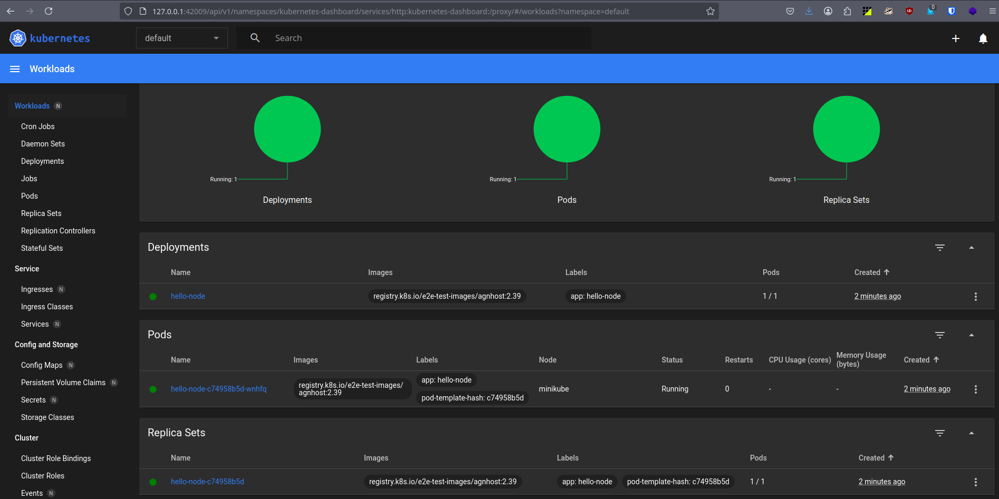
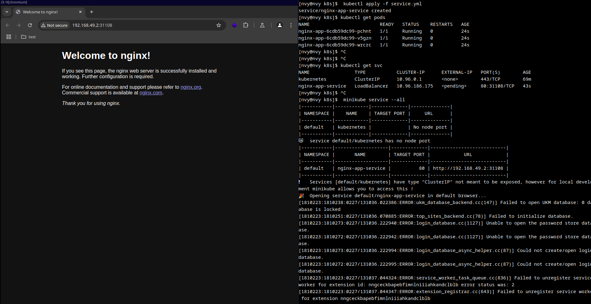
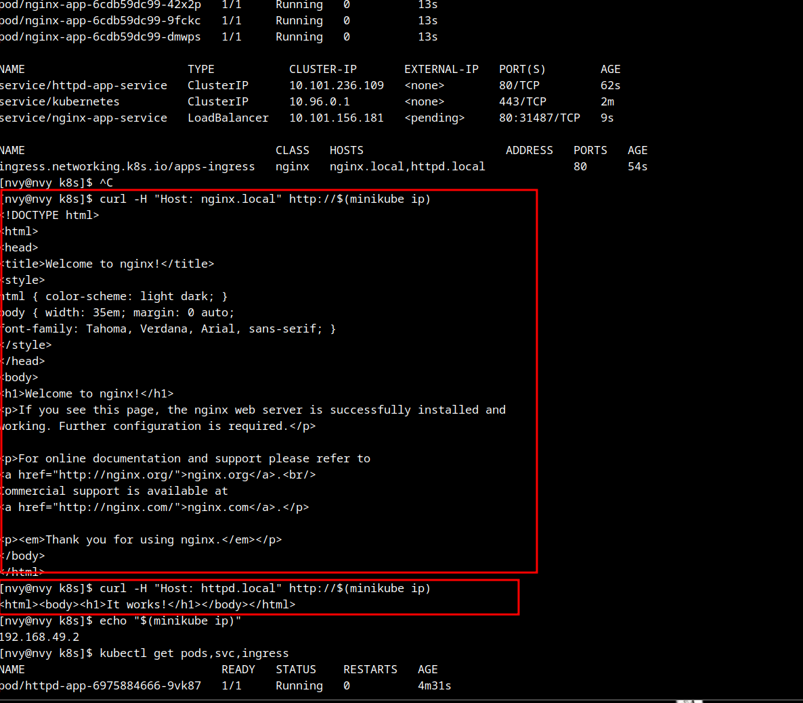

# Task 1

Steps I performed:

1. Started minikube
```bash
$ minikube start
$ minikube dashboard --url
```

2. Created a deployment
```bash
$ kubectl create deployment hello-node --image=registry.k8s.io/e2e-test-images/agnhost:2.39 -- /agnhost netexec --http-port=8080
```

3. Created a service

```bash
$ kubectl expose deployment hello-node --port=8080 --type=LoadBalancer
```

4. Checked the service
```bash
$ kubectl get svc

NAME         TYPE           CLUSTER-IP      EXTERNAL-IP   PORT(S)          AGE
hello-node   LoadBalancer   10.111.180.95   <pending>     8080:30250/TCP   117s
kubernetes   ClusterIP      10.96.0.1       <none>        443/TCP          5m8s
```

5. Checked the pods
```bash
$ kubectl get pods

NAME                         READY   STATUS    RESTARTS   AGE
hello-node-c74958b5d-wnhfq   1/1     Running   0          62s
```

Dashboard view:



6. Minikuber services:
```bash
$ minikube service --all
|-----------|------------|-------------|---------------------------|
| NAMESPACE |    NAME    | TARGET PORT |            URL            |
|-----------|------------|-------------|---------------------------|
| default   | hello-node |        8080 | http://192.168.49.2:30250 |
|-----------|------------|-------------|---------------------------|
|-----------|------------|-------------|--------------|
| NAMESPACE |    NAME    | TARGET PORT |     URL      |
|-----------|------------|-------------|--------------|
| default   | kubernetes |             | No node port |
|-----------|------------|-------------|--------------|
```

7. Cleaned up
```bash
$ kubectl delete deployment hello-node
$ kubectl delete service hello-node
$ minikube stop
```

# Task 2: Declarative Kubernetes Manifests

1. Applied the deployment manifest:
```bash
$ kubectl apply -f deployment.yml

deployment.apps/nginx-app created
```

2. Applied the service manifest:
```bash
$ kubectl apply -f service.yml

service/nginx-app-service created
```

3. Checked the pods status:
```bash
$ kubectl get pods

NAME                         READY   STATUS    RESTARTS   AGE
nginx-app-6cdb59dc99-pchnt   1/1     Running   0          24s
nginx-app-6cdb59dc99-v5gzn   1/1     Running   0          24s
nginx-app-6cdb59dc99-wrcrc   1/1     Running   0          24s
```

4. Checked the services:
```bash
$ kubectl get svc

NAME                TYPE           CLUSTER-IP      EXTERNAL-IP   PORT(S)        AGE
kubernetes          ClusterIP      10.96.0.1       <none>        443/TCP        69m
nginx-app-service   LoadBalancer   10.96.186.175   <pending>     80:31108/TCP   43s
```

5. Get the service URL using minikube:
```bash
$ minikube service --all
|-------------|------------------|-------------|---------------------------|
| NAMESPACE   | NAME             | TARGET PORT | URL                       |
|-------------|------------------|-------------|---------------------------|
| default     | kubernetes       | No node port|                          |
| default     | nginx-app-service| 80          | http://192.168.49.2:31108|
|-------------|------------------|-------------|---------------------------|
```

6. Access the application:
```bash
$ curl http://192.168.49.2:30000
<!DOCTYPE html>
<html>
<head>
<title>Welcome to nginx!</title>
...
</html>
```



# Bonus Task: Additional Configuration and Ingress

1. ingress addon in minikube:
```bash
$ minikube addons enable ingress
$ kubectl wait --namespace ingress-nginx \
  --for=condition=ready pod \
  --selector=app.kubernetes.io/component=controller \
  --timeout=90s
pod/ingress-nginx-controller-56d7c84fd4-tntv7 condition met
```

2. manifests:
```bash
$ kubectl apply -f second-app-deployment.yml
deployment.apps/httpd-app created

$ kubectl apply -f second-app-service.yml
service/httpd-app-service created

# Apply nginx deployment and service
kubectl apply -f deployment.yml
kubectl apply -f service.yml

# Apply httpd deployment and service
kubectl apply -f second-app-deployment.yml
kubectl apply -f second-app-service.yml

# Apply ingress configuration
kubectl apply -f ingress.yml
```

3. DNS entries:
```bash
$ echo "$(minikube ip) nginx.local httpd.local" | sudo tee -a /etc/hosts
192.168.49.2 nginx.local httpd.local
```

4. verified the deployments and services:
```bash
$ kubectl get pods,svc,ingress
NAME                             READY   STATUS    RESTARTS   AGE
pod/httpd-app-6975884666-9vk87   1/1     Running   0          67s
pod/httpd-app-6975884666-whnf8   1/1     Running   0          67s
pod/nginx-app-6cdb59dc99-42x2p   1/1     Running   0          13s
pod/nginx-app-6cdb59dc99-9fckc   1/1     Running   0          13s
pod/nginx-app-6cdb59dc99-dmwps   1/1     Running   0          13s

NAME                        TYPE           CLUSTER-IP       EXTERNAL-IP   PORT(S)        AGE
service/httpd-app-service   ClusterIP      10.101.236.109   <none>        80/TCP         62s
service/kubernetes          ClusterIP      10.96.0.1        <none>        443/TCP        2m
service/nginx-app-service   LoadBalancer   10.101.156.181   <pending>     80:31487/TCP   9s

NAME                                     CLASS   HOSTS                     ADDRESS   PORTS   AGE
ingress.networking.k8s.io/apps-ingress   nginx   nginx.local,httpd.local             80      54s
```

5. tested both applications:
```bash
$ curl -H "Host: nginx.local" http://$(minikube ip)
<!DOCTYPE html>
<html>
<head>
<title>Welcome to nginx!</title>
...
</html>

$ curl -H "Host: httpd.local" http://$(minikube ip)
<html><body><h1>It works!</h1></body></html>
```



