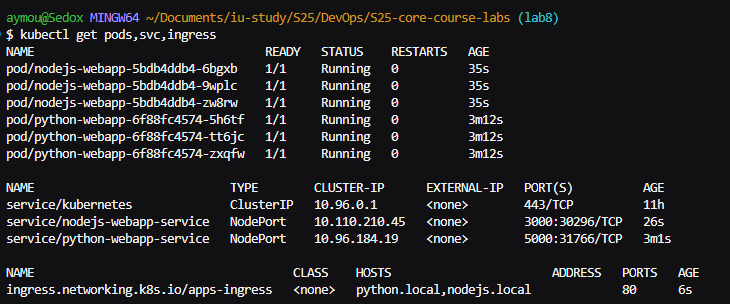
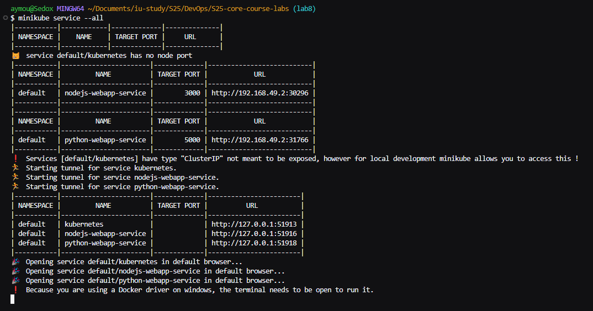
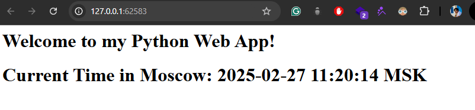
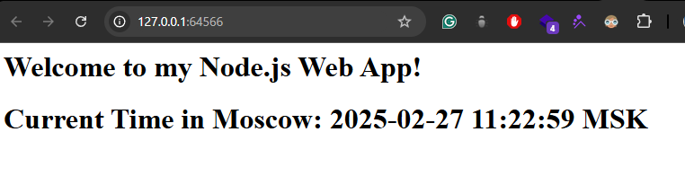

# Kubernetes Deployment Report

## Overview

This document describes the deployment of our applications using Kubernetes on Minikube. We have performed deployments for our Python and Node.js web applications. Additionally, we implemented an Ingress resource for external access.

---

## Task 1: Kubernetes Setup and Basic Deployment

### Step 1: Imperative Deployment

1. **Create Deployment (Python Web App):**
   ```sh
   $ kubectl create deployment python-webapp --image=sedoxxx/python-webapp:latest --replicas=1
   deployment.apps/python-webapp created
   ```
   - This command creates a Deployment named `python-webapp` using the specified image.

2. **Expose the Deployment as a Service:**
   ```sh
   $ kubectl expose deployment python-webapp --type=NodePort --port=5000
   service/python-webapp exposed
   ```
   - The Deployment is exposed via a Service of type NodePort on port 5000.

3. **Get the Application URL via Minikube:**
   ```sh
   $ minikube service python-webapp --url
   http://127.0.0.1:53126
   ```

4. **Verify Pods and Services:**
   ```sh
   $ kubectl get pods,svc
   NAME                                 READY   STATUS    RESTARTS   AGE
   pod/python-webapp-5d9b88594d-9bssg   1/1     Running   0          2m28s

   NAME                    TYPE        CLUSTER-IP       EXTERNAL-IP   PORT(S)          AGE
   service/kubernetes      ClusterIP   10.96.0.1        <none>        443/TCP          11h
   service/python-webapp   NodePort    10.111.198.197   <none>        5000:31919/TCP   109s
   ```

5. **Cleanup Imperative Resources:**
   ```sh
   $ kubectl delete service python-webapp
   service "python-webapp" deleted

   $ kubectl delete deployment python-webapp
   deployment.apps "python-webapp" deleted
   ```
   - Resources created imperatively are now removed.

---

## Task 2: Declarative Kubernetes Manifests

We now deploy our applications using YAML manifests stored in the `k8s` folder.

### Step 2.1: Deploy Python and Node.js Applications Declaratively

1. **Apply Python Deployment Manifest:**
   ```sh
   $ kubectl apply -f k8s/python-deployment.yml 
   deployment.apps/python-webapp created
   ```

2. **Apply Node.js Deployment Manifest:**
   ```sh
   $ kubectl apply -f k8s/nodejs-deployment.yml 
   deployment.apps/nodejs-webapp created
   ```

3. **Apply Python Service Manifest:**
   ```sh
   $ kubectl apply -f k8s/python-service.yml
   service/python-webapp-service created
   ```

4. **Apply Node.js Service Manifest:**
   ```sh
   $ kubectl apply -f k8s/nodejs-service.yml
   service/nodejs-webapp-service created
   ```

5. **Apply Ingress Manifest:**
   ```sh
   $ kubectl apply -f k8s/ingress.yml 
   ingress.networking.k8s.io/apps-ingress created
   ```
   - The bonus task was completed by adding an Ingress resource to expose both applications.

6. **Verify All Resources:**
   ```sh
   $ kubectl get pods,svc,ingress
   NAME                                 READY   STATUS    RESTARTS   AGE
   pod/nodejs-webapp-5bdb4ddb4-6bgxb    1/1     Running   0          35s
   pod/nodejs-webapp-5bdb4ddb4-9wplc    1/1     Running   0          35s
   pod/nodejs-webapp-5bdb4ddb4-zw8rw    1/1     Running   0          35s
   pod/python-webapp-6f88fc4574-5h6tf   1/1     Running   0          3m12s
   pod/python-webapp-6f88fc4574-tt6jc   1/1     Running   0          3m12s
   pod/python-webapp-6f88fc4574-zxqfw   1/1     Running   0          3m12s

   NAME                            TYPE        CLUSTER-IP      EXTERNAL-IP   PORT(S)          AGE      
   service/kubernetes              ClusterIP   10.96.0.1       <none>        443/TCP          11h      
   service/nodejs-webapp-service   NodePort    10.110.210.45   <none>        3000:30296/TCP   26s      
   service/python-webapp-service   NodePort    10.96.184.19    <none>        5000:31766/TCP   3m1s      

   NAME                                     CLASS    HOSTS                       ADDRESS   PORTS   AGE 
   ingress.networking.k8s.io/apps-ingress   <none>   python.local,nodejs.local             80      6s  
   ```
   - This output confirms that our deployments, services, and ingress are all running correctly.

7. **List All Minikube Service URLs:**
   ```sh
   $ minikube service --all
   |-----------|------------|-------------|--------------|
   | NAMESPACE |    NAME    | TARGET PORT |     URL      |
   |-----------|------------|-------------|--------------|
   | default   | kubernetes |             | No node port |
   |-----------|------------|-------------|--------------|
   😿  service default/kubernetes has no node port
   |-----------|-----------------------|-------------|---------------------------|
   | NAMESPACE |         NAME          | TARGET PORT |            URL            |
   |-----------|-----------------------|-------------|---------------------------|
   | default   | nodejs-webapp-service |        3000 | http://192.168.49.2:30296 |
   |-----------|-----------------------|-------------|---------------------------|
   |-----------|-----------------------|-------------|---------------------------|
   | NAMESPACE |         NAME          | TARGET PORT |            URL            |
   |-----------|-----------------------|-------------|---------------------------|
   | default   | python-webapp-service |        5000 | http://192.168.49.2:31766 |
   |-----------|-----------------------|-------------|---------------------------|
   ❗  Services [default/kubernetes] have type "ClusterIP" not meant to be exposed, however for local development minikube allows you to access this !
   🏃  Starting tunnel for service kubernetes.
   🏃  Starting tunnel for service nodejs-webapp-service.
   🏃  Starting tunnel for service python-webapp-service.
   |-----------|-----------------------|-------------|------------------------|
   | NAMESPACE |         NAME          | TARGET PORT |          URL           |
   |-----------|-----------------------|-------------|------------------------|
   | default   | kubernetes            |             | http://127.0.0.1:64563 |
   | default   | nodejs-webapp-service |             | http://127.0.0.1:64566 |
   | default   | python-webapp-service |             | http://127.0.0.1:64569 |
   |-----------|-----------------------|-------------|------------------------|
   🎉  Opening service default/kubernetes in default browser...
   🎉  Opening service default/nodejs-webapp-service in default browser...
   🎉  Opening service default/python-webapp-service in default browser...
   ```

---

## Screenshots

Place your screenshots in a folder (e.g., `k8s/screenshots`) and update the paths below:

- **Kubectl Output:**  
  

- **Minikube Service URLs:**  
  

- **Python App:**  
  

- **Node.js App:**  
  

---

## Bonus Task: Additional Configuration and Ingress

### Extra Application Manifests

We also deployed our Node.js application using declarative manifests.

- **Node.js Deployment and Service Manifests:**  
  The files `nodejs-deployment.yml` and `nodejs-service.yml` were applied as shown above.

### Ingress Configuration

- **Ingress Manifest:**  
  The `ingress.yml` file was applied to expose both applications under the hosts `python.local` and `nodejs.local`.

- **Verification with curl:**
   ```sh
   $ curl -H "Host: python.local" http://$(minikube ip)
   $ curl -H "Host: nodejs.local" http://$(minikube ip)

   ```
    ```
    <h1>Welcome to my Python Web App!</h1><h1>Current Time in Moscow: 2025-02-27 13:45:29 MSK</h1>
    <h1>Welcome to my Node.js Web App!</h1>
    <h1>Current Time in Moscow: 2025-02-27 13:39:53 MSK</h1>
    ```

---

## Cleanup

To clean up all resources, run:
```sh
kubectl delete -f k8s/python-deployment.yml
kubectl delete -f k8s/python-service.yml
kubectl delete -f k8s/nodejs-deployment.yml
kubectl delete -f k8s/nodejs-service.yml
kubectl delete -f k8s/ingress.yml
```

---

## Conclusion

This Kubernetes deployment report documents:
- The imperative deployment process and its outputs.
- The declarative deployment using manifest files for both Python and Node.js applications.
- The integration of an Ingress resource for external access (bonus task).
- Verification outputs from `kubectl` and `minikube service --all`.

Screenshots throughout the process confirm that all services are running correctly and are accessible externally.


