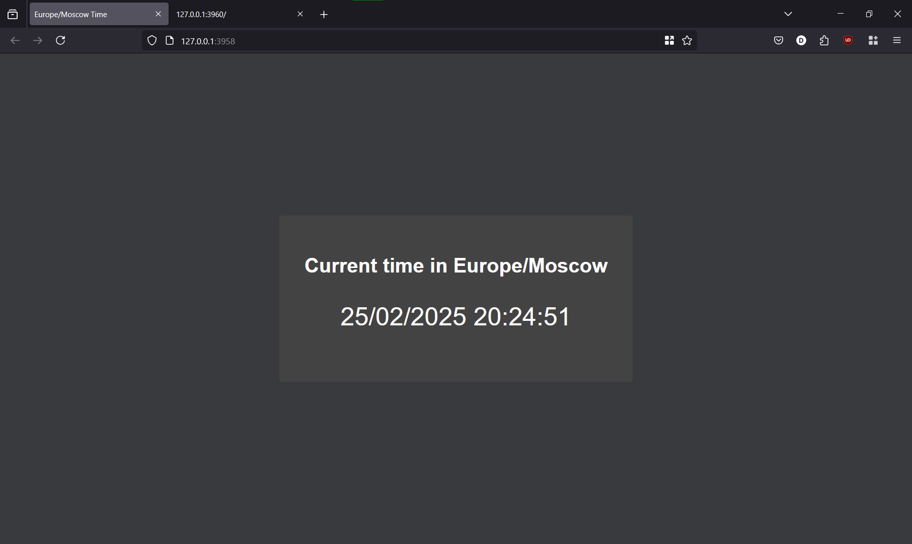

# Kubernetes

## Task 1

### Deploy my Application

```shell
>kubectl create deployment app-python --image=magicwinnie/simple-python-web-app-distroless:latest --port=8000
deployment.apps/app-python created
```

```shell
>kubectl get deployments
NAME         READY   UP-TO-DATE   AVAILABLE   AGE
app-python   1/1     1            1           2m8s
```

### Expose my Application

```bash
>kubectl expose deployment app-python --type=LoadBalancer --port=8000
service/app-python exposed
```

```bash
>minikube service app-python
|-----------|------------|-------------|---------------------------|
| NAMESPACE |    NAME    | TARGET PORT |            URL            |
|-----------|------------|-------------|---------------------------|
| default   | app-python |        8000 | http://192.168.49.2:30955 |
|-----------|------------|-------------|---------------------------|
🏃  Starting tunnel for service app-python.
|-----------|------------|-------------|-----------------------|
| NAMESPACE |    NAME    | TARGET PORT |          URL          |
|-----------|------------|-------------|-----------------------|
| default   | app-python |             | http://127.0.0.1:3093 |
|-----------|------------|-------------|-----------------------|
🎉  Opening service default/app-python in default browser...
❗  Because you are using a Docker driver on windows, the terminal needs to be open to run it.
```

### Info about my Application

```shell
>kubectl get pods,svc
NAME                             READY   STATUS    RESTARTS   AGE
pod/app-python-8bc8f7d97-7fbbz   1/1     Running   0          2m7s

NAME                 TYPE           CLUSTER-IP      EXTERNAL-IP   PORT(S)          AGE
service/app-python   LoadBalancer   10.103.127.26   <pending>     8000:30955/TCP   105s
service/kubernetes   ClusterIP      10.96.0.1       <none>        443/TCP          8m12s
```

### Cleaning Up my Application

```shell
>kubectl delete deployments app-python
deployment.apps "app-python" deleted
```

```shell
>kubectl delete service app-python
service "app-python" deleted
```

## Task 2

### Created Manifest

```shell
>kubectl apply -f k8s
deployment.apps/app-python created
service/app-python-service created
```

```shell
>kubectl get pods,svc
NAME                             READY   STATUS    RESTARTS   AGE
pod/app-python-f6489848c-brrpc   1/1     Running   0          5m26s
pod/app-python-f6489848c-vkzfm   1/1     Running   0          5m26s
pod/app-python-f6489848c-w6zl9   1/1     Running   0          5m26s

NAME                         TYPE        CLUSTER-IP      EXTERNAL-IP   PORT(S)          AGE
service/app-python-service   NodePort    10.100.72.149   <none>        8000:30808/TCP   5m26s
service/kubernetes           ClusterIP   10.96.0.1       <none>        443/TCP          55m
```

### Accessing

```shell
>minikube service --all
|-----------|--------------------|-------------|---------------------------|
| NAMESPACE |        NAME        | TARGET PORT |            URL            |
|-----------|--------------------|-------------|---------------------------|
| default   | app-python-service |        8000 | http://192.168.49.2:30808 |
|-----------|--------------------|-------------|---------------------------|
|-----------|------------|-------------|--------------|
| NAMESPACE |    NAME    | TARGET PORT |     URL      |
|-----------|------------|-------------|--------------|
| default   | kubernetes |             | No node port |
|-----------|------------|-------------|--------------|
😿  service default/kubernetes has no node port
❗  Services [default/kubernetes] have type "ClusterIP" not meant to be exposed, however for local development minikube allows you to access this !
🏃  Starting tunnel for service app-python-service.
🏃  Starting tunnel for service kubernetes.
|-----------|--------------------|-------------|-----------------------|
| NAMESPACE |        NAME        | TARGET PORT |          URL          |
|-----------|--------------------|-------------|-----------------------|
| default   | app-python-service |             | http://127.0.0.1:3958 |
| default   | kubernetes         |             | http://127.0.0.1:3960 |
|-----------|--------------------|-------------|-----------------------|
🎉  Opening service default/app-python-service in default browser...
🎉  Opening service default/kubernetes in default browser...
❗  Because you are using a Docker driver on windows, the terminal needs to be open to run it.
```



## Bonus Task

### Created Manifest for Bonus

```shell
>kubectl apply -f k8s
deployment.apps/app-go created
service/app-go-service created
deployment.apps/app-python unchanged
service/app-python-service unchanged
```

### Enabling Ingress

```shell
>minikube addons enable ingress
💡  ingress is an addon maintained by Kubernetes. For any concerns contact minikube on GitHub.
You can view the list of minikube maintainers at: https://github.com/kubernetes/minikube/blob/master/OWNERS
💡  After the addon is enabled, please run "minikube tunnel" and your ingress resources would be available at "127.0.0.1"
    ▪ Используется образ registry.k8s.io/ingress-nginx/kube-webhook-certgen:v1.4.4
    ▪ Используется образ registry.k8s.io/ingress-nginx/controller:v1.11.3
    ▪ Используется образ registry.k8s.io/ingress-nginx/kube-webhook-certgen:v1.4.4
🔎  Verifying ingress addon...
🌟  The 'ingress' addon is enabled
```

```shell
>kubectl get pods -n ingress-nginx
NAME                                        READY   STATUS      RESTARTS   AGE
ingress-nginx-admission-create-glw2f        0/1     Completed   0          4m55s
ingress-nginx-admission-patch-dgbnj         0/1     Completed   1          4m55s
ingress-nginx-controller-56d7c84fd4-h9qnb   1/1     Running     0          4m55s
```

```shell
>kubectl apply -f k8s
deployment.apps/app-go unchanged
service/app-go-service unchanged
deployment.apps/app-python unchanged
service/app-python-service unchanged
ingress.networking.k8s.io/example-ingress created
```

### Availability Check

I started `minikube tunnel` in other terminal:

```shell
>minikube tunnel
✅  Tunnel successfully started

📌  NOTE: Please do not close this terminal as this process must stay alive for the tunnel to be accessible ...

❗  Access to ports below 1024 may fail on Windows with OpenSSH clients older than v8.1. For more information, see: https://minikube.sigs.k8s.io/docs/handbook/accessing/#access-to-ports-1024-on-windows-requires-root-permission
🏃  Starting tunnel for service example-ingress.
```

Then I checked using curl:

```shell
>curl --resolve "app-python.example:80:127.0.0.1" http://app-python.example
<!DOCTYPE html>
<html lang="en">

<head>
    <meta charset="UTF-8">
    <meta name="viewport" content="width=device-width, initial-scale=1.0">
    <title>Europe/Moscow Time</title>
    <link rel="stylesheet" href="/static/css/style.css">
</head>

<body>
    <div class="container">
        <h1 id="time_header">Current time in Europe/Moscow</h1>
        <p id="formatted_time">25/02/2025 20:51:50</p>
    </div>
</body>

</html>
```

```shell
>curl --resolve "app-go.example:80:127.0.0.1" http://app-go.example
<!DOCTYPE html>
<html lang="en">

<head>
    <meta charset="UTF-8">
    <meta name="viewport" content="width=device-width, initial-scale=1.0">
    <title>Age Calculator</title>
    <link rel="stylesheet" href="/static/css/style.css">
</head>

<body>
    <div class="container">
        <h1 id="age-header">Age Calculator</h1>
        <input type="date" id="date" />
        <p id="age-display">Enter date of birth to see the age</p>
    </div>
    <script src="/static/js/script.js"></script>
</body>

</html>
```
