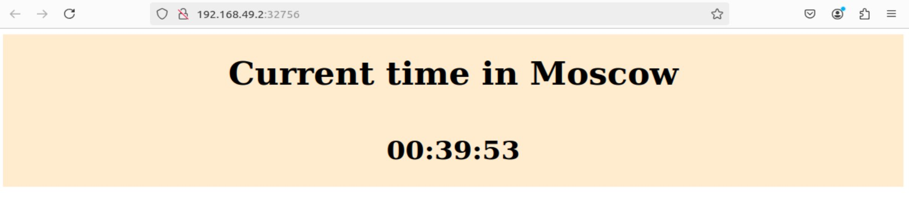

# Kubernetes
## Task 1
**Outputs kubectl get svc, pods**

````
kubectl get svc
NAME         TYPE        CLUSTER-IP      EXTERNAL-IP   PORT(S)        AGE
kubernetes   ClusterIP   10.96.0.1       <none>        443/TCP        19m
my-app       NodePort    10.110.91.119   <none>        80:30870/TCP   15m
````

````
kubectl get pods
NAME                      READY   STATUS    RESTARTS   AGE
my-app-56f7689b79-2cw6s   1/1     Running   0          17m
````
# Task 2: Declarative Kubernetes Manifests

````

minikube service --all
|-----------|------------|-------------|--------------|
| NAMESPACE |    NAME    | TARGET PORT |     URL      |
|-----------|------------|-------------|--------------|
| default   | kubernetes |             | No node port |
|-----------|------------|-------------|--------------|
😿  service default/kubernetes has no node port
|-----------|---------|-------------|---------------------------|
| NAMESPACE |  NAME   | TARGET PORT |            URL            |
|-----------|---------|-------------|---------------------------|
| default   | web-app |        5000 | http://192.168.49.2:32756 |
|-----------|---------|-------------|---------------------------|
❗  Services [default/kubernetes] have type "ClusterIP" not meant to be exposed, however for local development minikube allows you to access this !
🎉  Opening service default/web-app in default browser...
🏃  Starting tunnel for service kubernetes.
Gtk-Message: 00:39:15.835: Not loading module "atk-bridge": The functionality is provided by GTK natively. Please try to not load it.
|-----------|------------|-------------|------------------------|
| NAMESPACE |    NAME    | TARGET PORT |          URL           |
|-----------|------------|-------------|------------------------|
| default   | kubernetes |             | http://127.0.0.1:39855 |
|-----------|------------|-------------|------------------------|
🎉  Opening service default/kubernetes in default browser...
````

````
kubectl get svc
NAME         TYPE        CLUSTER-IP      EXTERNAL-IP   PORT(S)          AGE
kubernetes   ClusterIP   10.96.0.1       <none>        443/TCP          3h11m
web-app      NodePort    10.108.24.235   <none>        5000:32756/TCP   5m21s
````
````
kubectl get pods
NAME                      READY   STATUS    RESTARTS      AGE
web-app-bfcd6b6f9-27qk2   1/1     Running   1 (44m ago)   76m
web-app-bfcd6b6f9-qvl84   1/1     Running   1 (44m ago)   76m
web-app-bfcd6b6f9-t924j   1/1     Running   1 (44m ago)   76m
````
**Screenshot**

