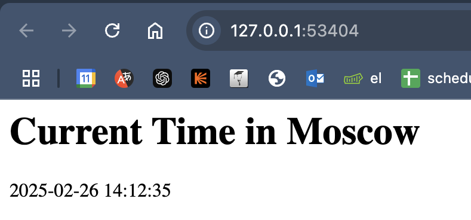
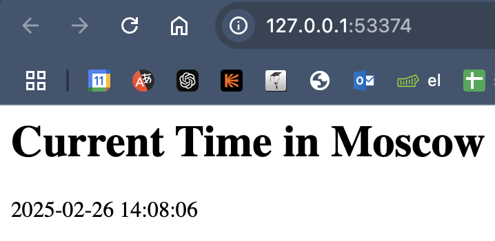
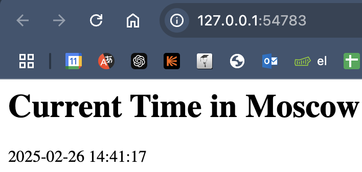
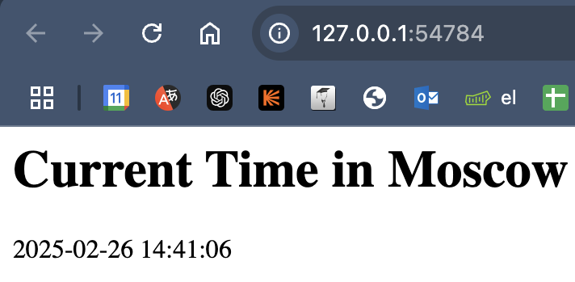

# Kubernetes Lab Report

### **1. Setup and Installation**

### **1.1 Install Required Tools**
To begin, the following tools were installed:
- `kubectl`: Kubernetes command-line tool.
- `minikube`: Local Kubernetes cluster for testing and development.

#### **1.2 Start Minikube**
```sh
minikube start
```
Verify the setup:
```sh
> kubectl get nodes
NAME       STATUS   ROLES           AGE   VERSION
minikube   Ready    control-plane   83m   v1.32.0
```

### **2. Deployment of Applications**

#### **2.1 Deploy Python and JavaScript Applications**
The following deployments were created:
```sh
> kubectl create deployment app-python --image=ramilevna/app_python
kubectl create deployment app-javascript --image=ramilevna/app_javascript
deployment.apps/app-python created
deployment.apps/app-javascript created
```
Check status:
```sh
> kubectl get deployments
kubectl get pods
NAME             READY   UP-TO-DATE   AVAILABLE   AGE
app-javascript   1/1     1            1           15s
app-python       1/1     1            1           15s
NAME                              READY   STATUS        RESTARTS   AGE
app-javascript-7685799c74-p7tm5   1/1     Running       0          15s
app-python-576b4b8bdd-csphp       1/1     Running       0          15s
> kubectl get svc     
NAME             TYPE        CLUSTER-IP       EXTERNAL-IP   PORT(S)          AGE
app-javascript   NodePort    10.108.198.157   <none>        6000:30902/TCP   14m
app-python       NodePort    10.106.126.190   <none>        4000:31943/TCP   14m
kubernetes       ClusterIP   10.96.0.1        <none>        443/TCP          128m
```

#### **2.2 Expose Applications as Services**
```sh
> kubectl expose deployment app-python --type=NodePort --port=4000
kubectl expose deployment app-javascript --type=NodePort --port=6000
service/app-python exposed
service/app-javascript exposed
```
Retrieve the service URLs:
```sh
> minikube service app-python --url
http://127.0.0.1:53374
```
```sh
> minikube service app-javascript --url
http://127.0.0.1:53404
```



Deleted everything:
```bash
> kubectl delete deployment app-python app-javascript
kubectl delete svc app-python app-javascript
deployment.apps "app-python" deleted
deployment.apps "app-javascript" deleted
service "app-python" deleted
service "app-javascript" deleted
```
### **3. Declarative Configuration Using YAML**

#### **3.1 Deployment Manifest (`deployment.yml`)**

Apply the manifest:
```sh
> kubectl apply -f deployment.yml 
deployment.apps/app-python created
deployment.apps/app-javascript created
```
#### **3.2 Service Manifest (`service.yml`)**

Apply the services:
```sh
> kubectl apply -f service.yml
service/app-python created
service/app-javascript created
```
### **4. Ingress Configuration, Bonus**
#### **4.1 Enable Ingress in Minikube**
```sh
> minikube addons enable ingress
💡  ingress is an addon maintained by Kubernetes. For any concerns contact minikube on GitHub.
You can view the list of minikube maintainers at: https://github.com/kubernetes/minikube/blob/master/OWNERS
💡  After the addon is enabled, please run "minikube tunnel" and your ingress resources would be available at "127.0.0.1"
    ▪ Используется образ registry.k8s.io/ingress-nginx/controller:v1.11.3
    ▪ Используется образ registry.k8s.io/ingress-nginx/kube-webhook-certgen:v1.4.4
    ▪ Используется образ registry.k8s.io/ingress-nginx/kube-webhook-certgen:v1.4.4
🔎  Verifying ingress addon...
🌟  The 'ingress' addon is enabled
```
#### **4.2 Ingress Manifest (`ingress.yml`)**
Apply the ingress configuration:
```sh
> kubectl apply -f ingress.yml
ingress.networking.k8s.io/app-ingress created
```
Verify ingress:
```sh
> kubectl get ingress
NAME          CLASS   HOSTS                                   ADDRESS        PORTS   AGE
app-ingress   nginx   app-python.local,app-javascript.local   192.168.49.2   80      38s
```
#### **Verification and Results**
Check status:
```bash
> kubectl get pods,svc,deployments,services
NAME                                  READY   STATUS    RESTARTS   AGE
pod/app-javascript-696fd89f8c-l7wmj   1/1     Running   0          5m6s
pod/app-javascript-696fd89f8c-wpd5r   1/1     Running   0          5m6s
pod/app-javascript-696fd89f8c-x5rjh   1/1     Running   0          5m6s
pod/app-python-7f88d94456-4dvq2       1/1     Running   0          5m6s
pod/app-python-7f88d94456-7nj85       1/1     Running   0          5m6s
pod/app-python-7f88d94456-g6bcr       1/1     Running   0          5m6s

NAME                     TYPE        CLUSTER-IP      EXTERNAL-IP   PORT(S)          AGE
service/app-javascript   NodePort    10.109.24.22    <none>        6000:30739/TCP   2m36s
service/app-python       NodePort    10.111.76.162   <none>        4000:31556/TCP   2m36s
service/kubernetes       ClusterIP   10.96.0.1       <none>        443/TCP          145m

NAME                             READY   UP-TO-DATE   AVAILABLE   AGE
deployment.apps/app-javascript   3/3     3            3           5m6s
deployment.apps/app-python       3/3     3            3           5m6s
```
```bash
> minikube service --all
|-----------|----------------|-------------|---------------------------|
| NAMESPACE |      NAME      | TARGET PORT |            URL            |
|-----------|----------------|-------------|---------------------------|
| default   | app-javascript |        6000 | http://192.168.49.2:30739 |
|-----------|----------------|-------------|---------------------------|
|-----------|------------|-------------|---------------------------|
| NAMESPACE |    NAME    | TARGET PORT |            URL            |
|-----------|------------|-------------|---------------------------|
| default   | app-python |        4000 | http://192.168.49.2:31556 |
|-----------|------------|-------------|---------------------------|
|-----------|------------|-------------|--------------|
| NAMESPACE |    NAME    | TARGET PORT |     URL      |
|-----------|------------|-------------|--------------|
| default   | kubernetes |             | No node port |
|-----------|------------|-------------|--------------|
😿  service default/kubernetes has no node port
❗  Services [default/kubernetes] have type "ClusterIP" not meant to be exposed, however for local development minikube allows you to access this !
🏃  Starting tunnel for service app-javascript.
🏃  Starting tunnel for service app-python.
🏃  Starting tunnel for service kubernetes.
|-----------|----------------|-------------|------------------------|
| NAMESPACE |      NAME      | TARGET PORT |          URL           |
|-----------|----------------|-------------|------------------------|
| default   | app-javascript |             | http://127.0.0.1:54783 |
| default   | app-python     |             | http://127.0.0.1:54784 |
| default   | kubernetes     |             | http://127.0.0.1:54787 |
|-----------|----------------|-------------|------------------------|
🎉  Opening service default/app-javascript in default browser...
🎉  Opening service default/app-python in default browser...
🎉  Opening service default/kubernetes in default browser...
❗  Because you are using a Docker driver on darwin, the terminal needs to be open to run it.
```


