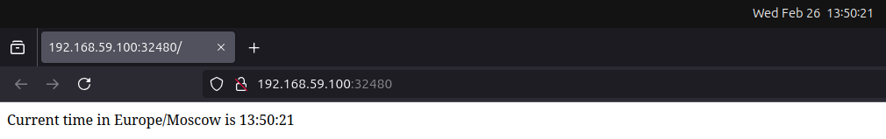
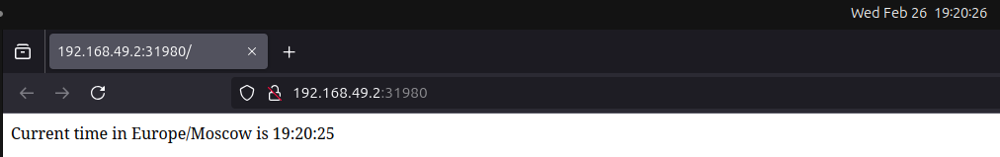

# Kubernetes

## Task 1

In this task I:

- Installed `kubectl` and `minikube`;
- Started `minikube`:
```sh
(venv) vm@vm ~/U/L/P/D/S25-core-course-labs (lab9)> minikube start
😄  minikube v1.35.0 on Ubuntu 24.04
✨  Using the virtualbox driver based on existing profile
👍  Starting "minikube" primary control-plane node in "minikube" cluster
🔄  Restarting existing virtualbox VM for "minikube" ...
🐳  Preparing Kubernetes v1.32.0 on Docker 27.4.0 ...
🔗  Configuring bridge CNI (Container Networking Interface) ...
🔎  Verifying Kubernetes components...
    ▪ Using image gcr.io/k8s-minikube/storage-provisioner:v5
🌟  Enabled addons: default-storageclass, storage-provisioner
🏄  Done! kubectl is now configured to use "minikube" cluster and "default" namespace by default
```
- Created `Deployment` resource for my app:
```sh
(venv) vm@vm /m/v/d/h/V/U/L/P/D/S/k8s (lab9)> kubectl create deployment python-app --image=voronm1522/devops:python-app eployment.apps/python-app created
(venv) vm@vm /m/v/d/h/V/U/L/P/D/S/k8s (lab9)> kubectl get deployments.apps 
NAME         READY   UP-TO-DATE   AVAILABLE   AGE
python-app   1/1     1            1           45s
```
- Created `ervice` for this resourse:
```sh
(venv) vm@vm /m/v/d/h/V/U/L/P/D/S/k8s (lab9)> kubectl expose deployment python-app --port=5000 --type=LoadBalancer
service/python-app exposed
(venv) vm@vm /m/v/d/h/V/U/L/P/D/S/k8s (lab9)> kubectl get service
NAME         TYPE           CLUSTER-IP    EXTERNAL-IP   PORT(S)          AGE
kubernetes   ClusterIP      10.96.0.1     <none>        443/TCP          62m
python-app   LoadBalancer   10.107.1.18   <pending>     5000:32480/TCP   3s
```
- Checked availability:
```sh
(venv) vm@vm /m/v/d/h/V/U/L/P/D/S/k8s (lab9) [0|115]> minikube service python-app
|-----------|------------|-------------|-----------------------------|
| NAMESPACE |    NAME    | TARGET PORT |             URL             |
|-----------|------------|-------------|-----------------------------|
| default   | python-app |        5000 | http://192.168.59.100:32480 |
|-----------|------------|-------------|-----------------------------|
🎉  Opening service default/python-app in default browser...
```

- Cleaned:
```sh
(venv) vm@vm /m/v/d/h/V/U/L/P/D/S/k8s (lab9) [0|14]> kubectl delete service python-app
service "python-app" deleted
(venv) vm@vm /m/v/d/h/V/U/L/P/D/S/k8s (lab9)> kubectl get services 
NAME         TYPE        CLUSTER-IP   EXTERNAL-IP   PORT(S)   AGE
kubernetes   ClusterIP   10.96.0.1    <none>        443/TCP   152m
(venv) vm@vm /m/v/d/h/V/U/L/P/D/S/k8s (lab9)> kubectl delete deployment python-app
deployment.apps "python-app" deleted
(venv) vm@vm /m/v/d/h/V/U/L/P/D/S/k8s (lab9)> kubectl get deployments
No resources found in default namespace.
```

- Asked output:
```sh
(venv) vm@vm /m/v/d/h/V/U/L/P/D/S/k8s (lab9)> kubectl get pods,svc
NAME                             READY   STATUS    RESTARTS   AGE
pod/python-app-b88468c57-bbtpv   1/1     Running   0          57s

NAME                 TYPE           CLUSTER-IP      EXTERNAL-IP   PORT(S)          AGE
service/kubernetes   ClusterIP      10.96.0.1       <none>        443/TCP          3h12m
service/python-app   LoadBalancer   10.102.41.188   <pending>     5000:30393/TCP   45s
```

## Task 2

In this task I:

- Created `python-app/deployment.yml` and applied it:
```sh
(venv) vm@vm /m/v/d/h/V/U/L/P/D/S/k8s (lab9)> kubectl apply -f python-app/deployment.yml
deployment.apps/python-app created
(venv) vm@vm /m/v/d/h/V/U/L/P/D/S/k8s (lab9)> kubectl get deployments
NAME         READY   UP-TO-DATE   AVAILABLE   AGE
python-app   3/3     3            0           4s
```
- Created `python-app/service.yml` and applied it:
```sh
vm@vm /m/v/d/h/V/U/L/P/D/S/k8s (lab9)> kubectl apply -f python-app/service.yml
service/python-app-service created
vm@vm /m/v/d/h/V/U/L/P/D/S/k8s (lab9)> kubectl get services
NAME                 TYPE           CLUSTER-IP     EXTERNAL-IP   PORT(S)          AGE
kubernetes           ClusterIP      10.96.0.1      <none>        443/TCP          12m
python-app-service   LoadBalancer   10.106.52.47   <pending>     5000:31980/TCP   2s
vm@vm /m/v/d/h/V/U/L/P/D/S/k8s (lab9)> minikube service python-app-service
|-----------|--------------------|-------------|---------------------------|
| NAMESPACE |        NAME        | TARGET PORT |            URL            |
|-----------|--------------------|-------------|---------------------------|
| default   | python-app-service |        5000 | http://192.168.49.2:31980 |
|-----------|--------------------|-------------|---------------------------|
🎉  Opening service default/python-app-service in default browser...
```
- Checked availability:

- Asked output:
```sh
vm@vm /m/v/d/h/V/U/L/P/D/S/k8s (lab9)> kubectl get pods,svc
NAME                              READY   STATUS    RESTARTS   AGE
pod/python-app-5989f4654b-h96kf   1/1     Running   0          16m
pod/python-app-5989f4654b-jkdn7   1/1     Running   0          16m
pod/python-app-5989f4654b-snvxz   1/1     Running   0          16m

NAME                         TYPE           CLUSTER-IP     EXTERNAL-IP   PORT(S)          AGE
service/kubernetes           ClusterIP      10.96.0.1      <none>        443/TCP          16m
service/python-app-service   LoadBalancer   10.106.52.47   <pending>     5000:31980/TCP   3m53s
vm@vm /m/v/d/h/V/U/L/P/D/S/k8s (lab9)> minikube service --all
|-----------|------------|-------------|--------------|
| NAMESPACE |    NAME    | TARGET PORT |     URL      |
|-----------|------------|-------------|--------------|
| default   | kubernetes |             | No node port |
|-----------|------------|-------------|--------------|
😿  service default/kubernetes has no node port
|-----------|--------------------|-------------|---------------------------|
| NAMESPACE |        NAME        | TARGET PORT |            URL            |
|-----------|--------------------|-------------|---------------------------|
| default   | python-app-service |        5000 | http://192.168.49.2:31980 |
|-----------|--------------------|-------------|---------------------------|
❗  Services [default/kubernetes] have type "ClusterIP" not meant to be exposed, however for local development minikube allows you to access this !
🎉  Opening service default/python-app-service in default browser...
🏃  Starting tunnel for service kubernetes.
Gtk-Message: 19:24:12.652: Not loading module "atk-bridge": The functionality is provided by GTK natively. Please try to not load it.
[27197, Main Thread] WARNING: GTK+ module /snap/firefox/5783/gnome-platform/usr/lib/gtk-2.0/modules/libcanberra-gtk-module.so cannot be loaded.
GTK+ 2.x symbols detected. Using GTK+ 2.x and GTK+ 3 in the same process is not supported.: 'glib warning', file /build/firefox/parts/firefox/build/toolkit/xre/nsSigHandlers.cpp:201

(firefox_firefox:27197): Gtk-WARNING **: 19:24:12.697: GTK+ module /snap/firefox/5783/gnome-platform/usr/lib/gtk-2.0/modules/libcanberra-gtk-module.so cannot be loaded.
GTK+ 2.x symbols detected. Using GTK+ 2.x and GTK+ 3 in the same process is not supported.
Gtk-Message: 19:24:12.697: Failed to load module "canberra-gtk-module"
[27197, Main Thread] WARNING: GTK+ module /snap/firefox/5783/gnome-platform/usr/lib/gtk-2.0/modules/libcanberra-gtk-module.so cannot be loaded.
GTK+ 2.x symbols detected. Using GTK+ 2.x and GTK+ 3 in the same process is not supported.: 'glib warning', file /build/firefox/parts/firefox/build/toolkit/xre/nsSigHandlers.cpp:201

(firefox_firefox:27197): Gtk-WARNING **: 19:24:12.698: GTK+ module /snap/firefox/5783/gnome-platform/usr/lib/gtk-2.0/modules/libcanberra-gtk-module.so cannot be loaded.
GTK+ 2.x symbols detected. Using GTK+ 2.x and GTK+ 3 in the same process is not supported.
Gtk-Message: 19:24:12.698: Failed to load module "canberra-gtk-module"
|-----------|------------|-------------|------------------------|
| NAMESPACE |    NAME    | TARGET PORT |          URL           |
|-----------|------------|-------------|------------------------|
| default   | kubernetes |             | http://127.0.0.1:41667 |
|-----------|------------|-------------|------------------------|
🎉  Opening service default/kubernetes in default browser...
❗  Because you are using a Docker driver on linux, the terminal needs to be open to run it.
Gtk-Message: 19:24:13.843: Not loading module "atk-bridge": The functionality is provided by GTK natively. Please try to not load it.
[27339, Main Thread] WARNING: GTK+ module /snap/firefox/5783/gnome-platform/usr/lib/gtk-2.0/modules/libcanberra-gtk-module.so cannot be loaded.
GTK+ 2.x symbols detected. Using GTK+ 2.x and GTK+ 3 in the same process is not supported.: 'glib warning', file /build/firefox/parts/firefox/build/toolkit/xre/nsSigHandlers.cpp:201

(firefox_firefox:27339): Gtk-WARNING **: 19:24:13.887: GTK+ module /snap/firefox/5783/gnome-platform/usr/lib/gtk-2.0/modules/libcanberra-gtk-module.so cannot be loaded.
GTK+ 2.x symbols detected. Using GTK+ 2.x and GTK+ 3 in the same process is not supported.
Gtk-Message: 19:24:13.887: Failed to load module "canberra-gtk-module"
[27339, Main Thread] WARNING: GTK+ module /snap/firefox/5783/gnome-platform/usr/lib/gtk-2.0/modules/libcanberra-gtk-module.so cannot be loaded.
GTK+ 2.x symbols detected. Using GTK+ 2.x and GTK+ 3 in the same process is not supported.: 'glib warning', file /build/firefox/parts/firefox/build/toolkit/xre/nsSigHandlers.cpp:201

(firefox_firefox:27339): Gtk-WARNING **: 19:24:13.888: GTK+ module /snap/firefox/5783/gnome-platform/usr/lib/gtk-2.0/modules/libcanberra-gtk-module.so cannot be loaded.
GTK+ 2.x symbols detected. Using GTK+ 2.x and GTK+ 3 in the same process is not supported.
Gtk-Message: 19:24:13.888: Failed to load module "canberra-gtk-module"
^C✋  Stopping tunnel for service kubernetes.
```

## Bonus Task

In this tash I;

- Enabled `ingress`:
```sh
vm@vm /m/v/d/h/V/U/L/P/D/S/k8s (lab9)> minikube addons enable ingress
💡  ingress is an addon maintained by Kubernetes. For any concerns contact minikube on GitHub.
You can view the list of minikube maintainers at: https://github.com/kubernetes/minikube/blob/master/OWNERS
    ▪ Using image registry.k8s.io/ingress-nginx/kube-webhook-certgen:v1.4.4
    ▪ Using image registry.k8s.io/ingress-nginx/controller:v1.11.3
    ▪ Using image registry.k8s.io/ingress-nginx/kube-webhook-certgen:v1.4.4
🔎  Verifying ingress addon...
🌟  The 'ingress' addon is enabled
vm@vm /m/v/d/h/V/U/L/P/D/S/k8s (lab9)> kubectl get pods -n ingress-nginx
NAME                                        READY   STATUS      RESTARTS   AGE
ingress-nginx-admission-create-2qf7d        0/1     Completed   0          96s
ingress-nginx-admission-patch-hh5l2         0/1     Completed   0          96s
ingress-nginx-controller-56d7c84fd4-k4t2z   1/1     Running     0          96s
```
- Created and applied `Deployment` and `Service`:
```sh
vm@vm /m/v/d/h/V/U/L/P/D/S/k8s (lab9)> kubectl apply -f cpp-app/deployment.yml
deployment.apps/cpp-app created
vm@vm /m/v/d/h/V/U/L/P/D/S/k8s (lab9)> kubectl get deployments.apps 
NAME      READY   UP-TO-DATE   AVAILABLE   AGE
cpp-app   3/3     3            0           7s
vm@vm /m/v/d/h/V/U/L/P/D/S/k8s (lab9)> kubectl apply -f cpp-app/service.yml
service/cpp-app-service created
vm@vm /m/v/d/h/V/U/L/P/D/S/k8s (lab9)> kubectl get service
NAME              TYPE           CLUSTER-IP       EXTERNAL-IP   PORT(S)          AGE
cpp-app-service   LoadBalancer   10.110.237.118   <pending>     8080:31316/TCP   9s
kubernetes        ClusterIP      10.96.0.1        <none>        443/TCP          9m52s
vm@vm /m/v/d/h/V/U/L/P/D/S/k8s (lab9)> minikube service cpp-app-service
|-----------|-----------------|-------------|---------------------------|
| NAMESPACE |      NAME       | TARGET PORT |            URL            |
|-----------|-----------------|-------------|---------------------------|
| default   | cpp-app-service |        8080 | http://192.168.49.2:31316 |
|-----------|-----------------|-------------|---------------------------|
🎉  Opening service default/cpp-app-service in default browser...
```
- Created and applied `Ingess`
```sh
vm@vm /m/v/d/h/V/U/L/P/D/S/k8s (lab9)> kubectl apply -f cpp-app/ingress.yml 
ingress.networking.k8s.io/cpp-app-ingress created
vm@vm /m/v/d/h/V/U/L/P/D/S/k8s (lab9)> kubectl get ingress
NAME              CLASS   HOSTS         ADDRESS        PORTS   AGE
cpp-app-ingress   nginx   cpp-app.com   192.168.49.2   80      3m1s
```
- Availability check:
```sh
vm@vm /m/v/d/h/V/U/L/P/D/S/k8s (lab9) [6]> curl --resolve "cpp-app.com:80:$( minikube ip )" -i http://cpp-app.com
HTTP/1.1 200 OK
Date: Wed, 26 Feb 2025 23:47:14 GMT
Content-Type: text/plain
Content-Length: 28
Connection: keep-alive

Random number is: 1731514229⏎ 
```
- Required output:
```sh
vm@vm /m/v/d/h/V/U/L/P/D/S/k8s (lab9)> kubectl get pods,svc,ingress
NAME                           READY   STATUS    RESTARTS   AGE
pod/cpp-app-78d9569698-hsx8c   1/1     Running   0          23m
pod/cpp-app-78d9569698-rnmzd   1/1     Running   0          23m
pod/cpp-app-78d9569698-zm4sm   1/1     Running   0          23m

NAME                      TYPE        CLUSTER-IP      EXTERNAL-IP   PORT(S)          AGE
service/cpp-app-service   NodePort    10.110.58.110   <none>        8080:32245/TCP   10m
service/kubernetes        ClusterIP   10.96.0.1       <none>        443/TCP          102m

NAME                                        CLASS   HOSTS         ADDRESS        PORTS   AGE
ingress.networking.k8s.io/cpp-app-ingress   nginx   cpp-app.com   192.168.49.2   80      10m

```
