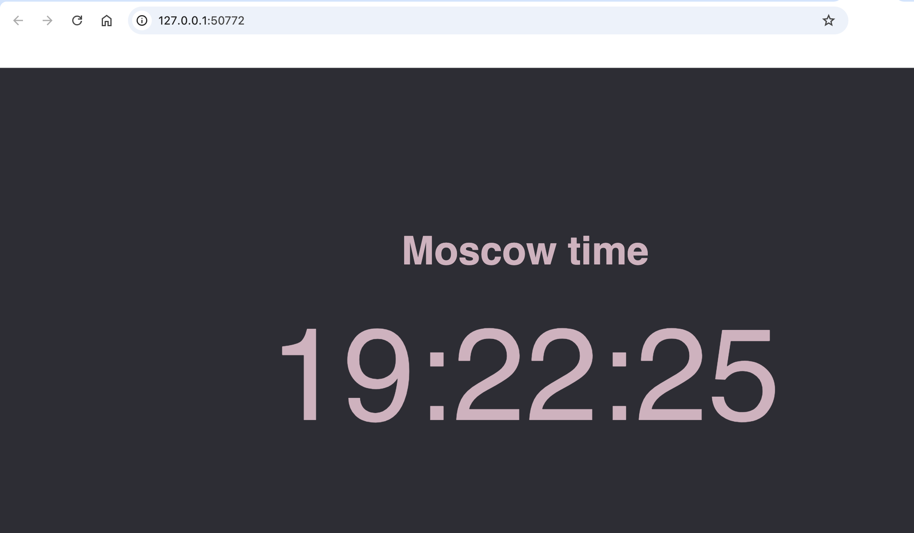
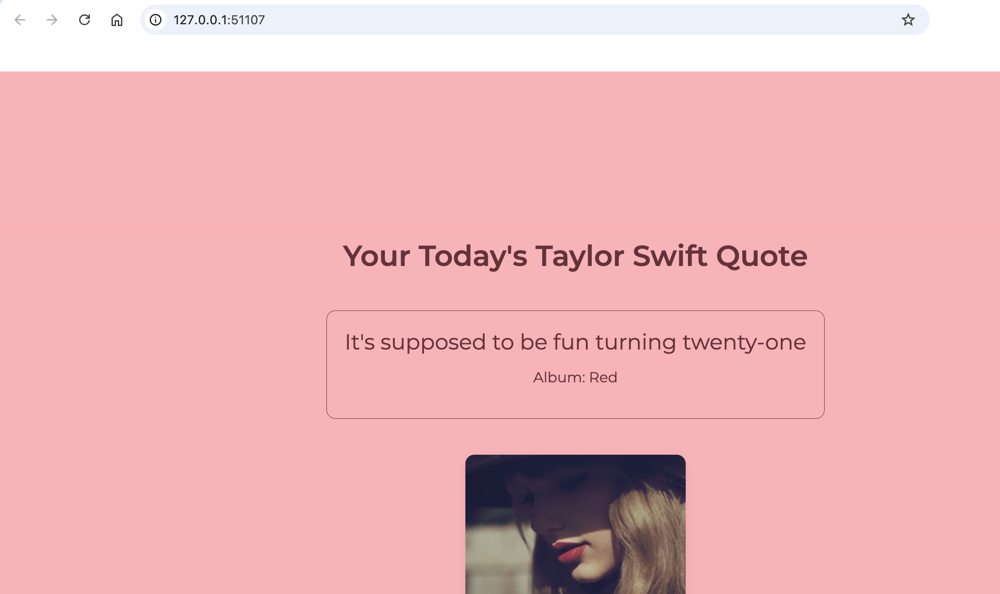

# Lab 9 + bonus

# Kubernetes Deployment

## Task 1: Output of `kubectl get pods,svc`

```bash
kubectl get pods,svc
NAME                              READY   STATUS    RESTARTS   AGE
pod/app-python-5656f5cb54-j4fb6   1/1     Running   0          41m

NAME                         TYPE           CLUSTER-IP     EXTERNAL-IP   PORT(S)          AGE
service/app-python           LoadBalancer   10.100.6.1     127.0.0.1     5000:32691/TCP   62m
service/app-python-service   LoadBalancer   10.96.83.123   127.0.0.1     80:30801/TCP     54m
service/kubernetes           ClusterIP      10.96.0.1      <none>        443/TCP          2d17h
```

---

## Task 2: Scaling to 3 Replicas

### Output of `kubectl get pods,svc` After Scaling

```bash
kubectl get pods,svc
NAME                              READY   STATUS              RESTARTS   AGE
pod/app-python-5656f5cb54-5xmjp   1/1     Running             0          4s
pod/app-python-5656f5cb54-j4fb6   1/1     Running             0          38m
pod/app-python-5656f5cb54-wjfmz   0/1     ContainerCreating   0          4s

NAME                         TYPE           CLUSTER-IP     EXTERNAL-IP   PORT(S)          AGE
service/app-python           LoadBalancer   10.100.6.1     127.0.0.1     5000:32691/TCP   59m
service/app-python-service   LoadBalancer   10.96.83.123   127.0.0.1     80:30801/TCP     52m
service/kubernetes           ClusterIP      10.96.0.1      <none>        443/TCP          2d17h
```

---

## Cleanup

```bash
kubectl delete deployment app-python
deployment.apps "app-python" deleted

kubectl delete service app-python
service.apps "app-python" deleted
```

---

## Starting 3 Replicas

### Output of `minikube service --all`

```bash
minikube service --all
|-----------|------------|-------------|---------------------------|
| NAMESPACE |    NAME    | TARGET PORT |            URL            |
|-----------|------------|-------------|---------------------------|
| default   | app-python |        5000 | http://192.168.49.2:32691 |
|-----------|------------|-------------|---------------------------|
|-----------|--------------------|-------------|---------------------------|
| NAMESPACE |        NAME        | TARGET PORT |            URL            |
|-----------|--------------------|-------------|---------------------------|
| default   | app-python-service |          80 | http://192.168.49.2:30801 |
|-----------|--------------------|-------------|---------------------------|
|-----------|------------|-------------|--------------|
| NAMESPACE |    NAME    | TARGET PORT |     URL      |
|-----------|------------|-------------|--------------|
| default   | kubernetes |             | No node port |
|-----------|------------|-------------|--------------|
😿  service default/kubernetes has no node port
❗  Services [default/kubernetes] have type "ClusterIP" not meant to be exposed, however for local development minikube allows you to access this !
🏃  Starting tunnel for service app-python.
🏃  Starting tunnel for service app-python-service.
🏃  Starting tunnel for service kubernetes.
|-----------|--------------------|-------------|------------------------|
| NAMESPACE |        NAME        | TARGET PORT |          URL           |
|-----------|--------------------|-------------|------------------------|
| default   | app-python         |             | http://127.0.0.1:50770 |
| default   | app-python-service |             | http://127.0.0.1:50772 |
| default   | kubernetes         |             | http://127.0.0.1:50774 |
|-----------|--------------------|-------------|------------------------|
🎉  Opening service default/app-python in default browser...
🎉  Opening service default/app-python-service in default browser...
🎉  Opening service default/kubernetes in default browser...
❗  Because you are using a Docker driver on darwin, the terminal needs to be open to run it.
```

---

## Manifest Application

```bash
kubectl apply -f k8s
deployment.apps/app-python created
service/app-python-service unchanged
```

---

## Checking Python App Availability

### Browser Screenshot



### `curl` Output

```bash
curl http://127.0.0.1:80
<!DOCTYPE HTML>
<html lang="en">

<head>
    <meta charset="UTF-8">
    <meta name="viewport" content="width=device-width, initial-scale=1.0">
    <title>Moscow Time</title>
    <link rel="stylesheet" href="/static/style.css">
</head>

<body>
    <h1>Moscow time</h1>
    <p>18:44:30</p>
</body>

</html>
```

---

## Adding Java App

### Output of `kubectl get pods,svc`

```bash
kubectl get pods
NAME                          READY   STATUS    RESTARTS   AGE
app-java-7676fbc894-52jbm     1/1     Running   0          4m8s
app-java-7676fbc894-9xkwj     1/1     Running   0          9m42s
app-python-5656f5cb54-rk4vx   1/1     Running   0          18m

kubectl get svc
NAME                 TYPE           CLUSTER-IP     EXTERNAL-IP   PORT(S)        AGE
app-java-service     LoadBalancer   10.97.39.154   127.0.0.1     80:30463/TCP   12m
app-python-service   LoadBalancer   10.96.83.123   127.0.0.1     80:30801/TCP   78m
kubernetes           ClusterIP      10.96.0.1      <none>        443/TCP        2d18h
```

---

## Checking Java App Availability

### Browser Screenshot



### `curl` Output

```bash
curl http://127.0.0.1:51107
<!DOCTYPE HTML>
<html lang="en">

<head>
    <meta charset="UTF-8">
    <meta name="viewport" content="width=device-width, initial-scale=1.0">
    <title>Random Quote</title>
    <link href="https://fonts.googleapis.com/css2?family=Montserrat:wght@400;600&display=swap" rel="stylesheet">
    <link rel="stylesheet" href="/css/style.css">
</head>

<body>
    <h1>Your Today's Taylor Swift Quote</h1>
    <div class="quote-container">
        <blockquote>Saw you there and I thought oh my god, look at that face, you look like my next mistake!</blockquote>
        <p class="album">Album: 1989</p>
    </div>
    <div class="image-container">
        
    </div>
</body>

</html>
```

---

## Kubernetes Events

```bash
kubectl get events
LAST SEEN   TYPE      REASON              OBJECT                             MESSAGE
6m5s        Normal    Scheduled           pod/app-java-7676fbc894-52jbm      Successfully assigned default/app-java-7676fbc894-52jbm to minikube
6m5s        Normal    Pulling             pod/app-java-7676fbc894-52jbm      Pulling image "mangocandle/app_java"
6m3s        Normal    Pulled              pod/app-java-7676fbc894-52jbm      Successfully pulled image "mangocandle/app_java" in 2.067s (2.067s including waiting). Image size: 203014539 bytes.
6m3s        Normal    Created             pod/app-java-7676fbc894-52jbm      Created container: app-java
6m2s        Normal    Started             pod/app-java-7676fbc894-52jbm      Started container app-java
...
```

---

## Enabling Ingress

```bash
minikube addons enable ingress
💡  ingress is an addon maintained by Kubernetes. For any concerns contact minikube on GitHub.
You can view the list of minikube maintainers at: https://github.com/kubernetes/minikube/blob/master/OWNERS
💡  After the addon is enabled, please run "minikube tunnel" and your ingress resources would be available at "127.0.0.1"
    ▪ Using image registry.k8s.io/ingress-nginx/kube-webhook-certgen:v1.4.4
    ▪ Using image registry.k8s.io/ingress-nginx/controller:v1.11.3
    ▪ Using image registry.k8s.io/ingress-nginx/kube-webhook-certgen:v1.4.4
🔎  Verifying ingress addon...
🌟  The 'ingress' addon is enabled

kubectl get pods -n ingress-nginx
NAME                                        READY   STATUS      RESTARTS   AGE
ingress-nginx-admission-create-9bgt8        0/1     Completed   0          113s
ingress-nginx-admission-patch-vg2xp         0/1     Completed   0          113s
ingress-nginx-controller-56d7c84fd4-52kb8   1/1     Running     0          113s
```
