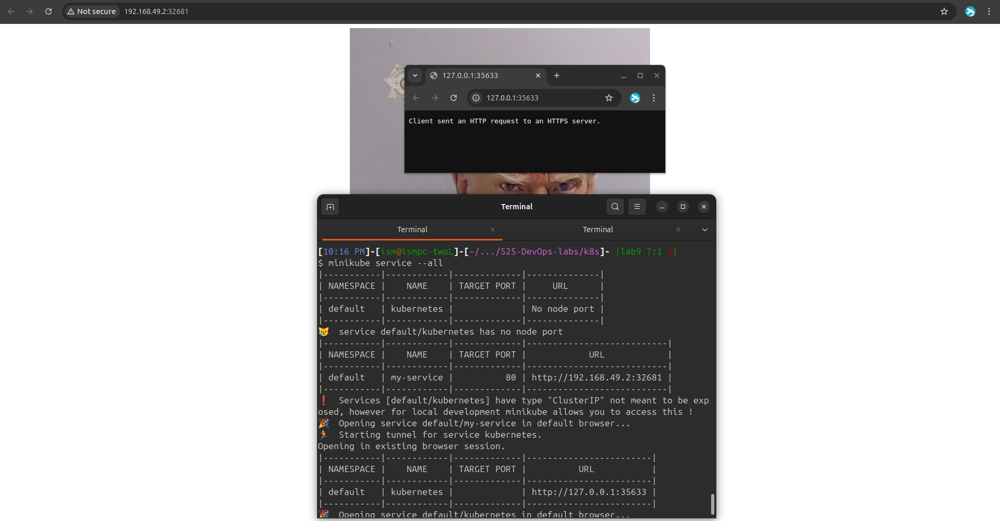

# Kubernetes

## Create deployment

My app cannot run without defining additional env variables, meaning I went straight up to creating `deployment.yml` (Task 2)

Deploying and exposing the app:

```bash
kubectl apply -f deployment.yml,service.yml

minikube service my-service
```

```text
$ kubectl get pods,svc
NAME                                        READY   STATUS    RESTARTS   AGE
pod/app-python-deployment-6b7c796cf-kkjbd   1/1     Running   0          2m11s
pod/app-python-deployment-6b7c796cf-pkfc9   1/1     Running   0          2m11s
pod/app-python-deployment-6b7c796cf-xxhdg   1/1     Running   0          2m11s

NAME                 TYPE           CLUSTER-IP      EXTERNAL-IP   PORT(S)        AGE
service/kubernetes   ClusterIP      10.96.0.1       <none>        443/TCP        76m
service/my-service   LoadBalancer   10.99.208.143   <pending>     80:32681/TCP   2m11s
```

## Result


