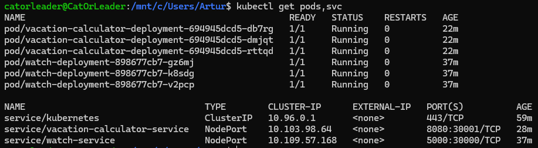
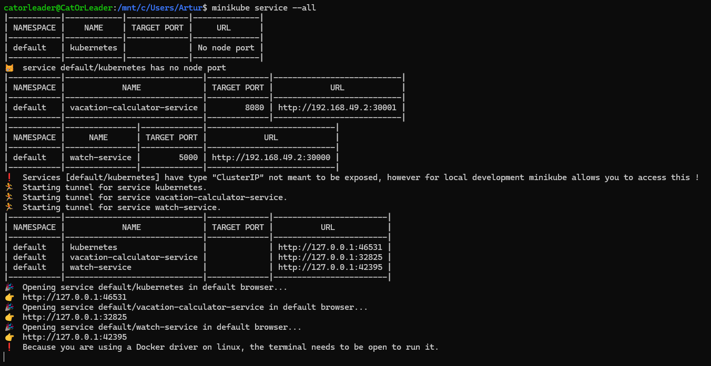
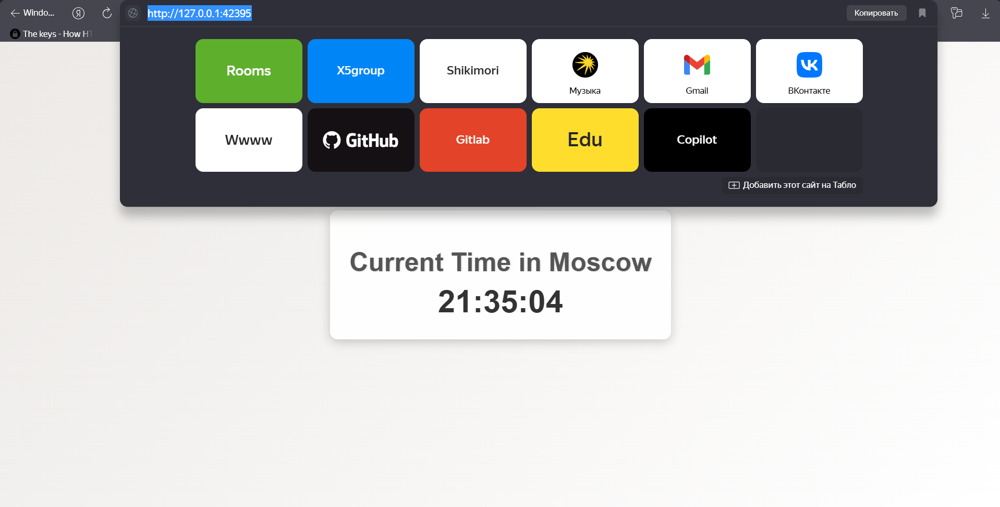
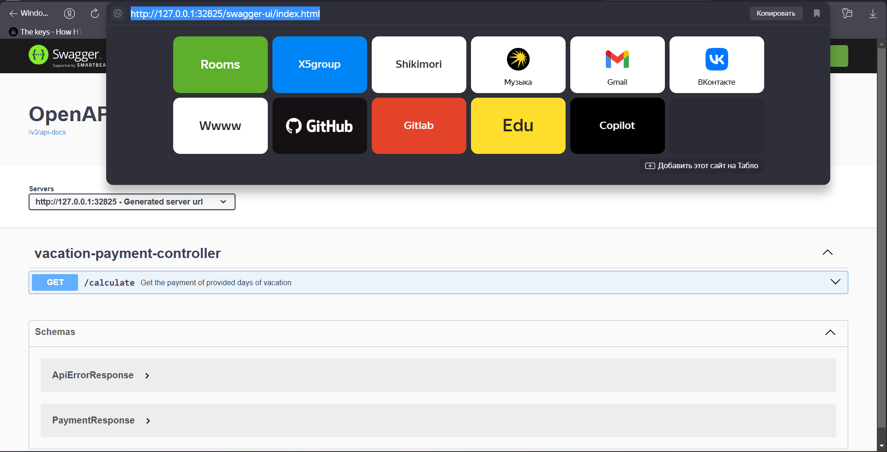
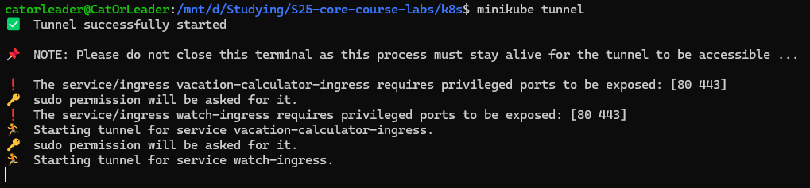
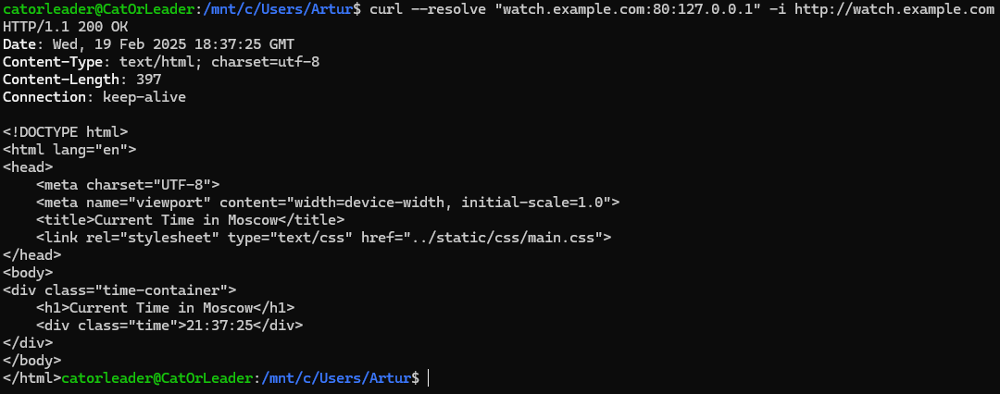
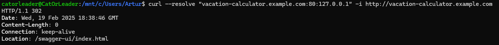

# K8S (finally)

---

## `kubectl get pods,svc`

* Output is mostly the same for the `.yaml` specification, and in-console configuration

---

## `minikube service --all`

### Python Application

### Java Application

---

## Creating ingresses

* Because I use windows (my bad honestly), I need to open terminal opened and `curl` from another terminal

### `minikube tunnel`

### Python Application

* `curl --resolve "watch.example.com:80:127.0.0.1" -i http://watch.example.com`; Host is written by me in
  the `ingress.yaml` files

### Java Application

* `curl --resolve "vacation-calculator.example.com:80:127.0.0.1" -i http://vacation-calculator.example.com`; Host is
  written by me in the `ingress.yaml` files

