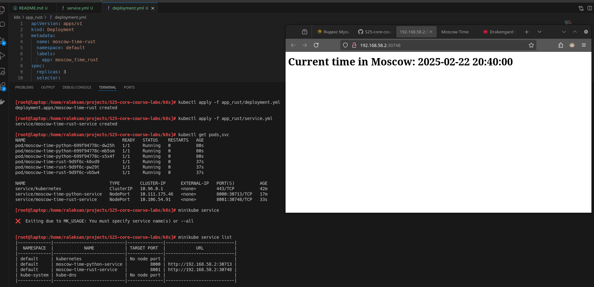
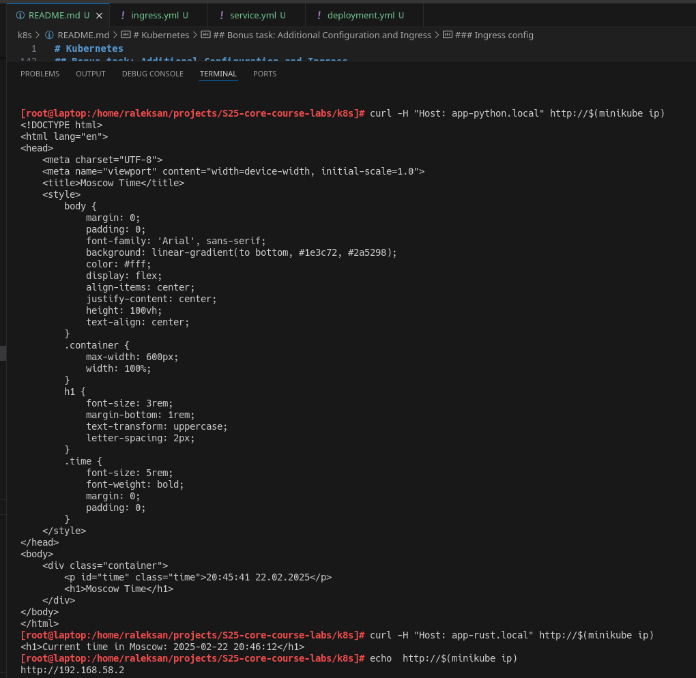

# Kubernetes

## Task 1: Kubernetes Setup and Basic Deployment

Create deployment of `app_python` with commands:

```bash
kubectl create deployment --image raleksan/app_python:v0.1 time-app --port 8000

kubectl expose deployment time-app --type=NodePort --port=8000
```

Console logs:

```bash
[raleksan@laptop:/home/raleksan/projects/S25-core-course-labs]# kubectl create deployment --image raleksan/app_python:v0.1 time-app --port 8000
deployment.apps/time-app created

[raleksan@laptop:/home/raleksan/projects/S25-core-course-labs]# kubectl expose deployment time-app --type=NodePort --port=8000
service/time-app exposed

[raleksan@laptop:/home/raleksan/projects/S25-core-course-labs]#  kubectl get svc
NAME         TYPE        CLUSTER-IP      EXTERNAL-IP   PORT(S)          AGE
kubernetes   ClusterIP   10.96.0.1       <none>        443/TCP          2m39s
time-app     NodePort    10.104.157.62   <none>        8000:30563/TCP   27s

[raleksan@laptop:/home/raleksan/projects/S25-core-course-labs]# minikube service list
|-------------|------------|--------------|---------------------------|
|  NAMESPACE  |    NAME    | TARGET PORT  |            URL            |
|-------------|------------|--------------|---------------------------|
| default     | kubernetes | No node port |                           |
| default     | time-app   |         8000 | http://192.168.58.2:30563 |
| kube-system | kube-dns   | No node port |                           |
|-------------|------------|--------------|---------------------------|

[raleksan@laptop:/home/raleksan/projects/S25-core-course-labs]# curl http://192.168.58.2:30563
<!DOCTYPE html>
<html lang="en">
<head>
    <meta charset="UTF-8">
    <meta name="viewport" content="width=device-width, initial-scale=1.0">
    <title>Moscow Time</title>
    <style>
        body {
            margin: 0;
            padding: 0;
            font-family: 'Arial', sans-serif;
            background: linear-gradient(to bottom, #1e3c72, #2a5298);
            color: #fff;
            display: flex;
            align-items: center;
            justify-content: center;
            height: 100vh;
            text-align: center;
        }
        .container {
            max-width: 600px;
            width: 100%;
        }
        h1 {
            font-size: 3rem;
            margin-bottom: 1rem;
            text-transform: uppercase;
            letter-spacing: 2px;
        }
        .time {
            font-size: 5rem;
            font-weight: bold;
            margin: 0;
            padding: 0;
        }
    </style>
</head>
<body>
    <div class="container">
        <p id="time" class="time">20:07:30 22.02.2025</p>
        <h1>Moscow Time</h1>
    </div>
</body>
</html>
```

Get information about `kubernetes` pods:

```bash
[raleksan@laptop:/home/raleksan/projects/S25-core-course-labs]# kubectl get pods,svc
NAME                            READY   STATUS    RESTARTS   AGE
pod/time-app-7c7bc9f44b-bvv7w   1/1     Running   0          10m

NAME                 TYPE        CLUSTER-IP      EXTERNAL-IP   PORT(S)          AGE
service/kubernetes   ClusterIP   10.96.0.1       <none>        443/TCP          11m
service/time-app     NodePort    10.104.157.62   <none>        8000:30563/TCP   9m35s
```

Clean deployments:

```bash
[raleksan@laptop:/home/raleksan/projects/S25-core-course-labs]# kubectl delete service time-app
service "time-app" deleted

[raleksan@laptop:/home/raleksan/projects/S25-core-course-labs]# kubectl delete deployments.apps time-app
deployment.apps "time-app" deleted
```

## Task 2: Declarative Kubernetes Manifests

Add `deployment.yml` and `service.yml` to `k8s/app_python` and apply them:

```bash
[raleksan@laptop:/home/raleksan/projects/S25-core-course-labs/k8s]# kubectl apply -f app_python/deployment.yml
deployment.apps/moscow-time-python created

[raleksan@laptop:/home/raleksan/projects/S25-core-course-labs/k8s]# kubectl apply -f app_python/service.yml
service/moscow-time-python-service created

[root@laptop:/home/raleksan/projects/S25-core-course-labs/k8s]# kubectl get pods,svc
NAME                                      READY   STATUS    RESTARTS   AGE
pod/moscow-time-python-8575fd8786-qcbb9   1/1     Running   0          51s
pod/moscow-time-python-8575fd8786-rgd9d   1/1     Running   0          51s
pod/moscow-time-python-8575fd8786-wj6dp   1/1     Running   0          51s

NAME                                 TYPE        CLUSTER-IP      EXTERNAL-IP   PORT(S)          AGE
service/kubernetes                   ClusterIP   10.96.0.1       <none>        443/TCP          25m
service/moscow-time-python-service   NodePort    10.111.175.46   <none>        8000:30713/TCP   30s

[root@laptop:/home/raleksan/projects/S25-core-course-labs/k8s]# minikube service --all
|-----------|------------|-------------|--------------|
| NAMESPACE |    NAME    | TARGET PORT |     URL      |
|-----------|------------|-------------|--------------|
| default   | kubernetes |             | No node port |
|-----------|------------|-------------|--------------|
😿  service default/kubernetes has no node port
|-----------|----------------------------|-------------|---------------------------|
| NAMESPACE |            NAME            | TARGET PORT |            URL            |
|-----------|----------------------------|-------------|---------------------------|
| default   | moscow-time-python-service |        8000 | http://192.168.58.2:30713 |
|-----------|----------------------------|-------------|---------------------------|
🎉  Opening service default/moscow-time-python-service in default browser...s
🏃  Starting tunnel for service kubernetes.
|-----------|------------|-------------|------------------------|
| NAMESPACE |    NAME    | TARGET PORT |          URL           |
|-----------|------------|-------------|------------------------|
| default   | kubernetes |             | http://127.0.0.1:34693 |
|-----------|------------|-------------|------------------------|

```


## Bonus task: Additional Configuration and Ingress

### Declarative Kubenetes Manifest for `app_rust`

Add `deployment.yml` and `service.yml` to `k8s/app_rust` and apply them:

```bash
[root@laptop:/home/raleksan/projects/S25-core-course-labs/k8s]# kubectl apply -f app_rust/deployment.yml 
deployment.apps/moscow-time-rust created

[root@laptop:/home/raleksan/projects/S25-core-course-labs/k8s]# kubectl apply -f app_rust/service.yml 
service/moscow-time-rust-service created

[root@laptop:/home/raleksan/projects/S25-core-course-labs/k8s]# kubectl get pods,svc
NAME                                      READY   STATUS    RESTARTS   AGE
pod/moscow-time-python-699f94778c-dw25h   1/1     Running   0          80s
pod/moscow-time-python-699f94778c-mb5sm   1/1     Running   0          80s
pod/moscow-time-python-699f94778c-s5x4f   1/1     Running   0          80s
pod/moscow-time-rust-9d9f6c-k6vd9         1/1     Running   0          37s
pod/moscow-time-rust-9d9f6c-pw29t         1/1     Running   0          37s
pod/moscow-time-rust-9d9f6c-vb5w4         1/1     Running   0          37s

NAME                                 TYPE        CLUSTER-IP      EXTERNAL-IP   PORT(S)          AGE
service/kubernetes                   ClusterIP   10.96.0.1       <none>        443/TCP          42m
service/moscow-time-python-service   NodePort    10.111.175.46   <none>        8000:30713/TCP   17m
service/moscow-time-rust-service     NodePort    10.106.54.91    <none>        8001:30748/TCP   33s

[root@laptop:/home/raleksan/projects/S25-core-course-labs/k8s]# minikube service list
|-------------|----------------------------|--------------|---------------------------|
|  NAMESPACE  |            NAME            | TARGET PORT  |            URL            |
|-------------|----------------------------|--------------|---------------------------|
| default     | kubernetes                 | No node port |                           |
| default     | moscow-time-python-service |         8000 | http://192.168.58.2:30713 |
| default     | moscow-time-rust-service   |         8001 | http://192.168.58.2:30748 |
| kube-system | kube-dns                   | No node port |                           |
|-------------|----------------------------|--------------|---------------------------|
```



### Ingress config

Enable `ingress` feature for `minikube`, add `ingress/ingress.yaml`, and apply it

```bash
[root@laptop:/home/raleksan/projects/S25-core-course-labs/k8s]# minikube addons enable ingress
💡  ingress is an addon maintained by Kubernetes. For any concerns contact minikube on GitHub.
You can view the list of minikube maintainers at: https://github.com/kubernetes/minikube/blob/master/OWNERS
    ▪ Using image registry.k8s.io/ingress-nginx/kube-webhook-certgen:v1.4.3
    ▪ Using image registry.k8s.io/ingress-nginx/kube-webhook-certgen:v1.4.3
    ▪ Using image registry.k8s.io/ingress-nginx/controller:v1.11.2
🔎  Verifying ingress addon...
🌟  The 'ingress' addon is enabled

[root@laptop:/home/raleksan/projects/S25-core-course-labs/k8s]# kubectl apply -f ingress/ingress.yml
ingress.networking.k8s.io/my-ingress created
```

Check hosts avalibility:

```bash
[root@laptop:/home/raleksan/projects/S25-core-course-labs/k8s]# curl -H "Host: app-python.local" http://$(minikube ip)
<!DOCTYPE html>
<html lang="en">
<head>
    <meta charset="UTF-8">
    <meta name="viewport" content="width=device-width, initial-scale=1.0">
    <title>Moscow Time</title>
    <style>
        body {
            margin: 0;
            padding: 0;
            font-family: 'Arial', sans-serif;
            background: linear-gradient(to bottom, #1e3c72, #2a5298);
            color: #fff;
            display: flex;
            align-items: center;
            justify-content: center;
            height: 100vh;
            text-align: center;
        }
        .container {
            max-width: 600px;
            width: 100%;
        }
        h1 {
            font-size: 3rem;
            margin-bottom: 1rem;
            text-transform: uppercase;
            letter-spacing: 2px;
        }
        .time {
            font-size: 5rem;
            font-weight: bold;
            margin: 0;
            padding: 0;
        }
    </style>
</head>
<body>
    <div class="container">
        <p id="time" class="time">20:45:41 22.02.2025</p>
        <h1>Moscow Time</h1>
    </div>
</body>
</html>

[root@laptop:/home/raleksan/projects/S25-core-course-labs/k8s]# curl -H "Host: app-rust.local" http://$(minikube ip)
<h1>Current time in Moscow: 2025-02-22 20:46:12</h1>
```

Show info about pods and services:

```bash
[root@laptop:/home/raleksan/projects/S25-core-course-labs/k8s]# kubectl get pods,svc
NAME                                      READY   STATUS    RESTARTS   AGE
pod/moscow-time-python-699f94778c-dw25h   1/1     Running   0          10m
pod/moscow-time-python-699f94778c-mb5sm   1/1     Running   0          10m
pod/moscow-time-python-699f94778c-s5x4f   1/1     Running   0          10m
pod/moscow-time-rust-9d9f6c-k6vd9         1/1     Running   0          10m
pod/moscow-time-rust-9d9f6c-pw29t         1/1     Running   0          10m
pod/moscow-time-rust-9d9f6c-vb5w4         1/1     Running   0          10m

NAME                                 TYPE        CLUSTER-IP      EXTERNAL-IP   PORT(S)          AGE
service/kubernetes                   ClusterIP   10.96.0.1       <none>        443/TCP          51m
service/moscow-time-python-service   NodePort    10.111.175.46   <none>        8000:30713/TCP   26m
service/moscow-time-rust-service     NodePort    10.106.54.91    <none>        8001:30748/TCP   10m

[root@laptop:/home/raleksan/projects/S25-core-course-labs/k8s]# minikube service list
|---------------|------------------------------------|--------------|---------------------------|
|   NAMESPACE   |                NAME                | TARGET PORT  |            URL            |
|---------------|------------------------------------|--------------|---------------------------|
| default       | kubernetes                         | No node port |                           |
| default       | moscow-time-python-service         |         8000 | http://192.168.58.2:30713 |
| default       | moscow-time-rust-service           |         8001 | http://192.168.58.2:30748 |
| ingress-nginx | ingress-nginx-controller           | http/80      | http://192.168.58.2:31523 |
|               |                                    | https/443    | http://192.168.58.2:31078 |
| ingress-nginx | ingress-nginx-controller-admission | No node port |                           |
| kube-system   | kube-dns                           | No node port |                           |
|---------------|------------------------------------|--------------|---------------------------|
```


