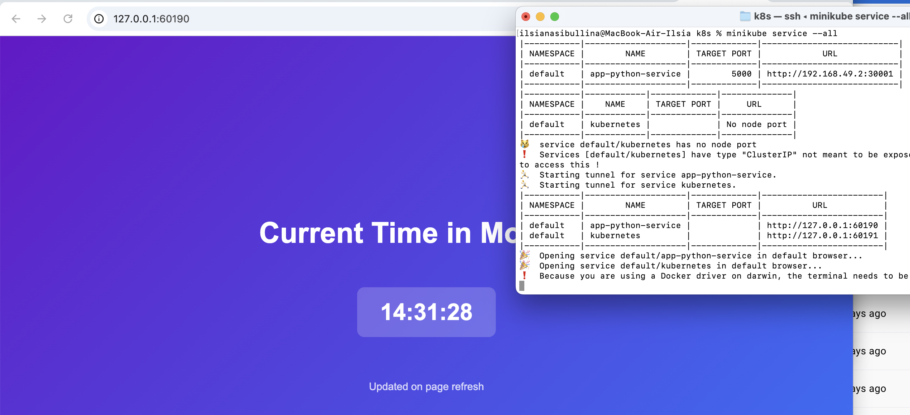
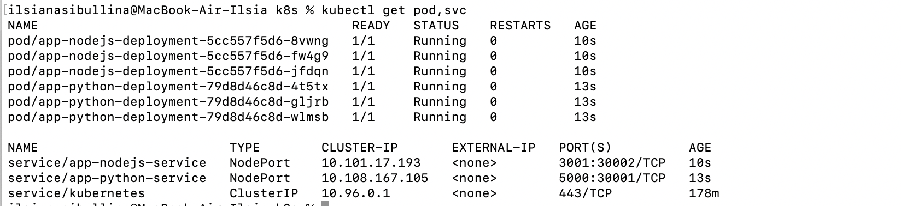
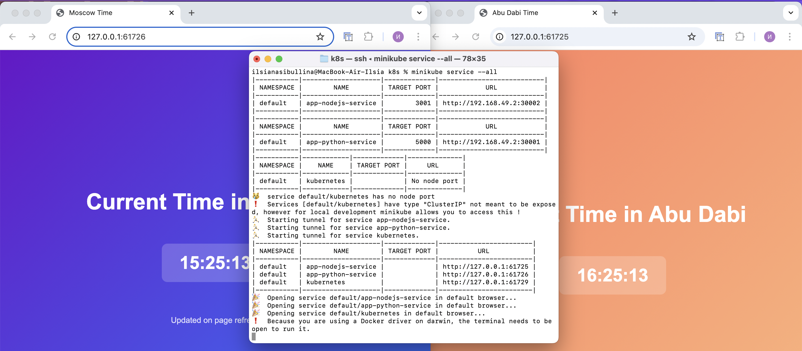
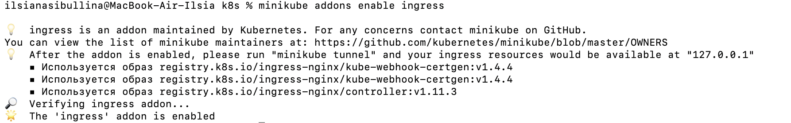
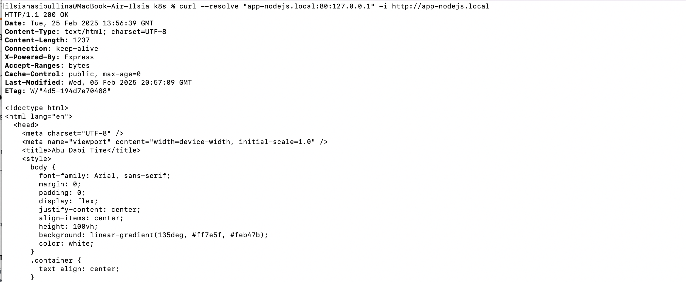
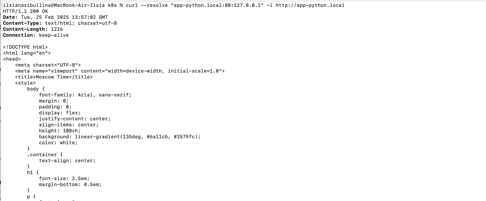

# Kubernetes and Minikubes

## Task 1

The result of running deployment and service:

```bash
S25-core-course-labs % kubectl get pods,svc
NAME                              READY   STATUS    RESTARTS   AGE
pod/app-python-7596dddfb6-gtgxv   1/1     Running   0          5m

NAME                 TYPE        CLUSTER-IP     EXTERNAL-IP   PORT(S)          AGE
service/app-python   NodePort    10.96.32.180   <none>        5000:30663/TCP   2m42s
service/kubernetes   ClusterIP   10.96.0.1      <none>        443/TCP          23m

```

## Task 2

Manifests development.yml and service.yml were created:

```bash
k8s % kubectl apply -f app-python        

deployment.apps/app-python-deployment created
service/app-python-service created
```

The output of `kubectl get pods,svc`:

```bash
k8s % kubectl get pods,svc
NAME                                         READY   STATUS    RESTARTS   AGE
pod/app-python-deployment-79d8d46c8d-5nwg2   1/1     Running   0          6m27s
pod/app-python-deployment-79d8d46c8d-m9vtg   1/1     Running   0          6m19s
pod/app-python-deployment-79d8d46c8d-pf9z9   1/1     Running   0          6m37s

NAME                         TYPE        CLUSTER-IP      EXTERNAL-IP   PORT(S)          AGE
service/app-python-service   NodePort    10.100.44.227   <none>        5000:30001/TCP   11s
service/kubernetes           ClusterIP   10.96.0.1       <none>        443/TCP          113m

```

The output of `minikube service --all`:

```bash
k8s % minikube service --all
|-----------|--------------------|-------------|---------------------------|
| NAMESPACE |        NAME        | TARGET PORT |            URL            |
|-----------|--------------------|-------------|---------------------------|
| default   | app-python-service |        5000 | http://192.168.49.2:30001 |
|-----------|--------------------|-------------|---------------------------|
|-----------|------------|-------------|--------------|
| NAMESPACE |    NAME    | TARGET PORT |     URL      |
|-----------|------------|-------------|--------------|
| default   | kubernetes |             | No node port |
|-----------|------------|-------------|--------------|
😿  service default/kubernetes has no node port
❗  Services [default/kubernetes] have type "ClusterIP" not meant to be exposed, however for local development minikube allows you to access this !
🏃  Starting tunnel for service app-python-service.
🏃  Starting tunnel for service kubernetes.
|-----------|--------------------|-------------|------------------------|
| NAMESPACE |        NAME        | TARGET PORT |          URL           |
|-----------|--------------------|-------------|------------------------|
| default   | app-python-service |             | http://127.0.0.1:60190 |
| default   | kubernetes         |             | http://127.0.0.1:60191 |
|-----------|--------------------|-------------|------------------------|
🎉  Opening service default/app-python-service in default browser...
🎉  Opening service default/kubernetes in default browser...
❗  Because you are using a Docker driver on darwin, the terminal needs to be open to run it.
```



## Bonust task

Manifests for an extra app were created:





Ingress was added:



After creating manifest, curl tool was used to check:





