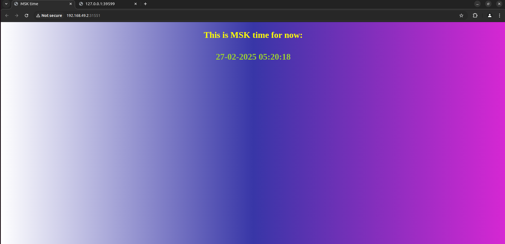

# Kubernetes Lab

---

## Task 1: Kubernetes Setup and Basic Deployment

### 1. Kubernetes Setup

- **Tools Installed**:
    - `kubectl`: Kubernetes command-line tool.
    - `minikube`: Local Kubernetes cluster.

### 2. Application Deployment

`kubectl get pods,svc`

```NAME                              READY   STATUS    RESTARTS   AGE
pod/python-msk-868c89fdfd-d6s2f   1/1     Running   0          3m27s

NAME                 TYPE           CLUSTER-IP       EXTERNAL-IP   PORT(S)          AGE
service/kubernetes   ClusterIP      10.96.0.1        <none>        443/TCP          41h
service/python-msk   LoadBalancer   10.105.251.176   <pending>     5000:32588/TCP   99s
```

### 3. Cleanup

---

## Task 2: kubernetes manifests

- A `deployment.yml` manifest file was created to describe the application's deployment with 3 replicas
- A `service.yml` manifest file was created for the application

```bash
kubectl get pods,svc
```

```
NAME                                         READY   STATUS    RESTARTS   AGE
pod/python-msk-deployment-868c89fdfd-7gr2s   1/1     Running   0          90s
pod/python-msk-deployment-868c89fdfd-n94tc   1/1     Running   0          90s
pod/python-msk-deployment-868c89fdfd-v6s7k   1/1     Running   0          90s
NAME                         TYPE        CLUSTER-IP       EXTERNAL-IP   PORT(S)        AGE
service/kubernetes           ClusterIP   10.96.0.1        <none>        443/TCP        41h
service/python-msk-service   NodePort    10.103.189.134   <none>        80:31551/TCP   90s
```

```bash
minikube service --all
```

```
|-----------|------------|-------------|--------------|
| NAMESPACE |    NAME    | TARGET PORT |     URL      |
|-----------|------------|-------------|--------------|
| default   | kubernetes |             | No node port |
|-----------|------------|-------------|--------------|
😿  service default/kubernetes has no node port
|-----------|--------------------|-------------|---------------------------|
| NAMESPACE |        NAME        | TARGET PORT |            URL            |
|-----------|--------------------|-------------|---------------------------|
| default   | python-msk-service |          80 | http://192.168.49.2:31551 |
|-----------|--------------------|-------------|---------------------------|
🎉  Opening service default/python-msk-service in default browser...
🏃  Starting tunnel for service kubernetes.
|-----------|------------|-------------|------------------------|
| NAMESPACE |    NAME    | TARGET PORT |          URL           |
|-----------|------------|-------------|------------------------|
| default   | kubernetes |             | http://127.0.0.1:39599 |
|-----------|------------|-------------|------------------------|
🎉  Opening service default/kubernetes in default browser...
Opening in existing browser session.
✋  Stopping tunnel for service kubernetes.
```

### The application was accessed using the URL provided by `minikube service --all`. The IP matches the output of the command

