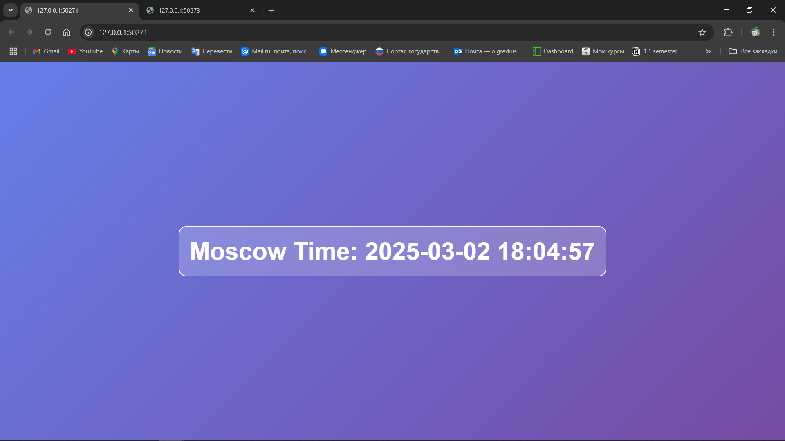

# Kubernetes

## Task 1

### Deploy

```bash
> kubectl create deployment app-python --image=wellnotwell/lab2:latest --port=5000
```
```bash
deployment.apps/app-python created
```

```bash
> kubectl get deployments
```
```bash
NAME         READY   UP-TO-DATE   AVAILABLE   AGE
app-python   1/1     1            1           96s
```

```bash
> kubectl get pods
```
```bash
NAME                          READY   STATUS    RESTARTS   AGE
app-python-75db8c8676-x5z74   1/1     Running   0          2m21s
```

### Expose

```bash
> kubectl expose deployment app-python --type=LoadBalancer --port=5000
```
```bash
service/app-python exposed
```

```bash
> minikube service app-python
```
```bash
|-----------|------------|-------------|---------------------------|
| NAMESPACE |    NAME    | TARGET PORT |            URL            |
|-----------|------------|-------------|---------------------------|
| default   | app-python |        5000 | http://192.168.49.2:32747 |
|-----------|------------|-------------|---------------------------|
* Starting tunnel for service app-python.
|-----------|------------|-------------|------------------------|
| NAMESPACE |    NAME    | TARGET PORT |          URL           |
|-----------|------------|-------------|------------------------|
| default   | app-python |             | http://127.0.0.1:65208 |
|-----------|------------|-------------|------------------------|
* Opening service default/app-python in default browser...
! Because you are using a Docker driver on windows, the terminal needs to be open to run it.
```

### Info

```bash
> kubectl get pods,svc
```
```bash
NAME                              READY   STATUS    RESTARTS   AGE
pod/app-python-75db8c8676-x5z74   1/1     Running   0          16m

NAME                 TYPE           CLUSTER-IP    EXTERNAL-IP   PORT(S)          AGE
service/app-python   LoadBalancer   10.98.138.6   <pending>     5000:32747/TCP   6m42s
service/kubernetes   ClusterIP      10.96.0.1     <none>        443/TCP          16m
```

### Cleaning Up
```bash
> kubectl delete deployments app-python
```
```bash
deployment.apps "app-python" deleted
```

```bash
> kubectl delete service app-python
```
```bash
service "app-python" deleted
```

## Task 2

### Manifest

```bash
> kubectl apply -f k8s
```
```bash
deployment.apps/app-python created
service/app-python-service created
```

```bash
> kubectl get pods,svc
```
```bash
NAME                             READY   STATUS    RESTARTS   AGE
pod/app-python-846d87d4f-hg798   1/1     Running   0          68s
pod/app-python-846d87d4f-jj7k4   1/1     Running   0          68s
pod/app-python-846d87d4f-k9d8w   1/1     Running   0          68s

NAME                         TYPE        CLUSTER-IP      EXTERNAL-IP   PORT(S)          AGE
service/app-python-service   NodePort    10.111.132.50   <none>        5000:30001/TCP   68s
service/kubernetes           ClusterIP   10.96.0.1       <none>        443/TCP          33m
```

### Access

```bash
> minikube service --all
```
```bash
|-----------|--------------------|-------------|---------------------------|
| NAMESPACE |        NAME        | TARGET PORT |            URL            |
|-----------|--------------------|-------------|---------------------------|
| default   | app-python-service |        5000 | http://192.168.49.2:30001 |
|-----------|--------------------|-------------|---------------------------|
|-----------|------------|-------------|--------------|
| NAMESPACE |    NAME    | TARGET PORT |     URL      |
|-----------|------------|-------------|--------------|
| default   | kubernetes |             | No node port |
|-----------|------------|-------------|--------------|
* service default/kubernetes has no node port
! Services [default/kubernetes] have type "ClusterIP" not meant to be exposed, however for local development minikube allows you to access this !
* Starting tunnel for service app-python-service.
* Starting tunnel for service kubernetes.
|-----------|--------------------|-------------|------------------------|
| NAMESPACE |        NAME        | TARGET PORT |          URL           |
|-----------|--------------------|-------------|------------------------|
| default   | app-python-service |             | http://127.0.0.1:50271 |
| default   | kubernetes         |             | http://127.0.0.1:50273 |
|-----------|--------------------|-------------|------------------------|
* Opening service default/app-python-service in default browser...
* Opening service default/kubernetes in default browser...
! Because you are using a Docker driver on windows, the terminal needs to be open to run it.
```


