# Kubernetes Setup Report

## Task1 Setup and Deployment 

- Installed minikube and kubectl : 
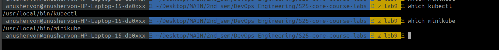

- Created `moscow-time-app` Deployment with the use of image `theanushervon/moscow_time:latest` from DockerHub
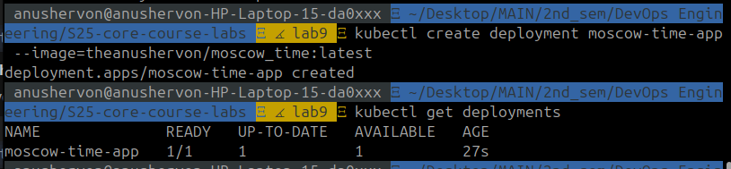

- Verification of deployment
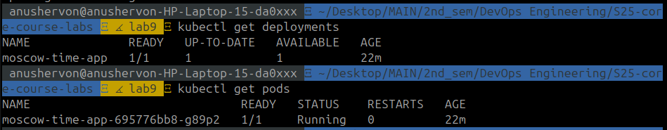

- created a Service to access application from outside k8s cluster network
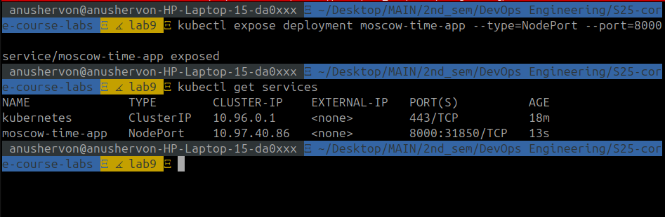
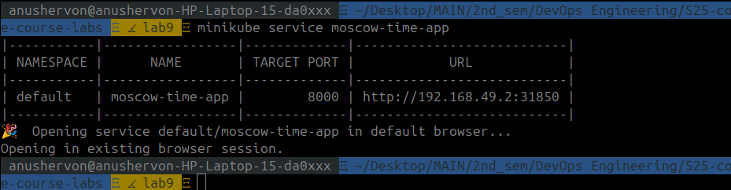
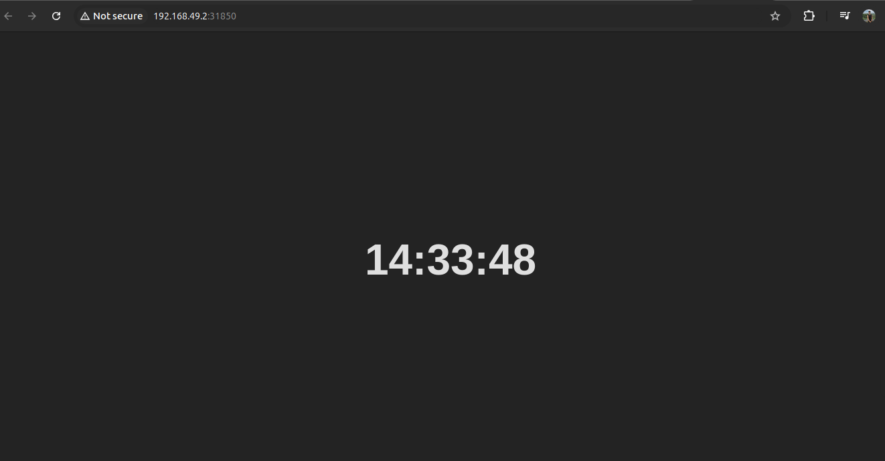

- Removed Deployment and Service resources
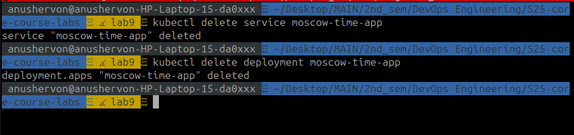

## Task2 Declarative Kubernetes Manifests

- Created `deployment` and `service` manifests

- Output of `kubectl get pods, svc`
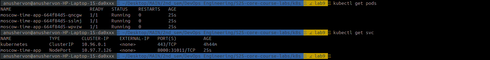

- Output of `minikube service --all` and its result 
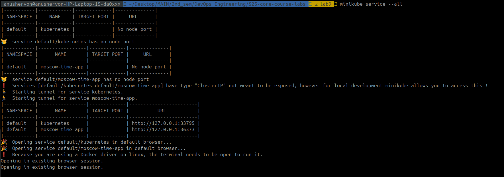
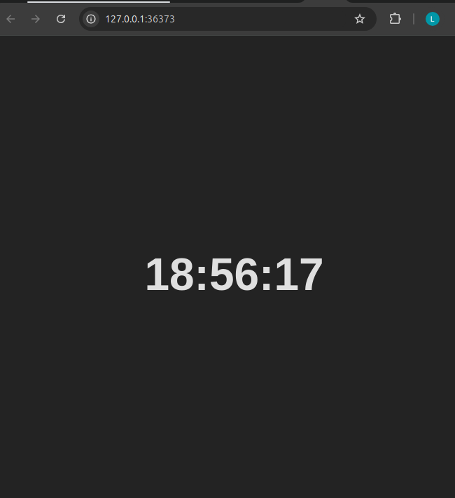

- Cleanup resources: 
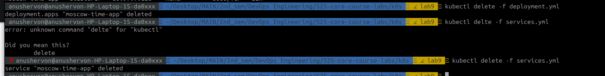