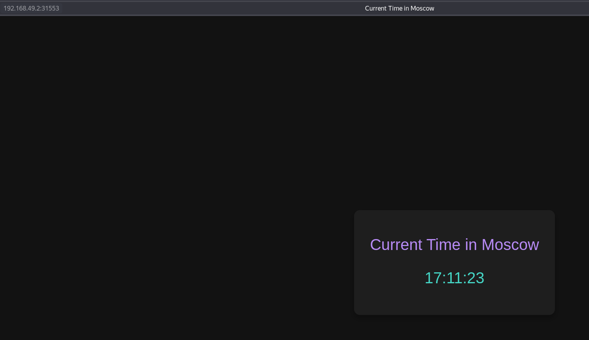
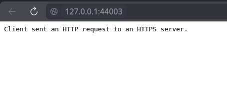

# Kubernetes Deployment Documentation

This document describes the Kubernetes deployment setup for the Moscow Time application.

## Prerequisites

- Minikube
- kubectl
- Docker

## Components

### 1. Deployment (deployment.yaml)
```yaml
apiVersion: apps/v1
kind: Deployment
metadata:
  name: app-python
spec:
  replicas: 3
  selector:
    matchLabels:
      app: app-python
  template:
    metadata:
      labels:
        app: app-python
    spec:
      containers:
      - name: app-python
        image: forygg/moscow-never-sleeps:latest
        ports:
        - containerPort: 5000
```

### 2. Service (service.yaml)
```yaml
apiVersion: v1
kind: Service
metadata:
  name: app-python-service
spec:
  selector:
    app: app-python
  ports:
    - protocol: TCP
      port: 80
      targetPort: 5000
  type: NodePort
```

## Deployment Status

### Pods and Services
```bash
fory@pop-os:~/devops-labs/S25-core-course-labs/k8s$ kubectl get pods,svc
NAME                              READY   STATUS    RESTARTS   AGE
pod/app-python-5fd5bb4b7c-4cj6k   1/1     Running   0          62s
pod/app-python-5fd5bb4b7c-6mfx9   1/1     Running   0          62s
pod/app-python-5fd5bb4b7c-c2cv7   1/1     Running   0          62s

NAME                         TYPE        CLUSTER-IP      EXTERNAL-IP   PORT(S)        AGE
service/app-python-service   NodePort    10.108.210.56   <none>        80:31553/TCP   13s
service/kubernetes           ClusterIP   10.96.0.1       <none>        443/TCP        29m
```

### Service Access
```bash
fory@pop-os:~/devops-labs/S25-core-course-labs/k8s$ minikube service --all
|-----------|--------------------|-------------|---------------------------|
| NAMESPACE |        NAME        | TARGET PORT |            URL            |
|-----------|--------------------|-------------|---------------------------|
| default   | app-python-service |          80 | http://192.168.49.2:31553 |
|-----------|--------------------|-------------|---------------------------|
|-----------|------------|-------------|--------------|
| NAMESPACE |    NAME    | TARGET PORT |     URL      |
|-----------|------------|-------------|--------------|
| default   | kubernetes |             | No node port |
|-----------|------------|-------------|--------------|
😿  service default/kubernetes has no node port
❗  Services [default/kubernetes] have type "ClusterIP" not meant to be exposed, however for local development minikube allows you to access this !
🎉  Opening service default/app-python-service in default browser...
🏃  Starting tunnel for service kubernetes.
|-----------|------------|-------------|------------------------|
| NAMESPACE |    NAME    | TARGET PORT |          URL           |
|-----------|------------|-------------|------------------------|
| default   | kubernetes |             | http://127.0.0.1:44003 |
|-----------|------------|-------------|------------------------|
🎉  Opening service default/kubernetes in default browser...
❗  Because you are using a Docker driver on linux, the terminal needs to be open to run it.
```

## Application Access

The application is accessible at: http://192.168.49.2:31553




*Browser showing Moscow Time application running in Kubernetes*

Kubernetes accessible at: http://127.0.0.1:44003




*Browser showing Kubernetes*

## Deployment Instructions

1. Start Minikube:
```bash
minikube start
```

2. Apply the manifests:
```bash
kubectl apply -f deployment.yaml
kubectl apply -f service.yaml
```

3. Verify deployment:
```bash
kubectl get pods
kubectl get svc
```

4. Access the application:
```bash
minikube service app-python-service
```

## Cleanup

To remove the deployment and service:
```bash
kubectl delete -f deployment.yaml
kubectl delete -f service.yaml
```

Or remove everything in the namespace:
```bash
kubectl delete all --all
```
