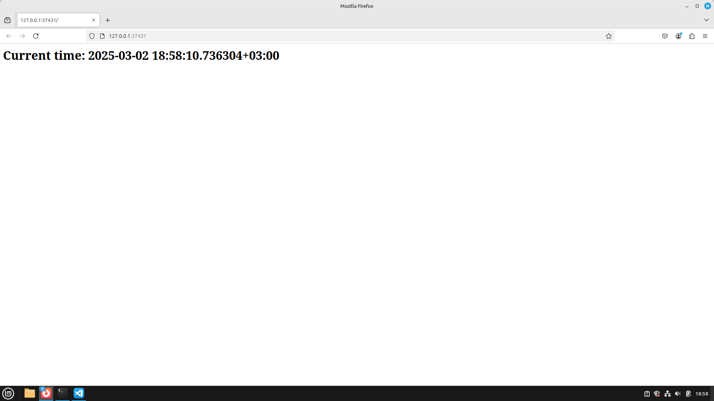

## Setup minikube with `minikube start`

```
😄  minikube v1.35.0 on Linuxmint 22.1 (vbox/amd64)
✨  Automatically selected the docker driver. Other choices: ssh, none
📌  Using Docker driver with root privileges
👍  Starting "minikube" primary control-plane node in "minikube" cluster
🚜  Pulling base image v0.0.46 ...
💾  Downloading Kubernetes v1.32.0 preload ...
    > preloaded-images-k8s-v18-v1...:  333.57 MiB / 333.57 MiB  100.00% 1.58 Mi
    > gcr.io/k8s-minikube/kicbase...:  500.31 MiB / 500.31 MiB  100.00% 1.91 Mi
🔥  Creating docker container (CPUs=2, Memory=2200MB) ...
🐳  Preparing Kubernetes v1.32.0 on Docker 27.4.1 ...
    ▪ Generating certificates and keys ...
    ▪ Booting up control plane ...
    ▪ Configuring RBAC rules ...
🔗  Configuring bridge CNI (Container Networking Interface) ...
🔎  Verifying Kubernetes components...
    ▪ Using image gcr.io/k8s-minikube/storage-provisioner:v5
🌟  Enabled addons: storage-provisioner, default-storageclass
🏄  Done! kubectl is now configured to use "minikube" cluster and "default" namespace by default
```

## Created deployment with `kubectl create deployment time-app-py --image=unileonid/time-app-py`

```
deployment.apps/time-app-py created
```

## `kubectl get pods,svc`

```
NAME                               READY   STATUS              RESTARTS   AGE
pod/time-app-py-684c4cd8b6-cxqmg   0/1     ContainerCreating   0          24s

NAME                 TYPE        CLUSTER-IP   EXTERNAL-IP   PORT(S)   AGE
service/kubernetes   ClusterIP   10.96.0.1    <none>        443/TCP   3m37s
```

## Removed services with `kubectl delete deployment time-app-py`

```
deployment.apps "time-app-py" deleted
```

## Applied service configuration with `kubectl apply -f service.yml`

```
service/time-app-py-service created
```

## Applied deployment configuration with `kubectl apply -f deployment.yml`

```
deployment.apps/time-app-py-deployment created
```

## `kubectl get pods,svc`

```
NAME                                          READY   STATUS    RESTARTS   AGE
pod/time-app-py-deployment-86d9cb7bf6-49rlr   1/1     Running   0          3m17s
pod/time-app-py-deployment-86d9cb7bf6-9vrqb   1/1     Running   0          3m17s
pod/time-app-py-deployment-86d9cb7bf6-d6ngp   1/1     Running   0          3m17s

NAME                          TYPE        CLUSTER-IP      EXTERNAL-IP   PORT(S)   AGE
service/kubernetes            ClusterIP   10.96.0.1       <none>        443/TCP   68m
service/time-app-py-service   ClusterIP   10.105.43.248   <none>        80/TCP    3m21s
```

## `minikube sevice --all`

```
|-----------|------------|-------------|--------------|
| NAMESPACE |    NAME    | TARGET PORT |     URL      |
|-----------|------------|-------------|--------------|
| default   | kubernetes |             | No node port |
|-----------|------------|-------------|--------------|
😿  service default/kubernetes has no node port
|-----------|---------------------|-------------|--------------|
| NAMESPACE |        NAME         | TARGET PORT |     URL      |
|-----------|---------------------|-------------|--------------|
| default   | time-app-py-service |             | No node port |
|-----------|---------------------|-------------|--------------|
😿  service default/time-app-py-service has no node port
❗  Services [default/kubernetes default/time-app-py-service] have type "ClusterIP" not meant to be exposed, however for local development minikube allows you to access this !
🏃  Starting tunnel for service kubernetes.
🏃  Starting tunnel for service time-app-py-service.
|-----------|---------------------|-------------|------------------------|
| NAMESPACE |        NAME         | TARGET PORT |          URL           |
|-----------|---------------------|-------------|------------------------|
| default   | kubernetes          |             | http://127.0.0.1:43529 |
| default   | time-app-py-service |             | http://127.0.0.1:37431 |
|-----------|---------------------|-------------|------------------------|
🎉  Opening service default/kubernetes in default browser...
🎉  Opening service default/time-app-py-service in default browser...
❗  Because you are using a Docker driver on linux, the terminal needs to be open to run it.
```


