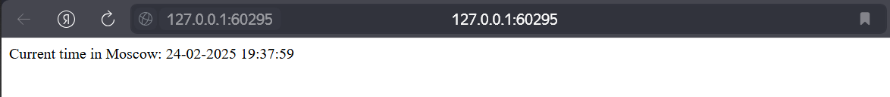

# Kubernetes

---

## Task 1

Firstly I installed `kubectl` and `minikube` on my Windows 10. Then, I started `minikube`:

```bash
E:\Innopolis\BS-3 (S25, S-2)\DevOps Engineering\Labs\S25-core-course-labs>minikube start --driver=docker

W0224 18:10:22.478610   23528 main.go:291] Unable to resolve the current Docker CLI context "default": context "default": context not found: open C:\Users\user\.docker\contexts\meta\37a8eec1ce19687d132fe29051dca629d164e2c4958ba141d5f4133a33f0688f\meta.json: The system cannot find the path specified.
W0224 18:10:22.511560   23528 main.go:292] Try running `docker context use default` to resolve the above error
* minikube v1.35.0 на Microsoft Windows 10 Home Single Language 10.0.19045.5487 Build 19045.5487
* Используется драйвер docker на основе существующего профиля
* Starting "minikube" primary control-plane node in "minikube" cluster
* Pulling base image v0.0.46 ...
* docker "minikube" container is missing, will recreate.
* Creating docker container (CPUs=2, Memory=3500MB) ...
! Failing to connect to https://registry.k8s.io/ from inside the minikube container
* To pull new external images, you may need to configure a proxy: https://minikube.sigs.k8s.io/docs/reference/networking/proxy/
* Подготавливается Kubernetes v1.32.0 на Docker 27.4.1 ...
  - Generating certificates and keys ...
  - Booting up control plane ...
  - Configuring RBAC rules ...
* Configuring bridge CNI (Container Networking Interface) ...
* Компоненты Kubernetes проверяются ...
  - Используется образ gcr.io/k8s-minikube/storage-provisioner:v5
* Включенные дополнения: storage-provisioner, default-storageclass

! C:\Program Files\Docker\Docker\resources\bin\kubectl.exe is version 1.27.2, which may have incompatibilities with Kubernetes 1.32.0.
  - Want kubectl v1.32.0? Try 'minikube kubectl -- get pods -A'
* Готово! kubectl настроен для использования кластера "minikube" и "default" пространства имён по умолчанию
```

Then I created deployment resourse of python app and expose app with service resource:

```bash
E:\Innopolis\BS-3 (S25, S-2)\DevOps Engineering\Labs\S25-core-course-labs>kubectl create deployment --image bugay/python-msk-time-app-distroless:1.0 python-time-app  --port 5000

deployment.apps/python-time-app created

E:\Innopolis\BS-3 (S25, S-2)\DevOps Engineering\Labs\S25-core-course-labs>kubectl expose deployment python-time-app --type=NodePort --port=5000

service/python-time-app exposed
```

And access the application on given by minikube port:

```bash
E:\Innopolis\BS-3 (S25, S-2)\DevOps Engineering\Labs\S25-core-course-labs>curl http://127.0.0.1:58931

Current time in Moscow: 24-02-2025    19:12:48
```

That is the output of `kubectl get pods,svc` command:

```bash
E:\Innopolis\BS-3 (S25, S-2)\DevOps Engineering\Labs\S25-core-course-labs>kubectl get pods,svc

NAME                                  READY   STATUS    RESTARTS   AGE
pod/python-time-app-d7bfb6975-kjn8m   1/1     Running   0          4m7s

NAME                      TYPE        CLUSTER-IP       EXTERNAL-IP   PORT(S)          AGE
service/kubernetes        ClusterIP   10.96.0.1        <none>        443/TCP          64m
service/python-time-app   NodePort    10.105.102.244   <none>        5000:31041/TCP   4m5s
```

And then I deleted `Deployment` and `Service` resources:

```bash
E:\Innopolis\BS-3 (S25, S-2)\DevOps Engineering\Labs\S25-core-course-labs>kubectl delete service python-time-app

service "python-time-app" deleted

E:\Innopolis\BS-3 (S25, S-2)\DevOps Engineering\Labs\S25-core-course-labs>kubectl delete deployments.apps python-time-app

deployment.apps "python-time-app" deleted
```

---

## Task 2

I created deployment.yml and service.yml for python application in k8s/app_python folder and do `kubectl apply`:

```bash
E:\Innopolis\BS-3 (S25, S-2)\DevOps Engineering\Labs\S25-core-course-labs>kubectl apply -f k8s/app_python/deployment.yml

deployment.apps/python-time-app created

E:\Innopolis\BS-3 (S25, S-2)\DevOps Engineering\Labs\S25-core-course-labs>kubectl apply -f k8s/app_python/service.yml

service/python-time-app-service created
```

This is an output for commands `kubectl get pods,svc` and `minikube service --all`:

```bash
E:\Innopolis\BS-3 (S25, S-2)\DevOps Engineering\Labs\S25-core-course-labs>kubectl get pods,svc
NAME                                   READY   STATUS    RESTARTS   AGE
pod/python-time-app-849cbc7896-ltxcw   1/1     Running   0          90s
pod/python-time-app-849cbc7896-pnmjt   1/1     Running   0          90s
pod/python-time-app-849cbc7896-rvqvq   1/1     Running   0          90s

NAME                              TYPE           CLUSTER-IP       EXTERNAL-IP   PORT(S)          AGE
service/kubernetes                ClusterIP      10.96.0.1        <none>        443/TCP          85m
service/python-time-app-service   LoadBalancer   10.108.140.140   <pending>     5000:30113/TCP   74s

E:\Innopolis\BS-3 (S25, S-2)\DevOps Engineering\Labs\S25-core-course-labs>minikube service --all
W0224 19:37:55.993127   16472 main.go:291] Unable to resolve the current Docker CLI context "default": context "default": context not found: open C:\Users\user\.docker\contexts\meta\37a8eec1ce19687d132fe29051dca629d164e2c4958ba141d5f4133a33f0688f\meta.json: The system cannot find the path specified.
W0224 19:37:56.021526   16472 main.go:292] Try running `docker context use default` to resolve the above error
|-----------|------------|-------------|--------------|
| NAMESPACE |    NAME    | TARGET PORT |     URL      |
|-----------|------------|-------------|--------------|
| default   | kubernetes |             | No node port |
|-----------|------------|-------------|--------------|
* service default/kubernetes has no node port
|-----------|-------------------------|-------------|---------------------------|
| NAMESPACE |          NAME           | TARGET PORT |            URL            |
|-----------|-------------------------|-------------|---------------------------|
| default   | python-time-app-service |        5000 | http://192.168.49.2:30113 |
|-----------|-------------------------|-------------|---------------------------|
! Services [default/kubernetes] have type "ClusterIP" not meant to be exposed, however for local development minikube allows you to access this !
* Starting tunnel for service kubernetes.
* Starting tunnel for service python-time-app-service.
|-----------|-------------------------|-------------|------------------------|
| NAMESPACE |          NAME           | TARGET PORT |          URL           |
|-----------|-------------------------|-------------|------------------------|
| default   | kubernetes              |             | http://127.0.0.1:60293 |
| default   | python-time-app-service |             | http://127.0.0.1:60295 |
|-----------|-------------------------|-------------|------------------------|
* Opening service default/kubernetes in default browser...
* Opening service default/python-time-app-service in default browser...
! Because you are using a Docker driver on windows, the terminal needs to be open to run it.
```

So, this is the screenshot from the localhost with given port:



---

## Bonus Task

Firstly, I renamed app_python/deployment.yml and app_python/service.yml to python-time-app-deployment.yml and python-time-app-service.yml (to keep similar names with scala app), change them a bit to be able to run it with ingress for both applications. Secondly, I created scala-time-app-deployment.yml and scala-time-app-service.yml. Thirdly, I applied all changes, got output of `kubectl get pods,svc,ingress` command, enabled ingress addon for kubernetes, and started it with `minikube tunnel`:

```bash
E:\Innopolis\BS-3 (S25, S-2)\DevOps Engineering\Labs\S25-core-course-labs>kubectl apply -f k8s

ingress.networking.k8s.io/app-ingress created
deployment.apps/python-time-app created
service/python-time-app-service created
deployment.apps/scala-time-app created
service/scala-time-app-service created

E:\Innopolis\BS-3 (S25, S-2)\DevOps Engineering\Labs\S25-core-course-labs>kubectl get pods,svc,ingress

NAME                                   READY   STATUS    RESTARTS   AGE
pod/python-time-app-64b4ccdfcd-26fpf   1/1     Running   0          8s
pod/python-time-app-64b4ccdfcd-r59hb   1/1     Running   0          8s
pod/python-time-app-64b4ccdfcd-w987h   1/1     Running   0          8s
pod/scala-time-app-64f899c55f-dcjmg    1/1     Running   0          8s
pod/scala-time-app-64f899c55f-j75wp    1/1     Running   0          8s
pod/scala-time-app-64f899c55f-sjzxh    1/1     Running   0          8s

NAME                              TYPE        CLUSTER-IP       EXTERNAL-IP   PORT(S)          AGE
service/kubernetes                ClusterIP   10.96.0.1        <none>        443/TCP          173m
service/python-time-app-service   NodePort    10.100.153.199   <none>        8082:30002/TCP   8s
service/scala-time-app-service    NodePort    10.102.101.95    <none>        8081:30001/TCP   8s

NAME                                    CLASS   HOSTS                            ADDRESS   PORTS   AGE
ingress.networking.k8s.io/app-ingress   nginx   pythonapp.local,scalaapp.local             80      8s

E:\Innopolis\BS-3 (S25, S-2)\DevOps Engineering\Labs\S25-core-course-labs>minikube addons enable ingress

W0224 21:05:07.351149   22040 main.go:291] Unable to resolve the current Docker CLI context "default": context "default": context not found: open C:\Users\user\.docker\contexts\meta\37a8eec1ce19687d132fe29051dca629d164e2c4958ba141d5f4133a33f0688f\meta.json: The system cannot find the path specified.
W0224 21:05:07.395707   22040 main.go:292] Try running `docker context use default` to resolve the above error
* ingress is an addon maintained by Kubernetes. For any concerns contact minikube on GitHub.
You can view the list of minikube maintainers at: https://github.com/kubernetes/minikube/blob/master/OWNERS
* After the addon is enabled, please run "minikube tunnel" and your ingress resources would be available at "127.0.0.1"
  - Используется образ registry.k8s.io/ingress-nginx/kube-webhook-certgen:v1.4.4
  - Используется образ registry.k8s.io/ingress-nginx/kube-webhook-certgen:v1.4.4
  - Используется образ registry.k8s.io/ingress-nginx/controller:v1.11.3
* Verifying ingress addon...
* The 'ingress' addon is enabled

E:\Innopolis\BS-3 (S25, S-2)\DevOps Engineering\Labs\S25-core-course-labs>minikube tunnel

W0224 21:05:25.305427   11404 main.go:291] Unable to resolve the current Docker CLI context "default": context "default": context not found: open C:\Users\user\.docker\contexts\meta\37a8eec1ce19687d132fe29051dca629d164e2c4958ba141d5f4133a33f0688f\meta.json: The system cannot find the path specified.
W0224 21:05:25.334128   11404 main.go:292] Try running `docker context use default` to resolve the above error
* Tunnel successfully started

* NOTE: Please do not close this terminal as this process must stay alive for the tunnel to be accessible ...

! Access to ports below 1024 may fail on Windows with OpenSSH clients older than v8.1. For more information, see: https://minikube.sigs.k8s.io/docs/handbook/accessing/#access-to-ports-1024-on-windows-requires-root-permission
* Starting tunnel for service app-ingress.
```

So, now I can access both applications using curl. This one for Python application:

```bash
E:\Innopolis\BS-3 (S25, S-2)\DevOps Engineering\Labs\S25-core-course-labs>curl --resolve "pythonapp.local:80:127.0.0.1" -i http://pythonapp.local

HTTP/1.1 200 OK
Date: Mon, 24 Feb 2025 18:07:46 GMT
Content-Type: text/html; charset=utf-8
Content-Length: 46
Connection: keep-alive

Current time in Moscow: 24-02-2025    21:07:46
```

And this one for Scala application:

```bash
E:\Innopolis\BS-3 (S25, S-2)\DevOps Engineering\Labs\S25-core-course-labs>curl --resolve "scalaapp.local:80:127.0.0.1" -i http://scalaapp.local

HTTP/1.1 200 OK
Date: Mon, 24 Feb 2025 18:08:04 GMT
Content-Type: text/html; charset=UTF-8
Content-Length: 1129
Connection: keep-alive


            <!DOCTYPE html>
            <html>
                <head>
                <title>Current Time in Moscow</title>
                <style>
                    body {
                    font-family: Arial, sans-serif;
                    text-align: center;
                    margin-top: 50px;
                    }
                    h1 {
                    color: #333;
                    }
                    .time {
                    font-size: 2em;
                    color: #007BFF;
                    }
                </style>
                <script>
                    function updateTime() {
                    fetch('/time')
                        .then(response => response.text())
                        .then(time => {
                        document.getElementById('time').innerText = time;
                        });
                    }
                </script>
                </head>
                <body>
                <h1>Current Time in Moscow</h1>
                <div id="time" class="time">2025-02-24 21:08:04</div>
                </body>
            </html>
```

---
