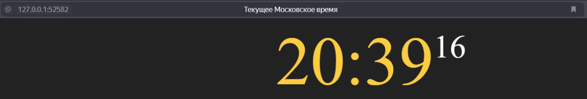

# Kubernetes

```text
$ minikube start

😄  minikube v1.35.0 on Microsoft Windows 11 Pro 10.0.26100.3194 Build 26100.3194
✨  Using the docker driver based on user configuration
📌  Using Docker Desktop driver with root privileges
👍  Starting "minikube" primary control-plane node in "minikube" cluster
🚜  Pulling base image v0.0.46 ...
💾  Downloading Kubernetes v1.32.0 preload ...
    > gcr.io/k8s-minikube/kicbase...:  500.31 MiB / 500.31 MiB  100.00% 30.73 M
    > preloaded-images-k8s-v18-v1...:  333.57 MiB / 333.57 MiB  100.00% 20.60 M
🔥  Creating docker container (CPUs=2, Memory=4000MB) ...
❗  Failing to connect to https://registry.k8s.io/ from inside the minikube container
💡  To pull new external images, you may need to configure a proxy: https://minikube.sigs.k8s.io/docs/reference/networking/proxy/
🐳  Preparing Kubernetes v1.32.0 on Docker 27.4.1 ...
    ▪ Generating certificates and keys ...
    ▪ Booting up control plane ...
    ▪ Configuring RBAC rules ...
🔗  Configuring bridge CNI (Container Networking Interface) ...
🔎  Verifying Kubernetes components...
    ▪ Using image gcr.io/k8s-minikube/storage-provisioner:v5
🌟  Enabled addons: storage-provisioner, default-storageclass

❗  C:\Program Files\Docker\Docker\resources\bin\kubectl.exe is version 1.30.5, which may have incompatibilities with Kubernetes 1.32.0.
    ▪ Want kubectl v1.32.0? Try 'minikube kubectl -- get pods -A'
🏄  Done! kubectl is now configured to use "minikube" cluster and "default" namespace by default
```

```text
$ minikube kubectl -- get pods -A

NAMESPACE     NAME                               READY   STATUS    RESTARTS      AGE
kube-system   coredns-668d6bf9bc-6bxhs           1/1     Running   0             61s
kube-system   etcd-minikube                      1/1     Running   0             66s
kube-system   kube-apiserver-minikube            1/1     Running   0             66s
kube-system   kube-controller-manager-minikube   1/1     Running   0             66s
kube-system   kube-proxy-dxdsk                   1/1     Running   0             62s
kube-system   kube-scheduler-minikube            1/1     Running   0             66s
kube-system   storage-provisioner                1/1     Running   1 (39s ago)   65s
```

```text
$ kubectl create deployment app-python --image=dsaee/app

deployment.apps/app-python created
```

```text
$ kubectl expose deployment app-python --type=LoadBalancer --port=8000

service/app-python exposed
```

```text
$ kubectl get pods,svc

NAME                             READY   STATUS    RESTARTS   AGE
pod/app-python-c998ccfbd-hj98h   1/1     Running   0          2m6s

NAME                 TYPE           CLUSTER-IP      EXTERNAL-IP   PORT(S)          AGE
service/app-python   LoadBalancer   10.110.122.32   <pending>     8000:31021/TCP   53s
service/kubernetes   ClusterIP      10.96.0.1       <none>        443/TCP          11m
```

```text
$ minikube service --all

|-----------|------------|-------------|---------------------------|
| NAMESPACE |    NAME    | TARGET PORT |            URL            |
|-----------|------------|-------------|---------------------------|
| default   | app-python |        8000 | http://192.168.49.2:31021 |
|-----------|------------|-------------|---------------------------|
|-----------|------------|-------------|--------------|
| NAMESPACE |    NAME    | TARGET PORT |     URL      |
|-----------|------------|-------------|--------------|
| default   | kubernetes |             | No node port |
|-----------|------------|-------------|--------------|
😿  service default/kubernetes has no node port
❗  Services [default/kubernetes] have type "ClusterIP" not meant to be exposed, however for local development minikube allows you to access this !
🏃  Starting tunnel for service app-python.
🏃  Starting tunnel for service kubernetes.
|-----------|------------|-------------|------------------------|
| NAMESPACE |    NAME    | TARGET PORT |          URL           |
|-----------|------------|-------------|------------------------|
| default   | app-python |             | http://127.0.0.1:52096 |
| default   | kubernetes |             | http://127.0.0.1:52097 |
|-----------|------------|-------------|------------------------|
🎉  Opening service default/app-python in default browser...
🎉  Opening service default/kubernetes in default browser...
❗  Because you are using a Docker driver on windows, the terminal needs to be open to run it.
```

```text
$ kubectl delete deployment app-python

deployment.apps "app-python" deleted
```

```text
$ kubectl delete service app-python

service "app-python" deleted
```

```text
$ kubectl apply -f .

deployment.apps/app-python-deployment created
service/app-python-service created
```

```text
$ kubectl get pods,svc

NAME                                         READY   STATUS    RESTARTS   AGE
pod/app-python-deployment-78c597684c-7gld5   1/1     Running   0          49s
pod/app-python-deployment-78c597684c-dl2t5   1/1     Running   0          49s
pod/app-python-deployment-78c597684c-wssfc   1/1     Running   0          49s

NAME                         TYPE           CLUSTER-IP      EXTERNAL-IP   PORT(S)          AGE
service/app-python-service   LoadBalancer   10.100.201.56   <pending>     8000:30398/TCP   60s
service/kubernetes           ClusterIP      10.96.0.1       <none>        443/TCP          21m
```

```text
$ minikube service --all
|-----------|--------------------|-------------|---------------------------|
| NAMESPACE |        NAME        | TARGET PORT |            URL            |
|-----------|--------------------|-------------|---------------------------|
| default   | app-python-service |        8000 | http://192.168.49.2:30398 |
|-----------|--------------------|-------------|---------------------------|
|-----------|------------|-------------|--------------|
| NAMESPACE |    NAME    | TARGET PORT |     URL      |
|-----------|------------|-------------|--------------|
| default   | kubernetes |             | No node port |
|-----------|------------|-------------|--------------|
😿  service default/kubernetes has no node port
❗  Services [default/kubernetes] have type "ClusterIP" not meant to be exposed, however for local development minikube allows you to access this !
🏃  Starting tunnel for service app-python-service.
🏃  Starting tunnel for service kubernetes.
|-----------|--------------------|-------------|------------------------|
| NAMESPACE |        NAME        | TARGET PORT |          URL           |
|-----------|--------------------|-------------|------------------------|
| default   | app-python-service |             | http://127.0.0.1:52582 |
| default   | kubernetes         |             | http://127.0.0.1:52584 |
|-----------|--------------------|-------------|------------------------|
🎉  Opening service default/app-python-service in default browser...
🎉  Opening service default/kubernetes in default browser...
❗  Because you are using a Docker driver on windows, the terminal needs to be open to run it.
```


