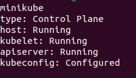
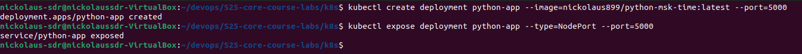
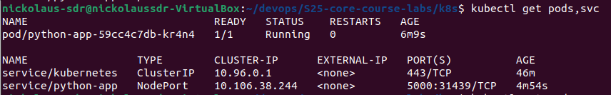
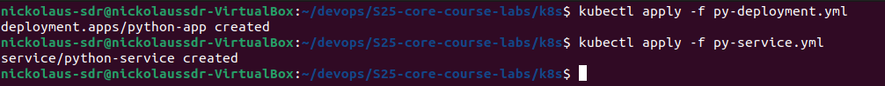
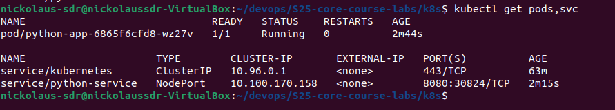
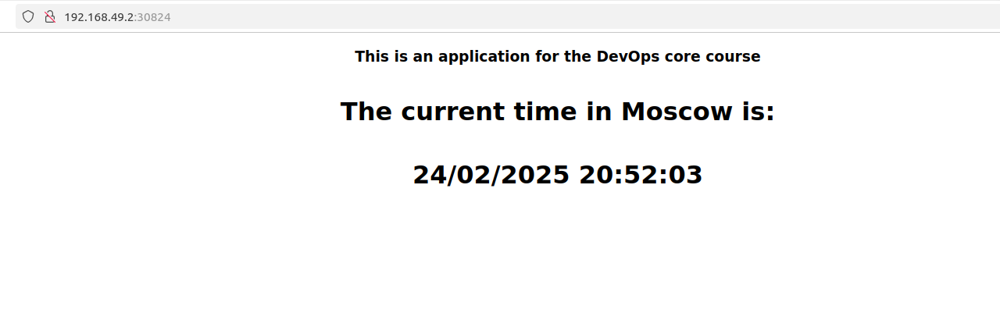

# Kubernets

## Start cluster

After starting a cluster, we can check its status:
```
minikube status
```



## Create a deployment and a service with a command



Check `pods` and `svc`

```
kubectl get pods,svc
```


### After that, clean up


## Create a deployment and a service with a file


To apply a file we need to run a command
```
kubectl apply -f <name>.yml
```



```
kubectl get pods,svc
```



## Verify 

``` 
minikube service --all
```

```
|-----------|------------|-------------|--------------|
| NAMESPACE |    NAME    | TARGET PORT |     URL      |
|-----------|------------|-------------|--------------|
| default   | kubernetes |             | No node port |
|-----------|------------|-------------|--------------|
😿  service default/kubernetes has no node port
|-----------|----------------|-------------|---------------------------|
| NAMESPACE |      NAME      | TARGET PORT |            URL            |
|-----------|----------------|-------------|---------------------------|
| default   | python-service |        8080 | http://192.168.49.2:30824 |
|-----------|----------------|-------------|---------------------------|
❗  Services [default/kubernetes] have type "ClusterIP" not meant to be exposed, however for local development minikube allows you to access this !
🎉  Opening service default/python-service in default browser...
🏃  Starting tunnel for service kubernetes.
update.go:85: cannot change mount namespace according to change mount (/run/user/1000/doc/by-app/snap.firefox /run/user/1000/doc none bind,rw,x-snapd.ignore-missing 0 0): cannot inspect "/run/user/1000/doc": lstat /run/user/1000/doc: permission denied
|-----------|------------|-------------|------------------------|
| NAMESPACE |    NAME    | TARGET PORT |          URL           |
|-----------|------------|-------------|------------------------|
| default   | kubernetes |             | http://127.0.0.1:42455 |
|-----------|------------|-------------|------------------------|
🎉  Opening service default/kubernetes in default browser...
❗  Because you are using a Docker driver on linux, the terminal needs to be open to run it.
update.go:85: cannot change mount namespace according to change mount (/run/user/1000/doc/by-app/snap.firefox /run/user/1000/doc none bind,rw,x-snapd.ignore-missing 0 0): cannot inspect "/run/user/1000/doc": lstat /run/user/1000/doc: permission denied
Gtk-Message: 20:52:03.196: Not loading module "atk-bridge": The functionality is provided by GTK natively. Please try to not load it.
Gtk-Message: 20:52:03.196: Not loading module "atk-bridge": The functionality is provided by GTK natively. Please try to not load it.
[49288, Main Thread] WARNING: Failed to read portal settings: GDBus.Error:org.freedesktop.DBus.Error.AccessDenied: Portal operation not allowed: Unable to open /proc/49288/root: 'glib warning', file /build/firefox/parts/firefox/build/toolkit/xre/nsSigHandlers.cpp:201

(firefox_firefox:49288): Gdk-WARNING **: 20:52:03.232: Failed to read portal settings: GDBus.Error:org.freedesktop.DBus.Error.AccessDenied: Portal operation not allowed: Unable to open /proc/49288/root
[49366, Main Thread] WARNING: Failed to read portal settings: GDBus.Error:org.freedesktop.DBus.Error.AccessDenied: Portal operation not allowed: Unable to open /proc/49366/root: 'glib warning', file /build/firefox/parts/firefox/build/toolkit/xre/nsSigHandlers.cpp:201

(firefox_firefox:49366): Gdk-WARNING **: 20:52:03.233: Failed to read portal settings: GDBus.Error:org.freedesktop.DBus.Error.AccessDenied: Portal operation not allowed: Unable to open /proc/49366/root

```




## Bonus
