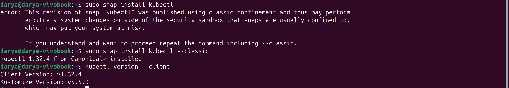
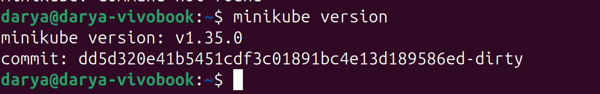
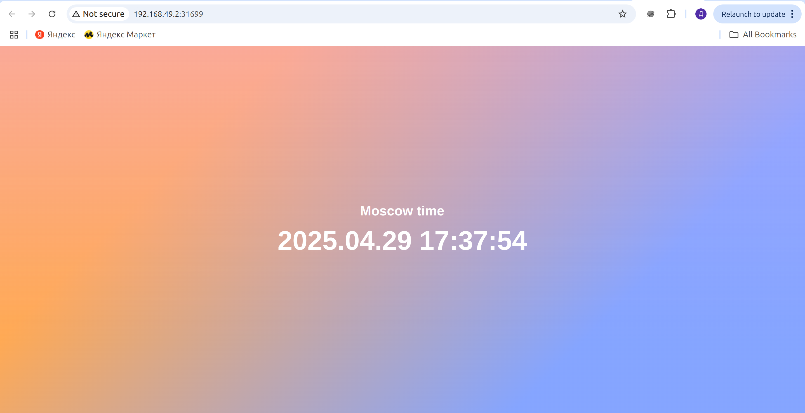

# Kubernetes

### Install cubectl and minikube.




### Deployment

1. Create deployment
```bash
kubectl create deployment app-python --image=darrpyy/devops:latest
deployment.apps/app-python created
```

2. Expose deployment
```bash
kubectl expose deployment app-python --port=8001 --type=LoadBalancer
service/app-python exposed
```

3. See information about deployments, pods, and service
```bash
kubectl get pods,deployments,svc

NAME                              READY   STATUS    RESTARTS   AGE
pod/app-python-85cf7b6c6d-9tfvz   1/1     Running   0          38s

NAME                         READY   UP-TO-DATE   AVAILABLE   AGE
deployment.apps/app-python   1/1     1            1           38s

NAME                 TYPE           CLUSTER-IP     EXTERNAL-IP   PORT(S)          AGE
service/app-python   LoadBalancer   10.98.85.137   <pending>     8001:32425/TCP   8s
service/kubernetes   ClusterIP      10.96.0.1      <none>        443/TCP          88s
```

4. Start minikube tunnel
```bash
minikube tunnel
[sudo] password for darya: 
Status: 
        machine: minikube
        pid: 375227
        route: 10.96.0.0/12 -> 192.168.49.2
        minikube: Running
        services: [app-python]
    errors: 
                minikube: no errors
                router: no errors
                loadbalancer emulator: no errors
```

5. See information about deployments, pods, and service one more time
```bash
kubectl get pods,deployments,svc
NAME                              READY   STATUS    RESTARTS   AGE
pod/app-python-85cf7b6c6d-9tfvz   1/1     Running   0          13m

NAME                         READY   UP-TO-DATE   AVAILABLE   AGE
deployment.apps/app-python   1/1     1            1           13m

NAME                 TYPE           CLUSTER-IP     EXTERNAL-IP    PORT(S)          AGE
service/app-python   LoadBalancer   10.98.85.137   10.98.85.137   8001:32425/TCP   12m
service/kubernetes   ClusterIP      10.96.0.1      <none>         443/TCP          13m
```

6. Remove deployment
```bash
kubectl delete deployment app-python
deployment.apps "app-python" deleted
```

7. Remove service
```bash
kubectl delete service app-python
service "app-python" deleted
```

8. See information about deployments, pods, and service one more time
```bash
kubectl get pods,deployments,svc
NAME                 TYPE        CLUSTER-IP   EXTERNAL-IP   PORT(S)   AGE
service/kubernetes   ClusterIP   10.96.0.1    <none>        443/TCP   41m
```

# Declarative Deployment of Python App

1. Create the deployment and service
```bash
kubectl apply -f app_python
deployment.apps/app-python created
ingress.networking.k8s.io/app-python created
service/app-python created
```

2. See information about deployments, pods, and service
```bash
kubectl get pods,deployments,svc
NAME                              READY   STATUS    RESTARTS   AGE
pod/app-python-54c4bd6d8c-8wgwp   1/1     Running   0          78s
pod/app-python-54c4bd6d8c-jjxsg   1/1     Running   0          78s
pod/app-python-54c4bd6d8c-m625m   1/1     Running   0          78s
pod/app-python-54c4bd6d8c-znxx7   1/1     Running   0          78s

NAME                         READY   UP-TO-DATE   AVAILABLE   AGE
deployment.apps/app-python   4/4     4            4           78s

NAME                 TYPE           CLUSTER-IP     EXTERNAL-IP    PORT(S)          AGE
service/app-python   LoadBalancer   10.98.155.70   10.98.155.70   8001:31699/TCP   78s
service/kubernetes   ClusterIP      10.96.0.1      <none>         443/TCP          48m
```

3. Test application
```bash
curl 10.98.155.70:8001/
<!DOCTYPE html>
<html>
    <head>
        <meta charset="UTF-8">
        <title>Moscow Time</title>
        <style>
        * {
            margin: 0;
            padding: 0;
        }
        body, html {
            height: 100%;
            font-family: Inter, sans-serif;
            color: white;
        }
        body {
            background-blend-mode: screen;
            background:
                linear-gradient(rgba(135, 60, 255, 0.4), rgba(135, 60, 255, 0.0) 80%),
                linear-gradient(-45deg, rgba(120, 155, 255, 0.9) 25%, rgba(255, 160, 65, 0.9) 75%);
            display: flex;
            justify-content: center;
            align-items: center;
            text-align: center;
        }
        .time-container {
            padding: 2em;
        }
        h2 {
            font-size: 1.5em;
            margin-bottom: 0.5em;
        }
        h1 {
            font-size: 3em;
            font-weight: bold;
        }
        </style>
    </head>

    <body>
        <div class="time-container">
            <h2>Moscow time</h2>
            <h1>2025.04.29 17:37:36</h1>
        </div>
    </body>
</html>
```

4. Test application using `minikube service --all`
```bash
minikube service --all
|-----------|------------|-------------|---------------------------|
| NAMESPACE |    NAME    | TARGET PORT |            URL            |
|-----------|------------|-------------|---------------------------|
| default   | app-python |        8001 | http://192.168.49.2:31699 |
|-----------|------------|-------------|---------------------------|
|-----------|-----------------|-------------|--------------|
| NAMESPACE |      NAME       | TARGET PORT |     URL      |
|-----------|-----------------|-------------|--------------|
| default   | app-python-helm |             | No node port |
|-----------|-----------------|-------------|--------------|
😿  service default/app-python-helm has no node port
|-----------|------------|-------------|--------------|
| NAMESPACE |    NAME    | TARGET PORT |     URL      |
|-----------|------------|-------------|--------------|
| default   | kubernetes |             | No node port |
|-----------|------------|-------------|--------------|
😿  service default/kubernetes has no node port
❗  Services [default/app-python-helm default/kubernetes] have type "ClusterIP" not meant to be exposed, however for local development minikube allows you to access this !
🎉  Opening service default/app-python in default browser...
🏃  Starting tunnel for service app-python-helm.
🏃  Starting tunnel for service kubernetes.
Opening in existing browser session.
|-----------|-----------------|-------------|------------------------|
| NAMESPACE |      NAME       | TARGET PORT |          URL           |
|-----------|-----------------|-------------|------------------------|
| default   | app-python-helm |             | http://127.0.0.1:33761 |
| default   | kubernetes      |             | http://127.0.0.1:38703 |
|-----------|-----------------|-------------|------------------------|
🎉  Opening service default/app-python-helm in default browser...
🎉  Opening service default/kubernetes in default browser...
❗  Because you are using a Docker driver on linux, the terminal needs to be open to run it.
Opening in existing browser session.
[591146:591146:0100/000000.837142:ERROR:zygote_linux.cc(664)] write: Broken pipe (32)
Opening in existing browser session.

```

Screenshots:



5. Remove deployment
```bash
kubectl delete deployment app-python
deployment.apps "app-python" deleted
```

6. Remove service
```bash
kubectl delete service app-python
service "app-python" deleted

```

7. See information about deployments, pods, and service one more time
```bash
kubectl get pods,deployments,svc
NAME                                   READY   STATUS    RESTARTS   AGE
pod/app-python-helm-79cffdbc5d-nbjdv   1/1     Running   0          97m

NAME                              READY   UP-TO-DATE   AVAILABLE   AGE
deployment.apps/app-python-helm   1/1     1            1           97m

NAME                      TYPE        CLUSTER-IP     EXTERNAL-IP   PORT(S)   AGE
service/app-python-helm   ClusterIP   10.98.190.42   <none>        80/TCP    97m
service/kubernetes        ClusterIP   10.96.0.1      <none>        443/TCP   5h26m
```

I started lab 10 too, so there appeared helm app python
