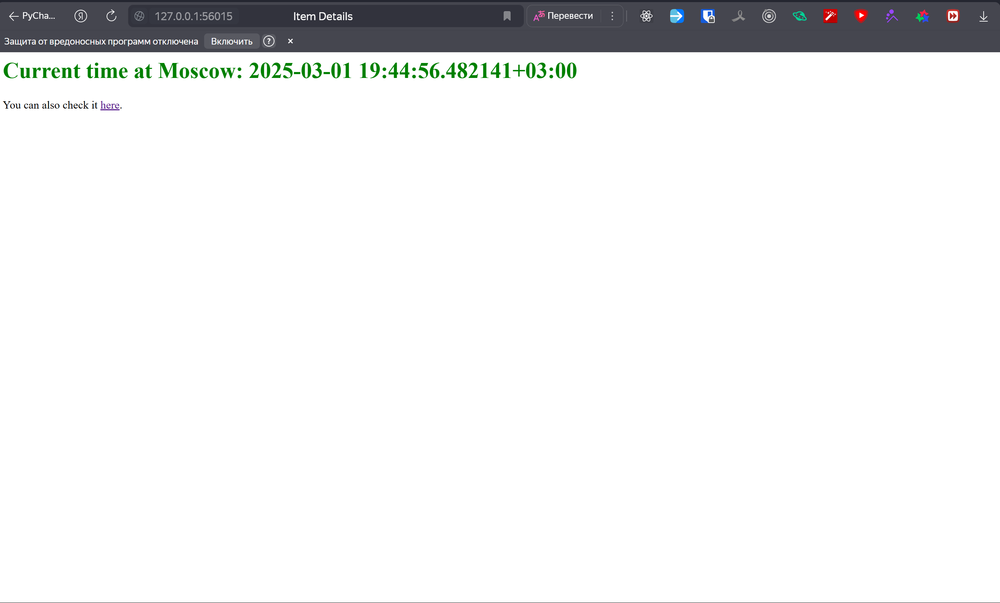
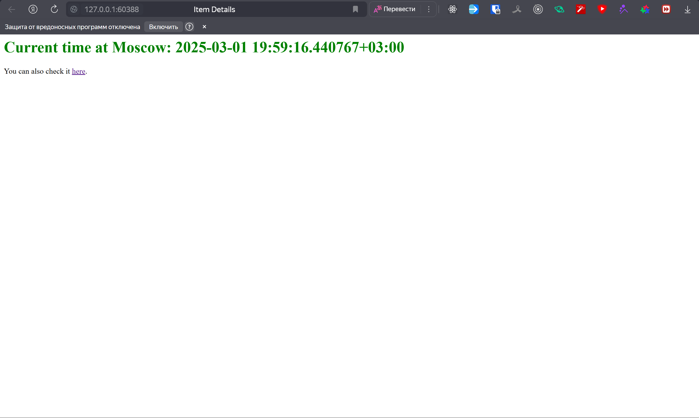
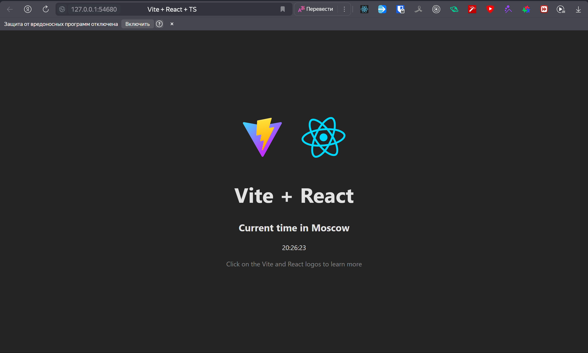
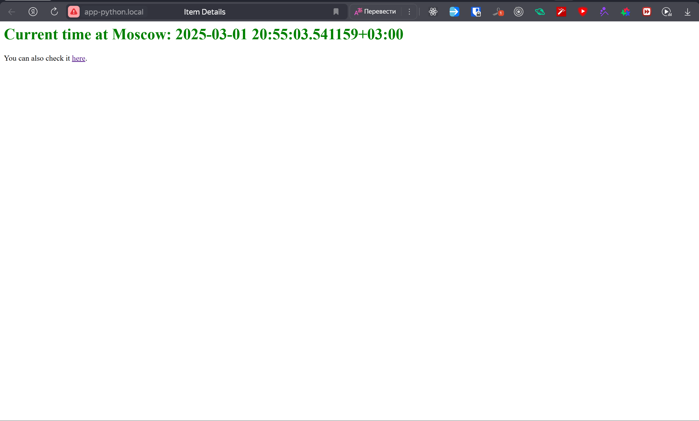
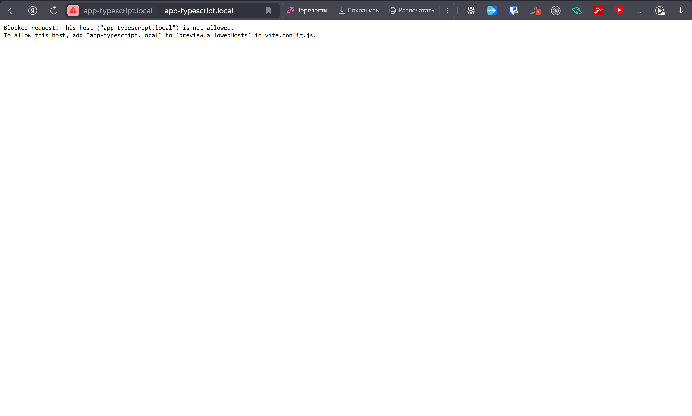
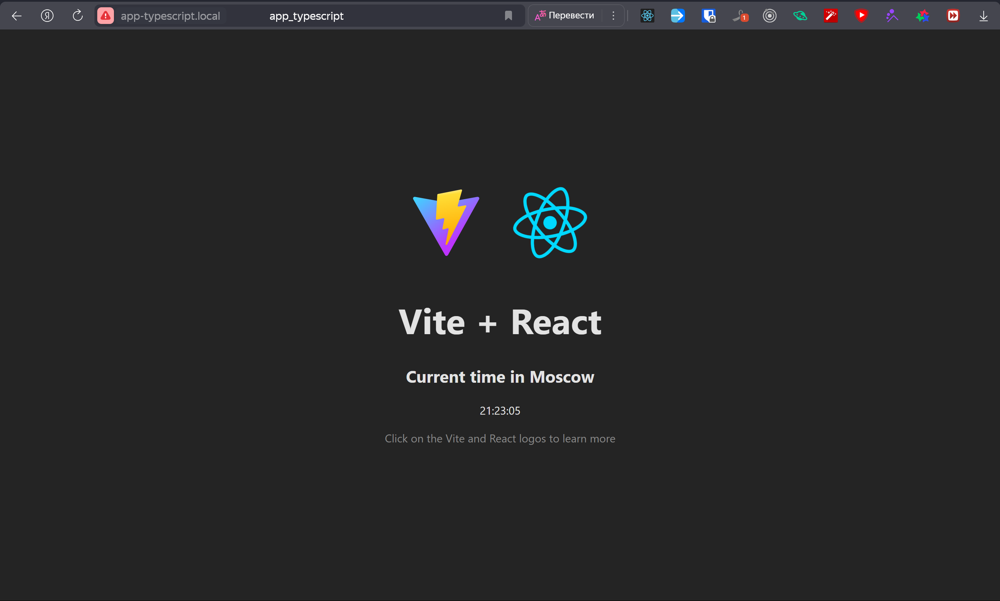

# Lab 9: Introduction to Kubernetes

## Task 1: Kubernetes Setup and Basic Deployment

### Activate `minicube` for local cluster:

`minikube start`

```
PS C:\Projects\University\S25\DevOps\S25-core-course-labs\k8s> minikube start                                                                            
* minikube v1.35.0 on Microsoft Windows 11 Pro 10.0.26100.3194 Build 26100.3194
* Using the docker driver based on existing profile
* Starting "minikube" primary control-plane node in "minikube" cluster
* Pulling base image v0.0.46 ...
* Restarting existing docker container for "minikube" ...
* Preparing Kubernetes v1.32.0 on Docker 27.4.1 ...
! Failing to connect to https://registry.k8s.io/ from both inside the minikube container and host machine
* To pull new external images, you may need to configure a proxy: https://minikube.sigs.k8s.io/docs/reference/networking/proxy/
* Verifying Kubernetes components...
  - Using image gcr.io/k8s-minikube/storage-provisioner:v5
* Enabled addons: default-storageclass, storage-provisioner

! C:\Program Files\Docker\Docker\resources\bin\kubectl.exe is version 1.30.5, which may have incompatibilities with Kubernetes 1.32.0.
  - Want kubectl v1.32.0? Try 'minikube kubectl -- get pods -A'
* Done! kubectl is now configured to use "minikube" cluster and "default" namespace by default
```

### Create deployment:

`kubectl create deployment app-python --image=dmhd6219/inno_devops_lab2_python_bonus:latest`

```
PS C:\Projects\University\S25\DevOps\S25-core-course-labs\k8s> kubectl create deployment app-python --image=dmhd6219/inno_devops_lab2_python_bonus:latest
deployment.apps/app-python created
```

### Expose deployment:

`kubectl expose deployment app-python --type=LoadBalancer --port=8000`

```
PS C:\Projects\University\S25\DevOps\S25-core-course-labs\k8s> kubectl expose deployment app-python --type=LoadBalancer --port=8000
service/app-python exposed
```

### Get current pods and services:

`kubectl get pods,svc`

```
PS C:\Projects\University\S25\DevOps\S25-core-course-labs\k8s> kubectl get pods,svc
NAME                              READY   STATUS    RESTARTS   AGE
pod/app-python-768cdb75c5-v9ltt   1/1     Running   0          2m2s

NAME                 TYPE           CLUSTER-IP       EXTERNAL-IP   PORT(S)          AGE
service/app-python   LoadBalancer   10.107.141.197   <pending>     8000:32751/TCP   91s
service/kubernetes   ClusterIP      10.96.0.1        <none>        443/TCP          3d18h
```

### Open deployment:

`minikube service app-python --url`

```
PS C:\Projects\University\S25\DevOps\S25-core-course-labs\k8s> minikube service app-python --url
http://127.0.0.1:56015
! Because you are using a Docker driver on windows, the terminal needs to be open to run it.
```



### Remove resources:

`kubectl delete deployment app-python`

```
PS C:\Projects\University\S25\DevOps\S25-core-course-labs\k8s> kubectl delete deployment app-python
deployment.apps "app-python" deleted
```

`kubectl delete svc app-python`

```
PS C:\Projects\University\S25\DevOps\S25-core-course-labs\k8s> kubectl delete svc app-python
service "app-python" deleted
```

`kubectl get pods,svc`

```
PS C:\Projects\University\S25\DevOps\S25-core-course-labs\k8s> kubectl get pods,svc
NAME                 TYPE        CLUSTER-IP   EXTERNAL-IP   PORT(S)   AGE
service/kubernetes   ClusterIP   10.96.0.1    <none>        443/TCP   3d18h
```

## Task 2: Declarative Kubernetes Manifests

### Apply manifests for app_python:

`kubectl apply -f app_python`

```
PS C:\Projects\University\S25\DevOps\S25-core-course-labs\k8s> kubectl apply -f app_python
deployment.apps/app-python created
service/app-python-service created
```

`kubectl get pods,svc`

```
PS C:\Projects\University\S25\DevOps\S25-core-course-labs\k8s> kubectl get pods,svc
NAME                              READY   STATUS    RESTARTS   AGE
pod/app-python-65cf4749b8-d772n   1/1     Running   0          21s
pod/app-python-65cf4749b8-nxlbz   1/1     Running   0          21s
pod/app-python-65cf4749b8-xzsnw   1/1     Running   0          21s

NAME                         TYPE        CLUSTER-IP       EXTERNAL-IP   PORT(S)   AGE
service/app-python-service   ClusterIP   10.101.131.199   <none>        80/TCP    21s
service/kubernetes           ClusterIP   10.96.0.1        <none>        443/TCP   3d19h
```

`minikube service --all`

```
PS C:\Projects\University\S25\DevOps\S25-core-course-labs\k8s> minikube service --all
|-----------|--------------------|-------------|--------------|
| NAMESPACE |        NAME        | TARGET PORT |     URL      |
|-----------|--------------------|-------------|--------------|
| default   | app-python-service |             | No node port |
|-----------|--------------------|-------------|--------------|
* service default/app-python-service has no node port
|-----------|------------|-------------|--------------|
| NAMESPACE |    NAME    | TARGET PORT |     URL      |
|-----------|------------|-------------|--------------|
| default   | kubernetes |             | No node port |
|-----------|------------|-------------|--------------|
* service default/kubernetes has no node port
! Services [default/app-python-service default/kubernetes] have type "ClusterIP" not meant to be exposed, however for local development minikube allows you to access this !
* Starting tunnel for service app-python-service.
* Starting tunnel for service kubernetes.
|-----------|--------------------|-------------|------------------------|
| NAMESPACE |        NAME        | TARGET PORT |          URL           |
|-----------|--------------------|-------------|------------------------|
| default   | app-python-service |             | http://127.0.0.1:60388 |
| default   | kubernetes         |             | http://127.0.0.1:60390 |
|-----------|--------------------|-------------|------------------------|
* Opening service default/app-python-service in default browser...
* Opening service default/kubernetes in default browser...
! Because you are using a Docker driver on windows, the terminal needs to be open to run it.
```

### Open app_python deployment:



### Apply manifests for app_typescript:

`kubectl apply -f app_typescript`

```
PS C:\Projects\University\S25\DevOps\S25-core-course-labs\k8s> kubectl apply -f app_typescript 
deployment.apps/app-typescript created
service/app-typescript-service created
```

`kubectl get pods,svc`

```
PS C:\Projects\University\S25\DevOps\S25-core-course-labs\k8s> kubectl get pods,svc
NAME                                  READY   STATUS    RESTARTS   AGE
pod/app-python-65cf4749b8-25zfs       1/1     Running   0          3m25s
pod/app-python-65cf4749b8-rwvgf       1/1     Running   0          3m25s
pod/app-python-65cf4749b8-wv8gh       1/1     Running   0          3m25s
pod/app-typescript-5667f9666c-266sv   1/1     Running   0          86s
pod/app-typescript-5667f9666c-jxt8z   1/1     Running   0          86s
pod/app-typescript-5667f9666c-n66wm   1/1     Running   0          86s

NAME                             TYPE        CLUSTER-IP     EXTERNAL-IP   PORT(S)   AGE
service/app-python-service       ClusterIP   10.98.225.19   <none>        80/TCP    3m25s
service/app-typescript-service   ClusterIP   10.97.175.83   <none>        80/TCP    86s
service/kubernetes               ClusterIP   10.96.0.1      <none>        443/TCP   3d19h
```

`minikube service --all`

```
PS C:\Projects\University\S25\DevOps\S25-core-course-labs\k8s> minikube service --all
|-----------|--------------------|-------------|--------------|
| NAMESPACE |        NAME        | TARGET PORT |     URL      |
|-----------|--------------------|-------------|--------------|
| default   | app-python-service |             | No node port |
|-----------|--------------------|-------------|--------------|
* service default/app-python-service has no node port
|-----------|------------------------|-------------|--------------|
| NAMESPACE |          NAME          | TARGET PORT |     URL      |
|-----------|------------------------|-------------|--------------|
| default   | app-typescript-service |             | No node port |
|-----------|------------------------|-------------|--------------|
* service default/app-typescript-service has no node port
|-----------|------------|-------------|--------------|
| NAMESPACE |    NAME    | TARGET PORT |     URL      |
|-----------|------------|-------------|--------------|
| default   | kubernetes |             | No node port |
|-----------|------------|-------------|--------------|
* service default/kubernetes has no node port
! Services [default/app-python-service default/app-typescript-service default/kubernetes] have type "ClusterIP" not meant to be exposed, however for local development minikube allows you to access this !
* Starting tunnel for service app-python-service.
* Starting tunnel for service app-typescript-service.
* Starting tunnel for service kubernetes.
|-----------|------------------------|-------------|------------------------|
| NAMESPACE |          NAME          | TARGET PORT |          URL           |
|-----------|------------------------|-------------|------------------------|
| default   | app-python-service     |             | http://127.0.0.1:54678 |
| default   | app-typescript-service |             | http://127.0.0.1:54680 |
| default   | kubernetes             |             | http://127.0.0.1:54682 |
|-----------|------------------------|-------------|------------------------|
* Opening service default/app-python-service in default browser...
* Opening service default/app-typescript-service in default browser...
* Opening service default/kubernetes in default browser...
! Because you are using a Docker driver on windows, the terminal needs to be open to run it.
```

### Open app_typescript deployment:



## Bonus Task: Additional Configuration and Ingress

### Configure Ingress

`minikube addons enable ingress`

```
PS C:\Projects\University\S25\DevOps\S25-core-course-labs\k8s> minikube addons enable ingress
* ingress is an addon maintained by Kubernetes. For any concerns contact minikube on GitHub.
You can view the list of minikube maintainers at: https://github.com/kubernetes/minikube/blob/master/OWNERS
* After the addon is enabled, please run "minikube tunnel" and your ingress resources would be available at "127.0.0.1"
  - Using image registry.k8s.io/ingress-nginx/controller:v1.11.3
  - Using image registry.k8s.io/ingress-nginx/kube-webhook-certgen:v1.4.4
  - Using image registry.k8s.io/ingress-nginx/kube-webhook-certgen:v1.4.4
* Verifying ingress addon...
* The 'ingress' addon is enabled
```

`kubectl apply -f ingress.yml`

```
PS C:\Projects\University\S25\DevOps\S25-core-course-labs\k8s> kubectl apply -f ingress.yml 
ingress.networking.k8s.io/app-ingress created
```

`kubectl get ingress`

```
PS C:\Projects\University\S25\DevOps\S25-core-course-labs\k8s> kubectl get ingress                     
NAME          CLASS   HOSTS                                   ADDRESS   PORTS   AGE
app-ingress   nginx   app-python.local,app-typescript.local             80      11s
```


`minikube tunnel`

```
PS C:\Projects\University\S25\DevOps\S25-core-course-labs\k8s> minikube tunnel
* Tunnel successfully started

* NOTE: Please do not close this terminal as this process must stay alive for the tunnel to be accessible ...
```

### Update hosts file

Add to the end of `\etc\hosts` file::

```
127.0.0.1 app-python.local
127.0.0.1 app-typescript.local
```

### Check deployment:

`curl app-python`

```
PS C:\Projects\University\S25\DevOps\S25-core-course-labs\k8s> curl app-python.local


StatusCode        : 200
StatusDescription : OK
Content           : <html>
                    <head>
                        <title>Item Details</title>
                        <link href="http://app-python.local/static/styles.css" rel="stylesheet">
                    </head>
                    <body>
                    <h1>
                        Current time at Moscow: 2025-03-01 20:54:44.400722+03...
RawContent        : HTTP/1.1 200 OK
                    Connection: keep-alive
                    Content-Length: 327
                    Content-Type: text/html; charset=utf-8
                    Date: Sat, 01 Mar 2025 17:54:44 GMT

                    <html>
                    <head>
                        <title>Item Details</title>
                        <link hre...
Forms             : {}
Headers           : {[Connection, keep-alive], [Content-Length, 327], [Content-Type, text/html; charset=utf-8], [Date, Sat, 01 Mar 2025 17:54:44 GMT]}
Images            : {}
InputFields       : {}
Links             : {@{innerHTML=here; innerText=here; outerHTML=<A href="https://www.timeanddate.com/worldclock/russia/moscow">here</A>; outerText=here; tagName=A;    
                    href=https://www.timeanddate.com/worldclock/russia/moscow}}
ParsedHtml        : mshtml.HTMLDocumentClass
RawContentLength  : 327
```



`curl app-typescript.local`

```
curl : The remote server returned an error: (403) Forbidden.
At line:1 char:1
+ curl app-typescript.local
+ ~~~~~~~~~~~~~~~~~~~~~~~~~
    + CategoryInfo          : InvalidOperation: (System.Net.HttpWebRequest:HttpWebRequest) [Invoke-WebRequest], WebException
    + FullyQualifiedErrorId : WebCmdletWebResponseException,Microsoft.PowerShell.Commands.InvokeWebRequestCommand
```



It seems like I need to update my web application to accept this url..

Let's update `vite.config.ts`:

```
export default defineConfig({
    preview: {
        allowedHosts: ['app-typescript.local'],
    },
});
```

Re-deploy everything...

`minikube delete`

...

Complete all previous steps again...

And... Everything works!

`curl app-typescript.local`

```
PS C:\Projects\University\S25\DevOps\S25-core-course-labs> curl app-typescript.local                                                                                    


StatusCode        : 200
StatusDescription : OK
Content           : <!doctype html>
                    <html lang="en">
                    <head>
                        <meta charset="UTF-8" />
                        <link rel="icon" type="image/svg+xml" href="/vite.svg" />
                        <meta name="viewport" content="width=device-width, initial-scale=...
RawContent        : HTTP/1.1 200 OK
                    Connection: keep-alive
                    Vary: Origin
                    Content-Length: 1372
                    Cache-Control: no-cache
                    Content-Type: text/html
                    Date: Sat, 01 Mar 2025 18:24:15 GMT
                    ETag: W/"55c-srrTDlrmw4gpYt+QEmuQnS5...
Forms             : {}
Headers           : {[Connection, keep-alive], [Vary, Origin], [Content-Length, 1372], [Cache-Control, no-cache]...}
Images            : {}
InputFields       : {}
Links             : {}
ParsedHtml        : mshtml.HTMLDocumentClass
RawContentLength  : 1372
```


