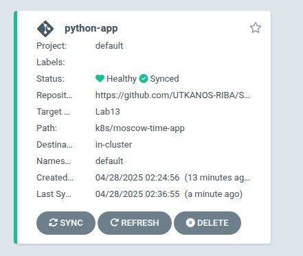

# Kubernetes Setup and Basic Deployment

## Step 1. Installation of kubectl and minikube

For this step I followed the instructions described in the guideline of kubectl and minikube.

## Step 2. Create deployment

```bash
PS C:\Users\Elizoveta\Desktop\S25-core-course-labs>    kubectl create deployment my-flask-app --image=nikolaevaelizaveta/my-flask-app:latest
deployment.apps/my-flask-app created
```

# Step 3. Access the application with service

```bash
PS C:\Users\Elizoveta\Desktop\S25-core-course-labs>    kubectl expose deployment my-flask-app --type=NodePort --port=5000
service/my-flask-app exposed
```

# Step 4. Check out on the resources

```bash
PS C:\Users\Elizoveta\Desktop\S25-core-course-labs>    kubectl get pods,svc
NAME                                READY   STATUS    RESTARTS   AGE
pod/my-flask-app-7d78c9db54-vpm7l   1/1     Running   0          59s

NAME                   TYPE        CLUSTER-IP      EXTERNAL-IP   PORT(S)          AGE 
service/kubernetes     ClusterIP   10.96.0.1       <none>        443/TCP          12h 
service/my-flask-app   NodePort    10.109.190.43   <none>        5000:30136/TCP   26s 
```

# Step 5. Access the app

```bash
PS C:\Users\Elizoveta\Desktop\S25-core-course-labs>    minikube service my-flask-app --url
http://127.0.0.1:62035
❗  Because you are using a Docker driver on windows, the terminal needs to be open to run it.
```



```bash
PS C:\Users\Elizoveta\Desktop\S25-core-course-labs> minikube service --all
|-----------|------------|-------------|--------------|
| NAMESPACE |    NAME    | TARGET PORT |     URL      |
|-----------|------------|-------------|--------------|
| default   | kubernetes |             | No node port |
|-----------|------------|-------------|--------------|
😿  service default/kubernetes has no node port
|-----------|--------------|-------------|---------------------------|
| NAMESPACE |     NAME     | TARGET PORT |            URL            |
|-----------|--------------|-------------|---------------------------|
| default   | my-flask-app |        5000 | http://192.168.49.2:30136 |
|-----------|--------------|-------------|---------------------------|
❗  Services [default/kubernetes] have type "ClusterIP" not meant to be exposed, however for local development minikube allows you to access this !
🏃  Starting tunnel for service kubernetes.
🏃  Starting tunnel for service my-flask-app.
|-----------|--------------|-------------|------------------------|
| NAMESPACE |     NAME     | TARGET PORT |          URL           |
|-----------|--------------|-------------|------------------------|
| default   | kubernetes   |             | http://127.0.0.1:62232 |
| default   | my-flask-app |             | http://127.0.0.1:62234 |
|-----------|--------------|-------------|------------------------|
🎉  Opening service default/kubernetes in default browser...
🎉  Opening service default/my-flask-app in default browser...
❗  Because you are using a Docker driver on windows, the terminal needs to be open to run it.
```

# Step 6. Clean everything

```bash
PS C:\Users\Elizoveta\Desktop\S25-core-course-labs> kubectl delete service my-flask-app
service "my-flask-app" deleted
PS C:\Users\Elizoveta\Desktop\S25-core-course-labs> kubectl delete deployment my-flask-app 
deployment.apps "my-flask-app" deleted
```
