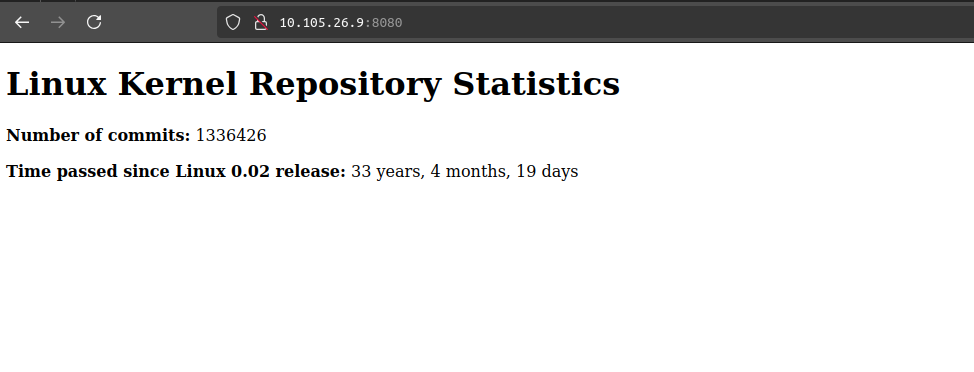
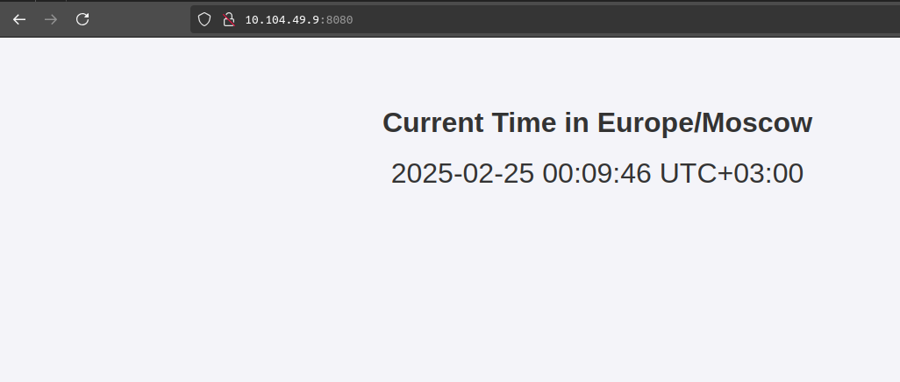
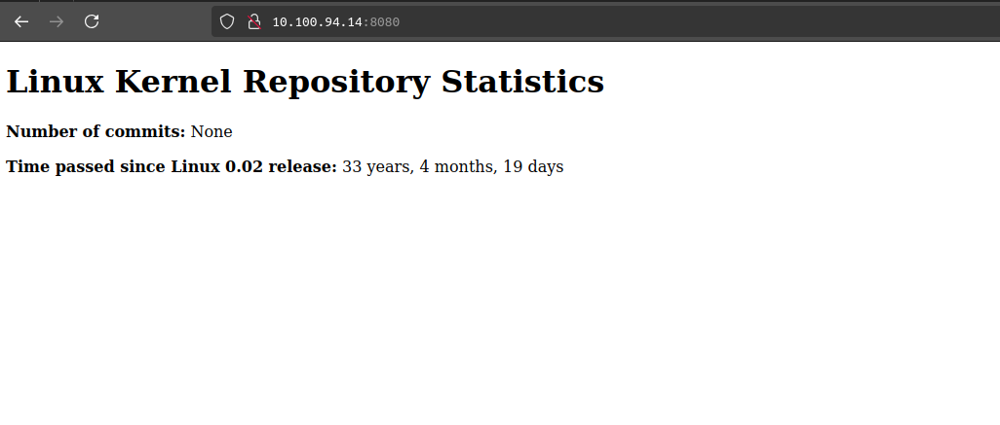
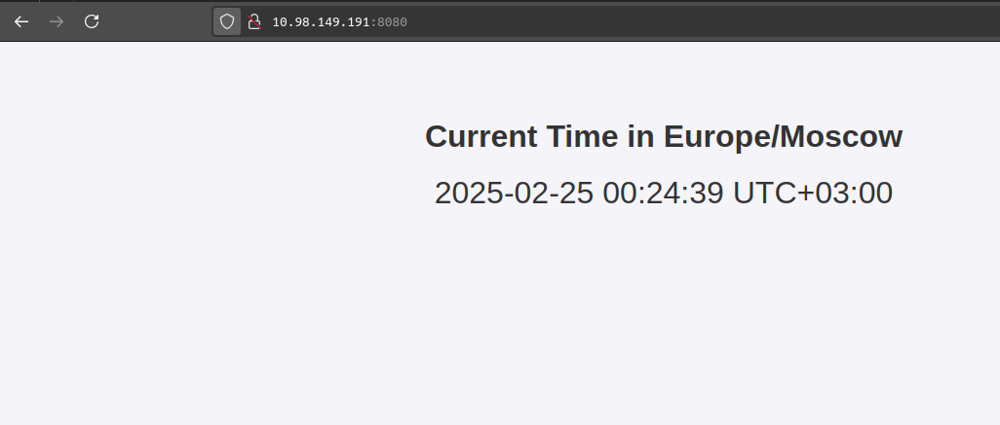
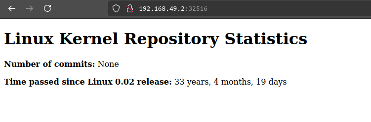

# Kubernetes

## Minikibe local deployment

```bash
$minikube start --driver=docker
😄  minikube v1.35.0 on Ubuntu 22.04
✨  Using the docker driver based on existing profile
👍  Starting "minikube" primary control-plane node in "minikube" cluster
🚜  Pulling base image v0.0.46 ...
🏃  Updating the running docker "minikube" container ...
🐳  Preparing Kubernetes v1.32.0 on Docker 27.4.1 ...
🔎  Verifying Kubernetes components...
    ▪ Using image docker.io/kubernetesui/dashboard:v2.7.0
    ▪ Using image docker.io/kubernetesui/metrics-scraper:v1.0.8
    ▪ Using image gcr.io/k8s-minikube/storage-provisioner:v5
💡  Some dashboard features require the metrics-server addon. To enable all features please run:

    minikube addons enable metrics-server

🌟  Enabled addons: storage-provisioner, dashboard, default-storageclass
🏄  Done! kubectl is now configured to use "minikube" cluster and "default" namespace by default

$minikube tunnel
[sudo] password for max:
Status:
    machine: minikube
    pid: 531873
    route: 10.96.0.0/12 -> 192.168.49.2
    minikube: Running
    services: [app-go]
    errors:
        minikube: no errors
        router: no errors
        loadbalancer emulator: no errors
```

Running deployment manually:

```bash
$ kubectl create deployment app-go --image=elonmaxx/app_go:latest
deployment.apps/app-go created
```

```bash
$ kubectl expose deployment app-go --type=LoadBalancer --port=8080 --target-port=8080
service/app-go exposed
```

```bash
$ kubectl get pods,svc
NAME                             READY   STATUS    RESTARTS      AGE
pod/app-go-55566d4c7d-lbqdd      1/1     Running   0             41m
pod/app-python-58d9dc464-lh65v   1/1     Running   1 (42m ago)   64m

NAME                 TYPE           CLUSTER-IP    EXTERNAL-IP   PORT(S)          AGE
service/app-go       LoadBalancer   10.105.26.9   10.105.26.9   8080:31730/TCP   40m
service/app-python   LoadBalancer   10.104.49.9   10.104.49.9   8080:32631/TCP   4m26s
service/kubernetes   ClusterIP      10.96.0.1     <none>        443/TCP          79m
```

Sites are available:



## Remove all the deployments and services

```bash
$ kubectl delete all --all
pod "app-go-55566d4c7d-lbqdd" deleted
pod "app-python-58d9dc464-lh65v" deleted
service "app-go" deleted
service "app-python" deleted
service "kubernetes" deleted
deployment.apps "app-go" deleted
deployment.apps "app-python" deleted

$ kubectl get pods,svc
NAME                 TYPE        CLUSTER-IP   EXTERNAL-IP   PORT(S)   AGE
service/kubernetes   ClusterIP   10.96.0.1    <none>        443/TCP   1s
```

## Deploy from configs

```bash
$ kubectl apply -f app_go
deployment.apps/app-go created
service/app-go created

$ kubectl apply -f app_python
deployment.apps/app-python created
service/app-python created

$ kubectl get pods,svc
NAME                              READY   STATUS              RESTARTS   AGE
pod/app-go-549b987b68-cbjz5       1/1     Running             0          9s
pod/app-go-549b987b68-g974s       1/1     Running             0          9s
pod/app-go-549b987b68-vzbnl       1/1     Running             0          9s
pod/app-python-68774cd7dd-ct494   0/1     ContainerCreating   0          5s
pod/app-python-68774cd7dd-gnqt8   1/1     Running             0          5s
pod/app-python-68774cd7dd-rhv59   0/1     ContainerCreating   0          5s

NAME                 TYPE           CLUSTER-IP      EXTERNAL-IP     PORT(S)          AGE
service/app-go       LoadBalancer   10.100.94.14    10.100.94.14    8080:32516/TCP   9s
service/app-python   LoadBalancer   10.98.149.191   10.98.149.191   8080:32081/TCP   5s
service/kubernetes   ClusterIP      10.96.0.1       <none>          443/TCP          15s
```

And again, sites available:



running `minikube service --all`:

```bash
|-----------|--------|-------------|---------------------------|
| NAMESPACE |  NAME  | TARGET PORT |            URL            |
|-----------|--------|-------------|---------------------------|
| default   | app-go |        8080 | http://192.168.49.2:32516 |
|-----------|--------|-------------|---------------------------|
|-----------|------------|-------------|---------------------------|
| NAMESPACE |    NAME    | TARGET PORT |            URL            |
|-----------|------------|-------------|---------------------------|
| default   | app-python |        8080 | http://192.168.49.2:32081 |
|-----------|------------|-------------|---------------------------|
|-----------|------------|-------------|--------------|
| NAMESPACE |    NAME    | TARGET PORT |     URL      |
|-----------|------------|-------------|--------------|
| default   | kubernetes |             | No node port |
|-----------|------------|-------------|--------------|
😿  service default/kubernetes has no node port
❗  Services [default/kubernetes] have type "ClusterIP" not meant to be exposed, however for local development minikube allows you to access this !
🎉  Opening service default/app-go in default browser...
🎉  Opening service default/app-python in default browser...
🏃  Starting tunnel for service kubernetes.
```

And the serice is available at that ip:


```bash
$  curl --resolve "python.elonmaxx.app:80:$(minikube ip)" -i python.elonmaxx.app
HTTP/1.1 200 OK
Date: Mon, 24 Feb 2025 21:58:50 GMT
Content-Type: text/html; charset=utf-8
Content-Length: 601
Connection: keep-alive

<!DOCTYPE html>
<html>
<head>
    <title>Time in Europe/Moscow</title>
    <style>
        body {
            font-family: Arial, sans-serif;
            text-align: center;
            padding: 50px;
            background-color: #f4f4f9;
            color: #333;
        }
        .time {
            font-size: 2em;
            margin-top: 20px;
        }
    </style>
</head>
<body>
    <h1>Current Time in Europe/Moscow</h1>
    <div class="time">2025-02-25 00:58:50 UTC+03:00</div>
</body>
</html>
```

## Ingress

```bash
$ kubectl apply -f ingress.yml
ingress.networking.k8s.io/example-ingress unchanged
```

## Sites availability

```bash
$ curl --resolve "go.elonmaxx.app:80:$(minikube ip)" -i go.elonmaxx.app
HTTP/1.1 200 OK
Date: Mon, 24 Feb 2025 22:00:58 GMT
Content-Type: text/html
Content-Length: 331
Connection: keep-alive

<!DOCTYPE html>
<html lang="en">
<head>
    <meta charset="UTF-8">
    <title>Linux Kernel Data</title>
</head>
<body>
    <h1>Linux Kernel Repository Statistics</h1>
    <p><strong>Number of commits:</strong> 1336426</p>
    <p><strong>Time passed since Linux 0.02 release:</strong> 33 years, 4 months, 19 days</p>
</body>
</html>
```
