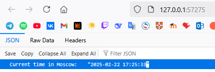
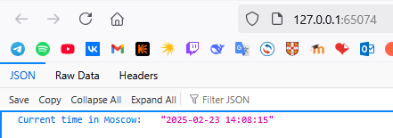
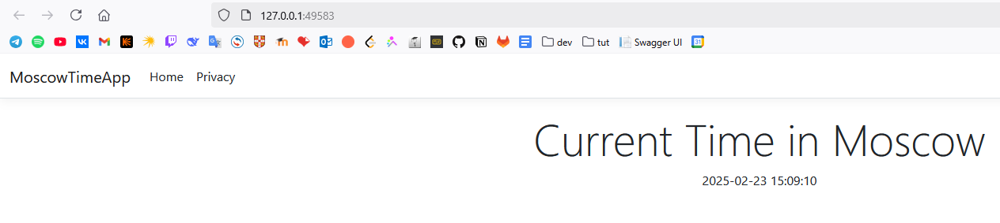

# Kubernetes

## Setup and Basic Deployment

Python app deployment

```bash
PS C:\Users\efimp> kubectl create deployment --image efimpuzhalov/moscow-time-py-app:distroless time-app --port 5000
deployment.apps/time-app created
PS C:\Users\efimp> kubectl expose deployment time-app --type=LoadBalancer --port=5000
service/time-app exposed
PS C:\Users\efimp> kubectl get svc
NAME         TYPE           CLUSTER-IP      EXTERNAL-IP   PORT(S)          AGE
kubernetes   ClusterIP      10.96.0.1       <none>        443/TCP          93s
time-app     LoadBalancer   10.96.125.206   <pending>     5000:32130/TCP   12s
PS C:\Users\efimp> minikube service time-app
|-----------|----------|-------------|---------------------------|
| NAMESPACE |   NAME   | TARGET PORT |            URL            |
|-----------|----------|-------------|---------------------------|
| default   | time-app |        5000 | http://192.168.49.2:32130 |
|-----------|----------|-------------|---------------------------|
🏃  Starting tunnel for service time-app.
|-----------|----------|-------------|------------------------|
| NAMESPACE |   NAME   | TARGET PORT |          URL           |
|-----------|----------|-------------|------------------------|
| default   | time-app |             | http://127.0.0.1:57275 |
|-----------|----------|-------------|------------------------|
🎉  Opening service default/time-app in default browser...
❗  Because you are using a Docker driver on windows, the terminal needs to be open to run it.
```

Result:



`kubectl get pods,svc`

```bash
PS C:\Users\efimp> kubectl get pods,svc
NAME                            READY   STATUS    RESTARTS   AGE
pod/time-app-5c9bbff4fc-5vnbp   1/1     Running   0          7m2s

NAME                 TYPE           CLUSTER-IP      EXTERNAL-IP   PORT(S)          AGE
service/kubernetes   ClusterIP      10.96.0.1       <none>        443/TCP          7m41s
service/time-app     LoadBalancer   10.96.125.206   <pending>     5000:32130/TCP   6m20s
```

Remove the Deployment and Service resources

```bash
PS C:\Users\efimp> kubectl delete service time-app
service "time-app" deleted
PS C:\Users\efimp> kubectl delete deployments.apps time-app
deployment.apps "time-app" deleted
```

## Declarative Kubernetes Manifests

Applying manifests and resulting app with 3 pods

```bash
PS E:\Documents\Innop\C3\S2\devops\S25-core-course-labs> kubectl apply -f k8s\time-py-deployment.k8s.yml    
deployment.apps/moscow-time-py created
PS E:\Documents\Innop\C3\S2\devops\S25-core-course-labs> kubectl apply -f k8s\time-py-service.k8s.yml
service/moscow-time-py-service created
PS E:\Documents\Innop\C3\S2\devops\S25-core-course-labs> kubectl get pods,svc
NAME                                  READY   STATUS    RESTARTS   AGE
pod/moscow-time-py-6b9f98d895-cnq4c   1/1     Running   0          40s
pod/moscow-time-py-6b9f98d895-gmfc7   1/1     Running   0          40s
pod/moscow-time-py-6b9f98d895-vrcfk   1/1     Running   0          40s

NAME                             TYPE        CLUSTER-IP      EXTERNAL-IP   PORT(S)        AGE
service/kubernetes               ClusterIP   10.96.0.1       <none>        443/TCP        81s
service/moscow-time-py-service   NodePort    10.105.233.61   <none>        80:32442/TCP   21s
PS E:\Documents\Innop\C3\S2\devops\S25-core-course-labs> minikube service --all
|-----------|------------|-------------|--------------|
| NAMESPACE |    NAME    | TARGET PORT |     URL      |
|-----------|------------|-------------|--------------|
| default   | kubernetes |             | No node port |
|-----------|------------|-------------|--------------|
😿  service default/kubernetes has no node port
|-----------|------------------------|-------------|---------------------------|
| NAMESPACE |          NAME          | TARGET PORT |            URL            |
|-----------|------------------------|-------------|---------------------------|
| default   | moscow-time-py-service |          80 | http://192.168.49.2:32442 |
|-----------|------------------------|-------------|---------------------------|
❗  Services [default/kubernetes] have type "ClusterIP" not meant to be exposed, however for local development minikube allows you to access this !
🏃  Starting tunnel for service kubernetes.
🏃  Starting tunnel for service moscow-time-py-service.
|-----------|------------------------|-------------|------------------------|
| NAMESPACE |          NAME          | TARGET PORT |          URL           |
|-----------|------------------------|-------------|------------------------|
| default   | kubernetes             |             | http://127.0.0.1:65072 |
| default   | moscow-time-py-service |             | http://127.0.0.1:65074 |
|-----------|------------------------|-------------|------------------------|
🎉  Opening service default/kubernetes in default browser...
🎉  Opening service default/moscow-time-py-service in default browser...
❗  Because you are using a Docker driver on windows, the terminal needs to be open to run it.
```

App url verification `http://127.0.0.1:65074`



## Additional Configuration and Ingress (BONUS)

### Additional app config result

```bash
PS E:\Documents\Innop\C3\S2\devops\S25-core-course-labs> kubectl apply -f k8s\time-cs-deployment.k8s.yml 
deployment.apps/moscow-time-cs created
PS E:\Documents\Innop\C3\S2\devops\S25-core-course-labs> kubectl apply -f k8s\time-cs-service.k8s.yml    
service/moscow-time-cs-service created
PS E:\Documents\Innop\C3\S2\devops\S25-core-course-labs> minikube service --all
|-----------|------------|-------------|--------------|
| NAMESPACE |    NAME    | TARGET PORT |     URL      |
|-----------|------------|-------------|--------------|
| default   | kubernetes |             | No node port |
|-----------|------------|-------------|--------------|
😿  service default/kubernetes has no node port
|-----------|------------------------|-------------|---------------------------|
| NAMESPACE |          NAME          | TARGET PORT |            URL            |
|-----------|------------------------|-------------|---------------------------|
| default   | moscow-time-cs-service |        8080 | http://192.168.49.2:30173 |
|-----------|------------------------|-------------|---------------------------|
❗  Services [default/kubernetes] have type "ClusterIP" not meant to be exposed, however for local development minikube allows you to access this !
🏃  Starting tunnel for service kubernetes.
🏃  Starting tunnel for service moscow-time-cs-service.
|-----------|------------------------|-------------|------------------------|
| NAMESPACE |          NAME          | TARGET PORT |          URL           |
|-----------|------------------------|-------------|------------------------|
| default   | kubernetes             |             | http://127.0.0.1:49581 |
| default   | moscow-time-cs-service |             | http://127.0.0.1:49583 |
|-----------|------------------------|-------------|------------------------|
🎉  Opening service default/kubernetes in default browser...
🎉  Opening service default/moscow-time-cs-service in default browser...
❗  Because you are using a Docker driver on windows, the terminal needs to be open to run it.
```

App url verification `http://127.0.0.1:49583`



```bash
PS E:\Documents\Innop\C3\S2\devops\S25-core-course-labs> kubectl get pods,svc
NAME                                  READY   STATUS    RESTARTS   AGE
pod/moscow-time-cs-54f74844b8-4ht5m   1/1     Running   0          8m40s
pod/moscow-time-cs-54f74844b8-gwxmh   1/1     Running   0          8m40s
pod/moscow-time-cs-54f74844b8-ksvgr   1/1     Running   0          8m40s

NAME                             TYPE        CLUSTER-IP      EXTERNAL-IP   PORT(S)          AGE  
service/kubernetes               ClusterIP   10.96.0.1       <none>        443/TCP          9m39s
service/moscow-time-cs-service   NodePort    10.111.97.120   <none>        8080:30173/TCP   8m25s
```

### Ingress manifests

Result of ingress application (configured in `ingress.k8s.yml`)

```bash
PS E:\Documents\Innop\C3\S2\devops\S25-core-course-labs> kubectl apply -f k8s\ingress.k8s.yml
ingress.networking.k8s.io/default-ingress created
PS E:\Documents\Innop\C3\S2\devops\S25-core-course-labs> kubectl get ingress
NAME              CLASS   HOSTS                                       ADDRESS        PORTS   AGE
default-ingress   nginx   moscow-time-py.local,moscow-time-cs.local   192.168.49.2   80      13s
PS E:\Documents\Innop\C3\S2\devops\S25-core-course-labs> minikube tunnel
✅  Tunnel successfully started

📌  NOTE: Please do not close this terminal as this process must stay alive for the tunnel to be accessible ...

❗  Access to ports below 1024 may fail on Windows with OpenSSH clients older than v8.1. For more information, see: https://minikube.sigs.k8s.io/docs/handbook/accessing/#access-to-ports-1024-on-windows-requires-root-permission       Starting tunnel for service default-ingress.
🏃  Starting tunnel for service default-ingress.
```

#### Application routing check

Python app

```bash
PS E:\Documents\Innop\C3\S2\devops\S25-core-course-labs> curl.exe --resolve "moscow-time-py.local:80:127.0.0.1" -i http://moscow-time-py.local
HTTP/1.1 200 OK
Date: Sun, 23 Feb 2025 12:41:32 GMT
Content-Type: application/json
Content-Length: 48
Connection: keep-alive

{"Current time in Moscow":"2025-02-23 15:41:32"}
```

C# app

```bash
PS E:\Documents\Innop\C3\S2\devops\S25-core-course-labs> curl.exe --resolve "moscow-time-cs.local:80:127.0.0.1" -i http://moscow-time-cs.local
HTTP/1.1 200 OK
Date: Sun, 23 Feb 2025 12:42:18 GMT   
Content-Type: text/html; charset=utf-8
Transfer-Encoding: chunked
Connection: keep-alive

<!DOCTYPE html>
<html lang="en">
<head>
    <meta charset="utf-8" />
    <meta name="viewport" content="width=device-width, initial-scale=1.0" />
    <title>Moscow Time - MoscowTimeApp</title>
    <link rel="stylesheet" href="/lib/bootstrap/dist/css/bootstrap.min.css" />
    <link rel="stylesheet" href="/css/site.css?v=r22M7xOahcMheWCkoVof2Nt7pQmj7mMSFKTei-SfmQ0" />
    <link rel="stylesheet" href="/MoscowTimeApp.styles.css?v=ziuCZhR78bLdWRFnTu2qmYUYJ6YMrpic_ufWw2G6rUg" />
</head>
<body>
    <header b-rrsoao6ibg>
        <nav b-rrsoao6ibg class="navbar navbar-expand-sm navbar-toggleable-sm navbar-light bg-white border-bottom box-shadow mb-3">
            <div b-rrsoao6ibg class="container-fluid">
                <a class="navbar-brand" href="/">MoscowTimeApp</a>
                <button b-rrsoao6ibg class="navbar-toggler" type="button" data-bs-toggle="collapse" data-bs-target=".navbar-collapse" aria-controls="navbarSupportedContent"
                        aria-expanded="false" aria-label="Toggle navigation">
                    <span b-rrsoao6ibg class="navbar-toggler-icon"></span>
                </button>
                <div b-rrsoao6ibg class="navbar-collapse collapse d-sm-inline-flex justify-content-between">
                    <ul b-rrsoao6ibg class="navbar-nav flex-grow-1">
                        <li b-rrsoao6ibg class="nav-item">
                            <a class="nav-link text-dark" href="/">Home</a>
                        </li>
                        <li b-rrsoao6ibg class="nav-item">
                            <a class="nav-link text-dark" href="/Home/Privacy">Privacy</a>
                        </li>
                    </ul>
                </div>
            </div>
        </nav>
    </header>
    <div b-rrsoao6ibg class="container">
        <main b-rrsoao6ibg role="main" class="pb-3">

<div class="text-center">
    <h1 class="display-4">Current Time in Moscow</h1>
    <p>2025-02-23 15:42:18</p>
</div>
        </main>
    </div>

    <footer b-rrsoao6ibg class="border-top footer text-muted">
        <div b-rrsoao6ibg class="container">
            &copy; 2025 - MoscowTimeApp - <a href="/Home/Privacy">Privacy</a>
        </div>
    </footer>
    <script src="/lib/jquery/dist/jquery.min.js"></script>
    <script src="/lib/bootstrap/dist/js/bootstrap.bundle.min.js"></script>
    <script src="/js/site.js?v=y_Ngd8W21UpuCUhEqGbUKDEqFnNfTjAfb24GhJJGUyM"></script>

</body>
</html>
```
