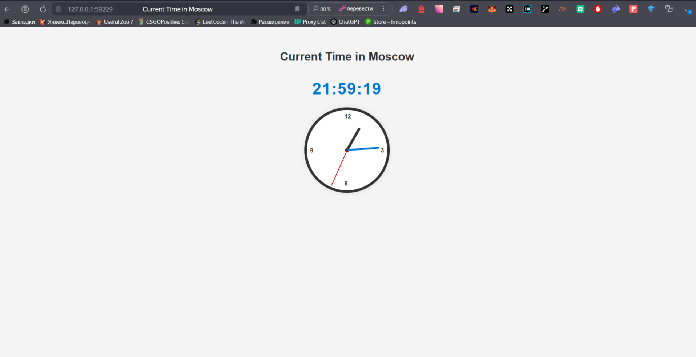

# Kubernetes

## Install Kubernetes Tools

### kubectl

```bash
choco install kubernetes-cli
```

### minikube

```bash
choco install minikube
```

### Running the minikube

```bash
minikube start
```

## Creating the deployment

```bash
kubectl create deployment app-python --image=friedox/app-python:latest
```

## Expose app

```bash
kubectl expose deployment app-python --type=NodePort --port=5000
```

### Outputs

The output of the command `kubectl get pods,svc`

```text
NAME                              READY   STATUS    RESTARTS   AGE
pod/app-python-5d7fc87ffb-5q4qj   1/1     Running   0          6s

NAME                 TYPE        CLUSTER-IP     EXTERNAL-IP   PORT(S)          AGE
service/app-python   NodePort    10.97.176.87   <none>        5000:31433/TCP   2s
service/kubernetes   ClusterIP   10.96.0.1      <none>        443/TCP          26m
```

### Cleanup

To clean the deployments and services I use these commands:

```bash
kubectl delete service app-python
kubectl delete deployment app-python
```

### Task 2

Two files were created: `deployment.yml` and `service.yml`. These files were used to create deployment and service
using `kubectl apply` command.

#### Task 2 Outputs

```bash
kubectl get pods,svc
```

```text
NAME                              READY   STATUS    RESTARTS   AGE
pod/app-python-687b47c976-57bl6   1/1     Running   0          7m29s
pod/app-python-687b47c976-cvd98   1/1     Running   0          7m29s
pod/app-python-687b47c976-rmbxn   1/1     Running   0          7m29s

NAME                 TYPE        CLUSTER-IP      EXTERNAL-IP   PORT(S)          AGE
service/app-python   NodePort    10.110.180.50   <none>        5000:31327/TCP   7m24s
service/kubernetes   ClusterIP   10.96.0.1       <none>        443/TCP          34m
```

```bash
minikube service --all
```

```text
|-----------|------------|-------------|---------------------------|
| NAMESPACE |    NAME    | TARGET PORT |            URL            |
|-----------|------------|-------------|---------------------------|
| default   | app-python |        5000 | http://192.168.49.2:31327 |
|-----------|------------|-------------|---------------------------|
|-----------|------------|-------------|--------------|
| NAMESPACE |    NAME    | TARGET PORT |     URL      |
|-----------|------------|-------------|--------------|
| default   | kubernetes |             | No node port |
|-----------|------------|-------------|--------------|
😿  service default/kubernetes has no node port
❗  Services [default/kubernetes] have type "ClusterIP" not meant to be exposed, however for local development minikube allows you to access this !
🏃  Starting tunnel for service app-python.
🏃  Starting tunnel for service kubernetes.
|-----------|------------|-------------|------------------------|
| NAMESPACE |    NAME    | TARGET PORT |          URL           |
|-----------|------------|-------------|------------------------|
| default   | app-python |             | http://127.0.0.1:59229 |
| default   | kubernetes |             | http://127.0.0.1:59231 |
|-----------|------------|-------------|------------------------|
🎉  Opening service default/app-python in default browser...
🎉  Opening service default/kubernetes in default browser...
❗  Because you are using a Docker driver on windows, the terminal needs to be open to run it.
```

#### Screenshot

