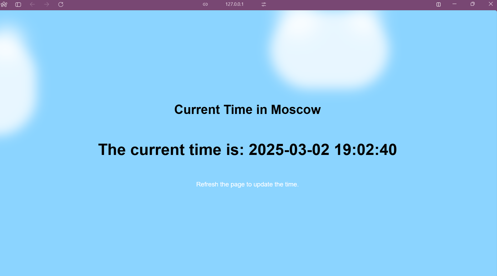

### Task 1

```commandline
demanzverev@MacBook-Pro-Deman S25-core-course-labs % kubectl get pods,svc 
NAME                             READY   STATUS    RESTARTS   AGE
pod/app-python-f58b856df-269s6   1/1     Running   0          3m50s
pod/app-python-f58b856df-9pdrk   1/1     Running   0          3m50s

NAME                         TYPE        CLUSTER-IP      EXTERNAL-IP   PORT(S)        AGE
service/app-python-service   NodePort    10.102.29.177   <none>        80:31962/TCP   115s
service/kubernetes           ClusterIP   10.96.0.1       <none>        443/TCP        9m18s
```

### Task 2

```commandline
demanzverev@MacBook-Pro-Deman S25-core-course-labs % kubectl get pods,svc
NAME                             READY   STATUS    RESTARTS   AGE
pod/app-python-f58b856df-kqhjr   1/1     Running   0          64s
pod/app-python-f58b856df-m2rxn   1/1     Running   0          64s
pod/app-python-f58b856df-z5528   1/1     Running   0          64s

NAME                         TYPE        CLUSTER-IP       EXTERNAL-IP   PORT(S)        AGE
service/app-python-service   NodePort    10.107.249.210   <none>        80:31561/TCP   35s
service/kubernetes           ClusterIP   10.96.0.1        <none>        443/TCP        15m
```

```commandline
demanzverev@MacBook-Pro-Deman S25-core-course-labs % minikube service --all
|-----------|--------------------|-------------|---------------------------|
| NAMESPACE |        NAME        | TARGET PORT |            URL            |
|-----------|--------------------|-------------|---------------------------|
| default   | app-python-service |          80 | http://192.168.49.2:31561 |
|-----------|--------------------|-------------|---------------------------|
|-----------|------------|-------------|--------------|
| NAMESPACE |    NAME    | TARGET PORT |     URL      |
|-----------|------------|-------------|--------------|
| default   | kubernetes |             | No node port |
|-----------|------------|-------------|--------------|
😿  service default/kubernetes has no node port
❗  Services [default/kubernetes] have type "ClusterIP" not meant to be exposed, however for local development minikube allows you to access this !
🏃  Starting tunnel for service app-python-service.
🏃  Starting tunnel for service kubernetes.
|-----------|--------------------|-------------|------------------------|
| NAMESPACE |        NAME        | TARGET PORT |          URL           |
|-----------|--------------------|-------------|------------------------|
| default   | app-python-service |             | http://127.0.0.1:60220 |
| default   | kubernetes         |             | http://127.0.0.1:60221 |
|-----------|--------------------|-------------|------------------------|
🎉  Opening service default/app-python-service in default browser...
🎉  Opening service default/kubernetes in default browser...
❗  Because you are using a Docker driver on darwin, the terminal needs to be open to run it.
```

