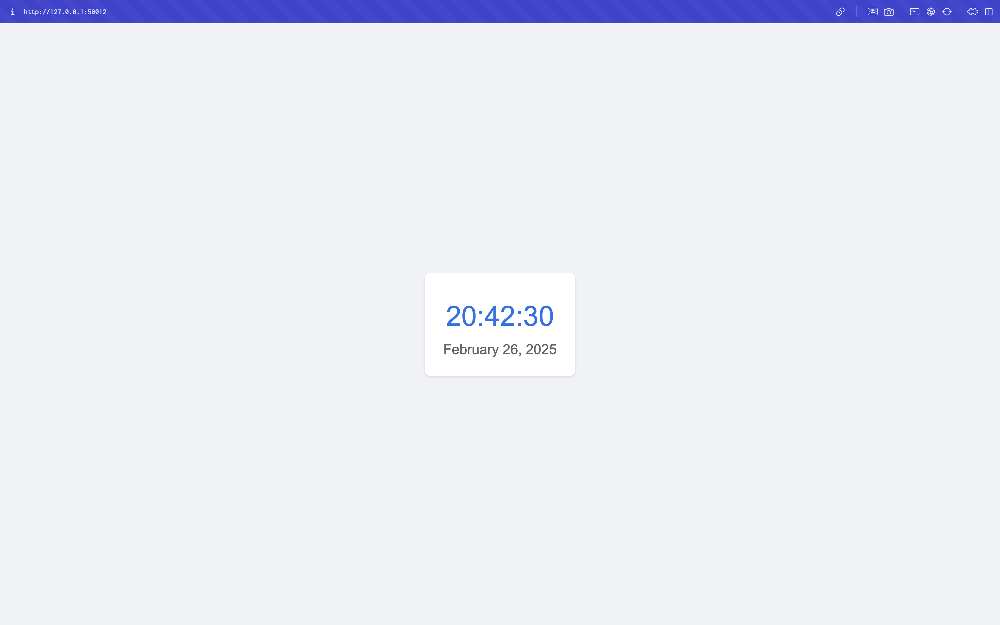
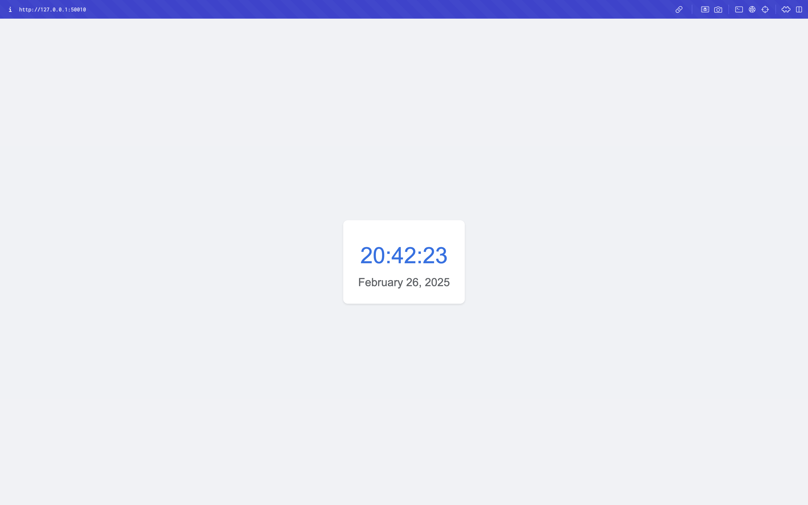
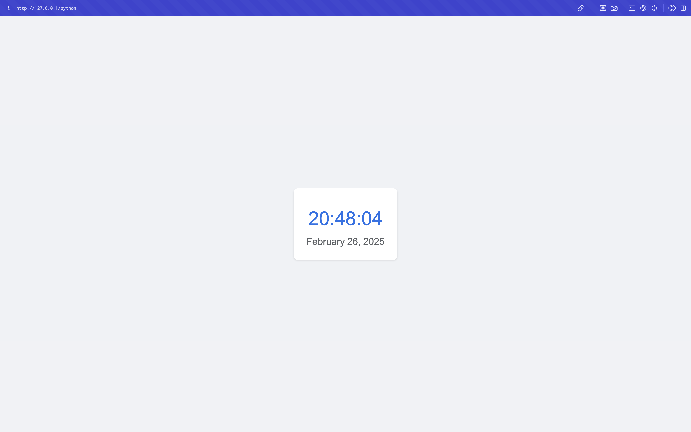

# Kubernetes Deployment Report

## Task 1: Basic Deployment

### Created Resources
- `k8s` folder containing all Kubernetes manifests
- Basic deployment and service for Python application

### Deployment Status
```bash
NAME                              READY   STATUS    RESTARTS   AGE
pod/nodejs-app-6989dc88c4-mncqn   1/1     Running   0          19m
pod/nodejs-app-6989dc88c4-xnzh8   1/1     Running   0          19m
pod/nodejs-app-6989dc88c4-zxslr   1/1     Running   0          19m
pod/python-app-64db5dc488-fhtn7   1/1     Running   0          19m
pod/python-app-64db5dc488-l478g   1/1     Running   0          19m
pod/python-app-64db5dc488-mrqg7   1/1     Running   0          19m

NAME                         TYPE        CLUSTER-IP      EXTERNAL-IP   PORT(S)        AGE
service/kubernetes           ClusterIP   10.96.0.1       <none>        443/TCP        20m
service/nodejs-app-service   NodePort    10.101.62.122   <none>        80:31267/TCP   19m
service/python-app-service   NodePort    10.109.161.94   <none>        80:31291/TCP   19m
```

## Task 2: Declarative Kubernetes Manifests

### Created Resources
- `<app>-deployment.yml`: Deployment manifest with 3 replicas
- `<app>-service.yml`: Service manifest exposing the application
- All manifests are stored in the `k8s` folder

### Deployment Status
The following output shows our running pods and services:

```bash
NAME                              READY   STATUS    RESTARTS   AGE
pod/nodejs-app-6989dc88c4-mncqn   1/1     Running   0          19m
pod/nodejs-app-6989dc88c4-xnzh8   1/1     Running   0          19m
pod/nodejs-app-6989dc88c4-zxslr   1/1     Running   0          19m
pod/python-app-64db5dc488-fhtn7   1/1     Running   0          19m
pod/python-app-64db5dc488-l478g   1/1     Running   0          19m
pod/python-app-64db5dc488-mrqg7   1/1     Running   0          19m

NAME                         TYPE        CLUSTER-IP      EXTERNAL-IP   PORT(S)        AGE
service/kubernetes           ClusterIP   10.96.0.1       <none>        443/TCP        20m
service/nodejs-app-service   NodePort    10.101.62.122   <none>        80:31267/TCP   19m
service/python-app-service   NodePort    10.109.161.94   <none>        80:31291/TCP   19m
```

### Service Access
Running `minikube service --all` shows our services are accessible:

```bash
|-----------|------------|-------------|--------------|
| NAMESPACE |    NAME    | TARGET PORT |     URL      |
|-----------|------------|-------------|--------------|
| default   | kubernetes |             | No node port |
|-----------|------------|-------------|--------------|
😿  service default/kubernetes has no node port
|-----------|--------------------|-------------|---------------------------|
| NAMESPACE |        NAME        | TARGET PORT |            URL            |
|-----------|--------------------|-------------|---------------------------|
| default   | nodejs-app-service |          80 | http://192.168.49.2:31267 |
|-----------|--------------------|-------------|---------------------------|
|-----------|--------------------|-------------|---------------------------|
| NAMESPACE |        NAME        | TARGET PORT |            URL            |
|-----------|--------------------|-------------|---------------------------|
| default   | python-app-service |          80 | http://192.168.49.2:31291 |
|-----------|--------------------|-------------|---------------------------|
🏃  Starting tunnel for service kubernetes.
🏃  Starting tunnel for service nodejs-app-service.
🏃  Starting tunnel for service python-app-service.
|-----------|--------------------|-------------|------------------------|
| NAMESPACE |        NAME        | TARGET PORT |          URL           |
|-----------|--------------------|-------------|------------------------|
| default   | kubernetes         |             | http://127.0.0.1:50008 |
| default   | nodejs-app-service |             | http://127.0.0.1:50010 |
| default   | python-app-service |             | http://127.0.0.1:50012 |
|-----------|--------------------|-------------|------------------------|
🎉  Opening service default/kubernetes in default browser...
🎉  Opening service default/nodejs-app-service in default browser...
🎉  Opening service default/python-app-service in default browser...
❗  Because you are using a Docker driver on darwin, the terminal needs to be open to run it.
```

### Application Screenshots
The following screenshots demonstrate that our applications are accessible via browser and match the service URLs:




## Bonus Task: Additional Configuration and Ingress

### Created Resources
- Additional deployment and service for Node.js application
- Ingress manifest for path-based routing:
  - `/python` -> Python application
  - `/nodejs` -> Node.js application

### Ingress Status
The ingress controller and routes are successfully deployed:

```bash
$ kubectl get ingress
NAME          CLASS   HOSTS   ADDRESS        PORTS   AGE
app-ingress   nginx   *       192.168.49.2   80      55m

$ kubectl get pods -n ingress-nginx
NAME                                        READY   STATUS      RESTARTS   AGE
ingress-nginx-admission-create-8bgxr        0/1     Completed   0          56m
ingress-nginx-admission-patch-kkfkf         0/1     Completed   1          56m
ingress-nginx-controller-7799c6795f-4khrr   1/1     Running     0          56m
```

### Application Availability
With minikube tunnel running, the applications are accessible through ingress at:
- Python app: http://127.0.0.1/python
- Node.js app: http://127.0.0.1/nodejs

You can verify the access using curl:
```bash
curl http://127.0.0.1/python
curl http://127.0.0.1/nodejs
```


