# Kubernetes

## Table of Contents

- [Kubernetes](#kubernetes)
  - [Table of Contents](#table-of-contents)
  - [K8s Setup and Basic Deployment](#k8s-setup-and-basic-deployment)
  - [Declarative Kubernetes Manifests](#declarative-kubernetes-manifests)
  - [Ingress Controller](#ingress-controller)

## K8s Setup and Basic Deployment

Manual deployment was created using the following steps:

```bash
> kubectl create deployment python-app --image=saleemasekrea/app_python:latest
```

This could be verified using `kubectl get deployments`

<details>
<summary>kubectl get deployments output</summary>

```cmd
saleem@saleem-MCLF-XX:~$ kubectl get deployments
NAME         READY   UP-TO-DATE   AVAILABLE   AGE
python-app   1/1     1            1           15m

```

</details>

Now, to access the deployment, a service was created:

```bash
> kubectl expose deployment python-app --type=LoadBalancer --port=8000
```

This could be verified using `kubectl get services` and `kubectl get pods`:

<details>
<summary>kubectl get services output</summary>

```cmd
saleem@saleem-MCLF-XX:~$ kubectl get services
NAME         TYPE           CLUSTER-IP     EXTERNAL-IP   PORT(S)          AGE
kubernetes   ClusterIP      10.96.0.1      <none>        443/TCP          2d
python-app   LoadBalancer   10.97.205.50   <pending>     8000:32685/TCP   10m
```

</details>

<details>
<summary>kubectl get pods output</summary>

```cmd
saleem@saleem-MCLF-XX:~$ kubectl get pods
NAME                          READY   STATUS    RESTARTS   AGE
python-app-77bdd85497-774sf   1/1     Running   0          21m

```

</details>

Running `minikube service python-app` would open the service in the default browser.

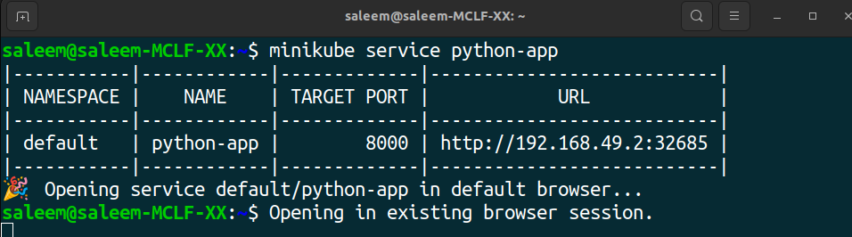

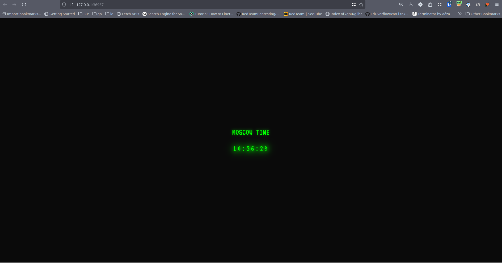

To remove the created pods and services, the following commands were used:

```bash
> kubectl delete service python-app

service "python-app" deleted

> kubectl delete deployment python-app

deployment.apps "python-app" deleted
```

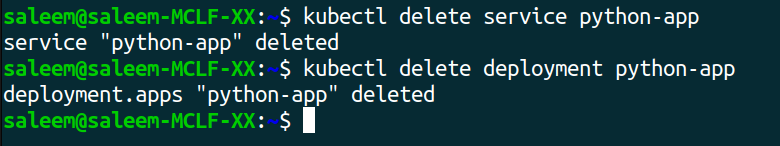

## Declarative Kubernetes Manifests

After creating the `yml` files for the deployment and service, I used `kubectl apply -f <filename>` to create the deployment and service.


Running `kubectl get pods,svc` would shows the created pods and services.

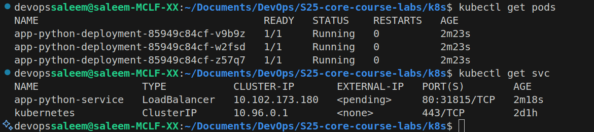

This could also be verified on the dashboard by running `minikube dashboard`.


Running `minikube service --all` opens the services in the default browser.


Browser window for the python app-
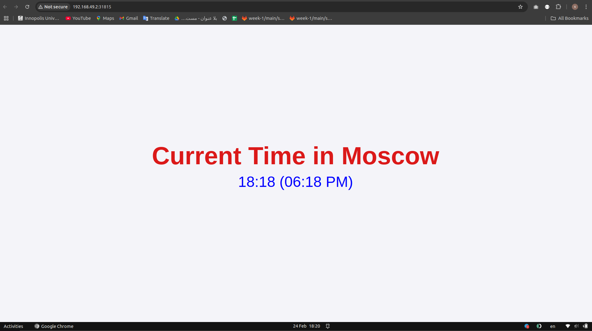

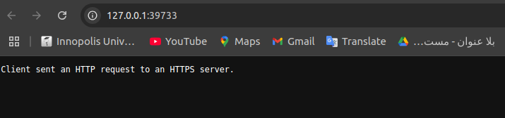

## Ingress Controller

The ingress controller was installed and verified using the following commands:

```bash
> minikube addons enable ingress
> kubectl get pods -n ingress-nginx
```

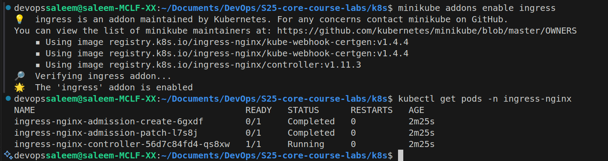

Then the `ingress.yml` file was created and applied.

```bash
> kubectl apply -f ingress.yml

ingress.networking.k8s.io/deployment-ingress created
```

Using `minkube ip`, the IP address can be found-

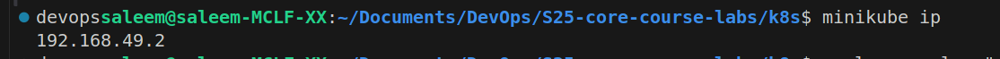

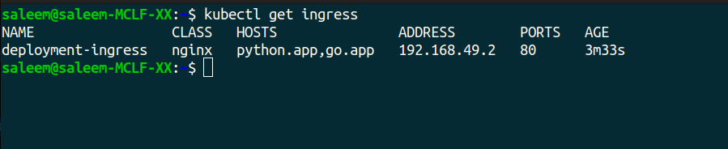

Using `curl --resolve "python.app:80:$( minikube ip )" -i http://python.app`, the app can be accessed.

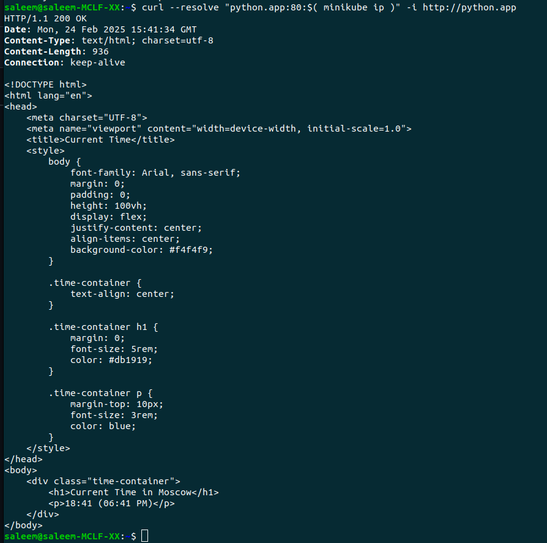

For the go app 


To clean up, the following commands were used:

```bash
> kubectl delete -f ingress.yml

ingress.networking.k8s.io "deployment-ingress" deleted

> kubectl delete -f app_python/deployment.yml

deployment.apps "app-python-deployment" deleted

> kubectl delete -f app_python/service.yml

service "app-python-service" deleted

> kubectl delete -f app_go/deployment.yml

deployment.apps "app-go-deployment" deleted

> kubectl delete -f app_go/service.yml

service "app-go-service" deleted

```

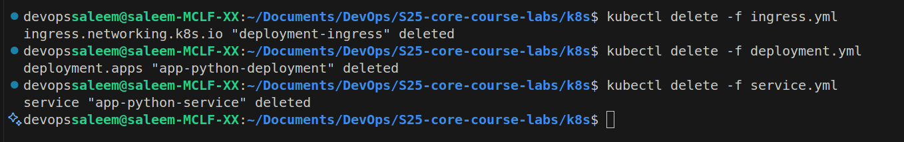
