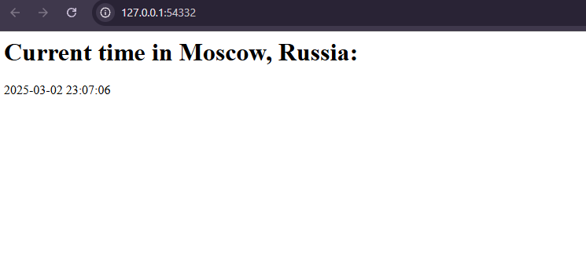

# Kubernetes Lab

## Task 1

### 1. Start minikube and metrics-server

```bash
PS C:\Users\S25-core-course-labs> minikube start --driver=docker
* minikube v1.35.0 on Microsoft Windows 11 Pro 10.0.26100.3194 Build 26100.3194
* Using the docker driver based on user configuration
* Using Docker Desktop driver with root privileges
* Starting "minikube" primary control-plane node in "minikube" cluster
* Pulling base image v0.0.46 ...
    > gcr.io/k8s-minikube/kicbase...:  500.31 MiB / 500.31 MiB  100.00% 25.00 M
* Creating docker container (CPUs=2, Memory=8100MB) ...
! Failing to connect to https://registry.k8s.io/ from inside the minikube container
* To pull new external images, you may need to configure a proxy: https://minikube.sigs.k8s.io/docs/reference/networking/proxy/
* Preparing Kubernetes v1.32.0 on Docker 27.4.1 ...
  - Generating certificates and keys ...
  - Booting up control plane ...
  - Configuring RBAC rules ...
* Configuring bridge CNI (Container Networking Interface) ...
* Verifying Kubernetes components...
  - Using image gcr.io/k8s-minikube/storage-provisioner:v5
* Enabled addons: storage-provisioner, default-storageclass

! C:\Program Files\Docker\Docker\resources\bin\kubectl.exe is version 1.30.5, which may have incompatibilities with Kubernetes 1.32.0.
  - Want kubectl v1.32.0? Try 'minikube kubectl -- get pods -A'
* Done! kubectl is now configured to use "minikube" cluster and "default" namespace by default
PS C:\Users\User> minikube addons enable metrics-server
* metrics-server is an addon maintained by Kubernetes. For any concerns contact minikube on GitHub.
You can view the list of minikube maintainers at: https://github.com/kubernetes/minikube/blob/master/OWNERS
  - Using image registry.k8s.io/metrics-server/metrics-server:v0.7.2
* The 'metrics-server' addon is enabled
```

### 2. Deploy python app and check it

```bash
PS C:\Users\User> kubectl create deployment application-real-time --image=dew1769/application-real-time:latest --port=5000
deployment.apps/application-real-time created

PS C:\Users\User> kubectl get deployments
NAME                    READY   UP-TO-DATE   AVAILABLE   AGE
application-real-time   1/1     1            1           22s

PS C:\Users\User> kubectl get pods
NAME                                     READY   STATUS    RESTARTS   AGE
application-real-time-7768744bf7-nzrkb   1/1     Running   0          46s
```

### 3. Create service and check that is running

```bash
PS C:\Users\User> kubectl expose deployment application-real-time --type=LoadBalancer --port=5000
service/application-real-time exposed

PS C:\Users\User> kubectl get services
NAME                    TYPE           CLUSTER-IP       EXTERNAL-IP   PORT(S)          AGE
application-real-time   LoadBalancer   10.110.178.105   <pending>     5000:32575/TCP   8s
kubernetes              ClusterIP      10.96.0.1        <none>        443/TCP          21m

PS C:\Users\User> minikube service application-real-time
|-----------|-----------------------|-------------|-----------------------------|
| NAMESPACE |         NAME          | TARGET PORT |             URL             |
|-----------|-----------------------|-------------|-----------------------------|
| default   | application-real-time |        5000 | http://172.28.182.219:32575 |
|-----------|-----------------------|-------------|-----------------------------|
* Opening service default/application-real-time in default browser...

PS C:\Users\User> kubectl get pods,svc
NAME                                         READY   STATUS    RESTARTS   AGE
pod/application-real-time-7768744bf7-nzrkb   1/1     Running   0          2m3s

NAME                            TYPE           CLUSTER-IP       EXTERNAL-IP   PORT(S)          AGE
service/application-real-time   LoadBalancer   10.110.178.105   <pending>     5000:32575/TCP   49s
service/kubernetes              ClusterIP      10.96.0.1        <none>        443/TCP          22m
```

### 4. Cleanup everything as the task was done

```bash
PS C:\Users\User> kubectl delete deployments application-real-time
deployment.apps "application-real-time" deleted
PS C:\Users\User> kubectl delete service application-real-time
service "application-real-time" deleted
```

## Task 2

### 1. Apply the manifests (`deployment.yml`, `service.yml`)

```bash
PS C:\Users\S25-core-course-labs> kubectl apply -f k8s/deployment.yml
deployment.apps/python-app created
PS C:\Users\S25-core-course-labs> kubectl apply -f k8s/service.yml
service/python-app created
```

### 2. Verify that it is running

```bash
PS C:\Users\S25-core-course-labs> kubectl get pods --all-namespaces
NAMESPACE     NAME                               READY   STATUS              RESTARTS   AGE
default       python-app-599f85d946-4nrhm        0/1     ContainerCreating   0          8s
default       python-app-599f85d946-khkrk        0/1     ContainerCreating   0          8s
default       python-app-599f85d946-kzk7b        0/1     ContainerCreating   0          8s
kube-system   coredns-668d6bf9bc-zqmkb           1/1     Running             0          3m27s
kube-system   etcd-minikube                      1/1     Running             0          3m32s
kube-system   kube-apiserver-minikube            1/1     Running             0          3m32s
kube-system   kube-controller-manager-minikube   1/1     Running             0          3m32s
kube-system   kube-proxy-crw2c                   1/1     Running             0          3m28s
kube-system   kube-scheduler-minikube            1/1     Running             0          3m33s
kube-system   metrics-server-7fbb699795-qwnjd    1/1     Running             0          2m50s
kube-system   storage-provisioner                1/1     Running             0          3m31s

PS C:\Users\S25-core-course-labs> kubectl get services
NAME         TYPE        CLUSTER-IP     EXTERNAL-IP   PORT(S)          AGE
kubernetes   ClusterIP   10.96.0.1      <none>        443/TCP          3m57s
python-app   NodePort    10.96.90.161   <none>        5000:32087/TCP   4s
```

### 3. Check the result

```bash
PS C:\Users\S25-core-course-labs> minikube service --all
|-----------|------------|-------------|--------------|
| NAMESPACE |    NAME    | TARGET PORT |     URL      |
|-----------|------------|-------------|--------------|
| default   | kubernetes |             | No node port |
|-----------|------------|-------------|--------------|
* service default/kubernetes has no node port
|-----------|------------|-------------|---------------------------|
| NAMESPACE |    NAME    | TARGET PORT |            URL            |
|-----------|------------|-------------|---------------------------|
| default   | python-app |        5000 | http://192.168.49.2:32087 |
|-----------|------------|-------------|---------------------------|
! Services [default/kubernetes] have type "ClusterIP" not meant to be exposed, however for local development minikube allows you to access this !
* Starting tunnel for service kubernetes.
* Starting tunnel for service python-app.
|-----------|------------|-------------|------------------------|
| NAMESPACE |    NAME    | TARGET PORT |          URL           |
|-----------|------------|-------------|------------------------|
| default   | kubernetes |             | http://127.0.0.1:54331 |
| default   | python-app |             | http://127.0.0.1:54332 |
|-----------|------------|-------------|------------------------|
* Opening service default/kubernetes in default browser...
* Opening service default/python-app in default browser...
! Because you are using a Docker driver on windows, the terminal needs to be open to run it.
```

The screenshot of the application with proper IP-address:

