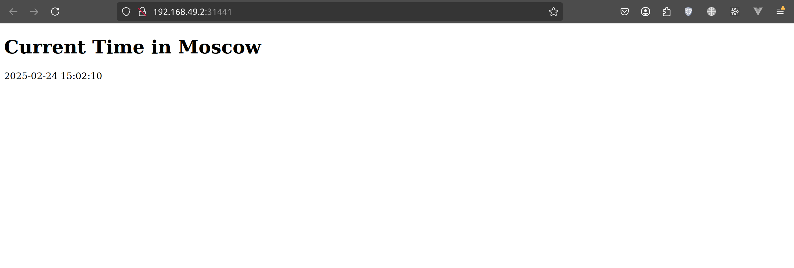

# Kubernetes

## Task 1

```bash
kubectl get pods,svc
```

**Output:**
```bash
NAME                              READY   STATUS    RESTARTS      AGE
pod/app-python-55c9bf8cc6-zzd9s   1/1     Running   1 (17m ago)   36m

NAME                 TYPE        CLUSTER-IP      EXTERNAL-IP   PORT(S)          AGE
service/app-python   NodePort    10.107.178.94   <none>        5000:30199/TCP   13m
service/kubernetes   ClusterIP   10.96.0.1       <none>        443/TCP          42m
```

## Task 2

```bash
kubectl get pods,svc
```

**Output:**
```bash
NAME                              READY   STATUS    RESTARTS   AGE
pod/app-python-64996799b6-bsnst   1/1     Running   0          2m14s
pod/app-python-64996799b6-sfxln   1/1     Running   0          2m14s
pod/app-python-64996799b6-x48r8   1/1     Running   0          2m14s

NAME                         TYPE        CLUSTER-IP      EXTERNAL-IP   PORT(S)        AGE
service/app-python-service   NodePort    10.99.240.214   <none>        80:31037/TCP   57s
service/kubernetes           ClusterIP   10.96.0.1       <none>        443/TCP        60m
```

**Minikube service URL**

```bash
minikube service --all
```

**Output:**
```bash
minikube service --all                                        [git:lab9] ✖  

|-----------|--------------------|-------------|---------------------------|
| NAMESPACE |        NAME        | TARGET PORT |            URL            |
|-----------|--------------------|-------------|---------------------------|
| default   | app-python-service |          80 | http://192.168.49.2:31441 |
|-----------|--------------------|-------------|---------------------------|
|-----------|------------|-------------|--------------|
| NAMESPACE |    NAME    | TARGET PORT |     URL      |
|-----------|------------|-------------|--------------|
| default   | kubernetes |             | No node port |
|-----------|------------|-------------|--------------|
😿  service default/kubernetes has no node port
❗  Services [default/kubernetes] have type "ClusterIP" not meant to be exposed, however for local development minikube allows you to access this !
🎉  Opening service default/app-python-service in default browser...
🏃  Starting tunnel for service kubernetes.
Gtk-Message: 15:03:08.068: Not loading module "atk-bridge": The functionality is provided by GTK natively. Please try to not load it.
|-----------|------------|-------------|------------------------|
| NAMESPACE |    NAME    | TARGET PORT |          URL           |
|-----------|------------|-------------|------------------------|
| default   | kubernetes |             | http://127.0.0.1:39181 |
|-----------|------------|-------------|------------------------|
🎉  Opening service default/kubernetes in default browser...
❗  Because you are using a Docker driver on linux, the terminal needs to be open to run it.
Gtk-Message: 15:03:09.105: Not loading module "atk-bridge": The functionality is provided by GTK natively. Please try to not load it.
```

## Deployment results


