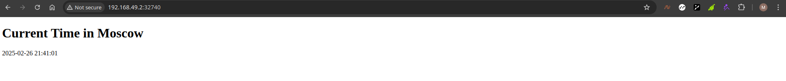

# Kubernetes Report

## Task 1
### 1. What is Kubernetes?

Kubernetes is an open-source platform designed to automate deploying, scaling, and operating application containers. It provides a framework to run distributed systems resiliently, taking care of scaling and failover for your application, and providing deployment patterns.

#### 1.1 **Kubernetes Components:**

- **Cluster:** A set of nodes that run containerized applications managed by Kubernetes.
- **Node:** A worker machine in Kubernetes, which can be a VM or physical machine.
- **Pod:** The smallest deployable unit in Kubernetes, which can contain one or more containers.
- **Service:** An abstraction that defines a logical set of Pods and a policy by which to access them.
- **Deployment:** A resource object in Kubernetes that provides declarative updates to applications.

### 2. Install Kubernetes Tools

**Install `kubectl` and `minikube`:**

- **kubectl:** The command-line tool for interacting with your Kubernetes cluster.
- **minikube:** A tool that lets you run Kubernetes locally.

You can follow the official Kubernetes documentation to install these tools:
- [Install kubectl](https://kubernetes.io/docs/tasks/tools/install-kubectl/)
- [Install minikube](https://minikube.sigs.k8s.io/docs/start/)

### 3. Deploy Your Application

**Deploy your application within the Minikube cluster:**

1. **Start Minikube:**
   ```bash
   minikube start
   ```

2. **Verify the setup:**

   ```bash
    (dev) deedjei@deedjei:~/Desktop/devops/S25-core-course-labs$ kubectl get nodes
    NAME       STATUS   ROLES           AGE     VERSION
    minikube   Ready    control-plane   5m19s   v1.32.0
   ```

### 4.Deployment of Applications

1. **Deploying Python application:**

```bash
(dev) deedjei@deedjei:~/Desktop/devops/S25-core-course-labs$ sudo kubectl create deployment app-python --image=deedjei/lab2
deployment.apps/app-python created
```
2. **Verify deploying:**

```bash
 sudo kubectl get deployments
    NAME         READY   UP-TO-DATE   AVAILABLE   AGE
    app-python   1/1     1            1           21s
 sudo kubectl get pods
    NAME                          READY   STATUS    RESTARTS   AGE
    app-python-7f5555f8cd-lxrsj   1/1     Running   0          56s

```

### 5.Create a Service

1. **Expose the Pod to the public internet using the `kubectl expose` command:**

```bash
kubectl expose deployment app-python --type=NodePort --port=5000 
 service/app-python exposed
```

2. **View the Service you created:**
```bash
kubectl get svc  
NAME         TYPE        CLUSTER-IP     EXTERNAL-IP   PORT(S)          AGE
app-python   NodePort    10.98.245.18   <none>        5000:32740/TCP   39m
kubernetes   ClusterIP   10.96.0.1      <none>        443/TCP          118m
```
3. **Retrieve the service URLs:**
```bash
minikube service app-python --url
http://192.168.49.2:32740
```

### 6. Cleanup

**Remove the Deployment and Service resources:**

```bash
kubectl delete -f deployment.yaml
kubectl delete -f service.yaml
deployment.apps "app-python" deleted
deployment.apps "app-python" deleted
```
## Task 2 

## Manifest Files

### Deployment Manifest

The `deployment.yml` file describes the deployment of the application with at least 3 replicas.

```yaml
apiVersion: apps/v1
kind: Deployment
metadata:
  name: app-python
spec:
  replicas: 3
  selector:
    matchLabels:
      app: app-python
  template:
    metadata:
      labels:
        app: app-python
    spec:
      containers:
        - name: app-python
          image: deedjei/lab2
          ports:
            - containerPort: 5000
```
### Service Manifest

```yaml
apiVersion: v1
kind: Service
metadata:
  name: app-python
spec:
  selector:
    app: app-python
  ports:
    - protocol: TCP
      port: 5000
      targetPort: 5000
  type: NodePort
```

### Usage

```bash
kubectl apply -f deployment.yml
kubectl apply -f service.yml
```

### `kubectl get pods,svc,` and `minikube service --all` outputs:

1. **`kubectl get pods`**

```bash
NAME                         READY   STATUS    RESTARTS   AGE
app-python-84665b6b7-2fmwl   1/1     Running   0          22s
```
2. **`ubectl get svc`**
```bash 
NAME         TYPE        CLUSTER-IP     EXTERNAL-IP   PORT(S)          AGE
app-python   NodePort    10.98.245.18   <none>        5000:32740/TCP   22s
kubernetes   ClusterIP   10.96.0.1      <none>        443/TCP          79m
```

3. **`minikube service --all`**
```bash
|-----------|------------|-------------|---------------------------|
| NAMESPACE |    NAME    | TARGET PORT |            URL            |
|-----------|------------|-------------|---------------------------|
| default   | app-python |        5000 | http://192.168.49.2:32740 |
|-----------|------------|-------------|---------------------------|
|-----------|------------|-------------|--------------|
| NAMESPACE |    NAME    | TARGET PORT |     URL      |
|-----------|------------|-------------|--------------|
| default   | kubernetes |             | No node port |
|-----------|------------|-------------|--------------|
😿  service default/kubernetes has no node port
❗  Services [default/kubernetes] have type "ClusterIP" not meant to be exposed, however for local development minikube allows you to access this !
🎉  Opening service default/app-python in default browser...
/usr/bin/xdg-open: 611: kfmclient: not found
/usr/bin/xdg-open: 491: test: Illegal number: 
/usr/bin/xdg-open: 492: test: Illegal number: 
/usr/bin/xdg-open: 493: test: Illegal number: 
🏃  Starting tunnel for service kubernetes.
|-----------|------------|-------------|------------------------|
| NAMESPACE |    NAME    | TARGET PORT |          URL           |
|-----------|------------|-------------|------------------------|
| default   | kubernetes |             | http://127.0.0.1:41741 |
|-----------|------------|-------------|------------------------|
🎉  Opening service default/kubernetes in default browser...
/usr/bin/xdg-open: 611: kfmclient: not found
/usr/bin/xdg-open: 491: test: Illegal number: 
/usr/bin/xdg-open: 492: test: Illegal number: 
/usr/bin/xdg-open: 493: test: Illegal number: 
❗  Because you are using a Docker driver on linux, the terminal needs to be open to run it.
```
4. **Images:**



