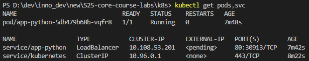

# Introduction to Kubernetes

## Task 1: Kubernetes Setup and Basic Deployment

I have created `Deployment` and `Service` resources for my application.

Output of `kubectl get pods,svc` command:

```bash
> kubectl get pods,svc

NAME                              READY   STATUS    RESTARTS   AGE
pod/app-python-5db479b68b-vqfr8   1/1     Running   0          7m48s

NAME                 TYPE           CLUSTER-IP      EXTERNAL-IP   PORT(S)        AGE
service/app-python   LoadBalancer   10.108.53.201   <pending>     80:30913/TCP   7m42s
service/kubernetes   ClusterIP      10.96.0.1       <none>        443/TCP        8m22s
```



## Task 2: Declarative Kubernetes Manifests

I employed configuration files for my application deployment. I have created `deployment.yml` manifest file with description of my deployment (with 3 replicas).

Unfortunately, due to the problems with my Kubernetes Windows and Hyper-V installation (refer to [this GitHub issue](https://github.com/kubernetes/minikube/issues/19460)), I have decided to use Ubuntu installation. Therefore, the screenshots may differ (mainly the terminals).

<!-- TODO: I need to add screenshots of working config from Ubuntu VM :( -->
