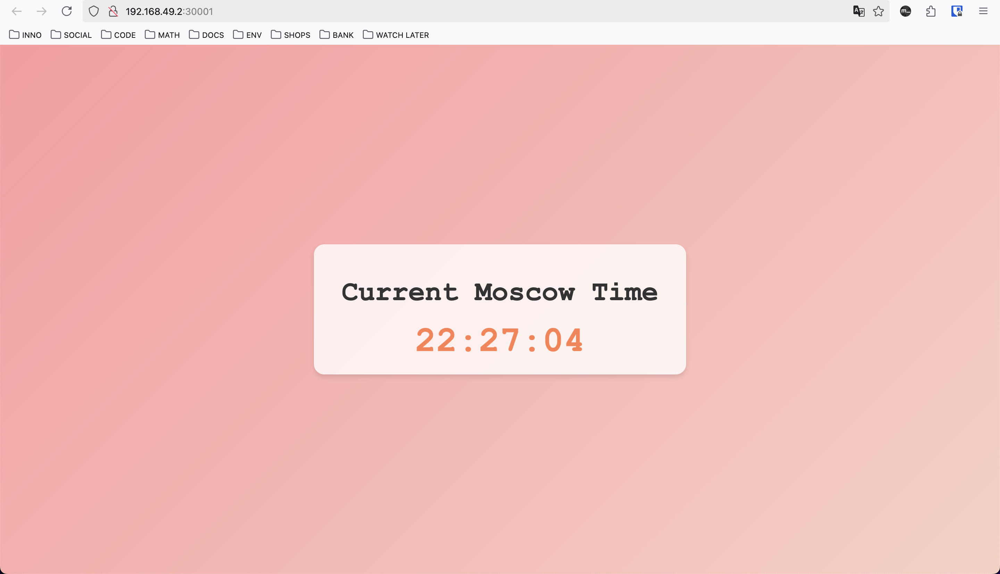

# Kubernetes

## `kubectl create deployment` and `kubectl expose deployment`

I've created deployment for default Python application, and exposed it using command line.

```bash
➜  S25-core-course-labs git:(lab-9) ✗ kubectl create deployment --image m0t9docker/pyapp:latest time-app --port 8000
deployment.apps/time-app created
➜  S25-core-course-labs git:(lab-9) ✗ kubectl expose deployment time-app --type=NodePort --port=8000
service/time-app exposed
➜  S25-core-course-labs git:(lab-9) ✗ kubectl get svc
NAME         TYPE        CLUSTER-IP        EXTERNAL-IP   PORT(S)          AGE
kubernetes   ClusterIP   192.168.194.129   <none>        443/TCP          33m
time-app     NodePort    192.168.194.195   <none>        8000:32097/TCP   4s
➜  S25-core-course-labs git:(lab-9) ✗ curl http://127.0.0.1:32097
<!DOCTYPE html>
<html lang="en">
<head>
    <meta charset="UTF-8">
    <meta name="viewport" content="width=device-width, initial-scale=1.0">
    <title>Moscow Time</title>
    <link rel="stylesheet" href="/static/style.css">
</head>
<body>
    <div class="container">
        <h1>Current Moscow Time</h1>
        <div class="time">00:13:33</div>
    </div>
</body>
</html>
➜  S25-core-course-labs git:(lab-9) ✗ kubectl get pods,svc
NAME                           READY   STATUS    RESTARTS   AGE
pod/time-app-6665ff47d-mww6f   1/1     Running   0          27s

NAME                 TYPE        CLUSTER-IP        EXTERNAL-IP   PORT(S)          AGE
service/kubernetes   ClusterIP   192.168.194.129   <none>        443/TCP          33m
service/time-app     NodePort    192.168.194.195   <none>        8000:32097/TCP   22s
➜  S25-core-course-labs git:(lab-9) ✗ kubectl delete service time-app
service "time-app" deleted
➜  S25-core-course-labs git:(lab-9) ✗ kubectl delete deployments.apps time-app
deployment.apps "time-app" deleted
```

## `kubectl apply -f k8s`

After application of declarative manifests of deployment and service, 
one can obtain the following outputs.

```bash
➜  S25-core-course-labs git:(lab-9) ✗ kubectl get pods,svc
NAME                               READY   STATUS    RESTARTS   AGE
pod/moscow-time-787f69f99f-28zjv   1/1     Running   0          19m
pod/moscow-time-787f69f99f-5tv65   1/1     Running   0          19m
pod/moscow-time-787f69f99f-kvk9w   1/1     Running   0          19m

NAME                          TYPE        CLUSTER-IP     EXTERNAL-IP   PORT(S)          AGE
service/kubernetes            ClusterIP   10.96.0.1      <none>        443/TCP          26m
service/moscow-time-service   NodePort    10.106.16.48   <none>        8000:30001/TCP   26m
➜  S25-core-course-labs git:(lab-9) ✗ minikube service --all
|-----------|------------|-------------|--------------|
| NAMESPACE |    NAME    | TARGET PORT |     URL      |
|-----------|------------|-------------|--------------|
| default   | kubernetes |             | No node port |
|-----------|------------|-------------|--------------|
😿  service default/kubernetes has no node port
|-----------|---------------------|--------------------------|---------------------------|
| NAMESPACE |        NAME         |       TARGET PORT        |            URL            |
|-----------|---------------------|--------------------------|---------------------------|
| default   | moscow-time-service | moscow-time-service/8000 | http://192.168.49.2:30001 |
|-----------|---------------------|--------------------------|---------------------------|
❗  Services [default/kubernetes] have type "ClusterIP" not meant to be exposed, however for local development minikube allows you to access this !
🏃  Starting tunnel for service kubernetes.
🏃  Starting tunnel for service moscow-time-service.
|-----------|---------------------|-------------|------------------------|
| NAMESPACE |        NAME         | TARGET PORT |          URL           |
|-----------|---------------------|-------------|------------------------|
| default   | kubernetes          |             | http://127.0.0.1:61306 |
| default   | moscow-time-service |             | http://127.0.0.1:61308 |
|-----------|---------------------|-------------|------------------------|
🎉  Opening service default/kubernetes in default browser...
🎉  Opening service default/moscow-time-service in default browser...
❗  Because you are using a Docker driver on darwin, the terminal needs to be open to run it.
```

And on service nodeport you can see fully functional service


## Bonus exercise

Using `numbers-app-deployment.k8s.yml` and `numbers-app-service.k8s.yml` one can set up
bonus application for numbers facts using `kubectl apply -f k8s`.

```bash
➜  S25-core-course-labs git:(lab-9) ✗ kubectl get po,svc
NAME                               READY   STATUS    RESTARTS   AGE
pod/moscow-time-787f69f99f-28zjv   1/1     Running   0          95m
pod/moscow-time-787f69f99f-5tv65   1/1     Running   0          95m
pod/moscow-time-787f69f99f-kvk9w   1/1     Running   0          95m
pod/numbers-app-5f6975c5db-j82m8   1/1     Running   0          59m
pod/numbers-app-5f6975c5db-lznrx   1/1     Running   0          59m
pod/numbers-app-5f6975c5db-s6tfh   1/1     Running   0          59m

NAME                          TYPE        CLUSTER-IP     EXTERNAL-IP   PORT(S)          AGE
service/kubernetes            ClusterIP   10.96.0.1      <none>        443/TCP          102m
service/moscow-time-service   NodePort    10.106.16.48   <none>        8000:30001/TCP   102m
service/numbers-app-service   NodePort    10.96.129.13   <none>        8082:30002/TCP   59m
```

## Ingress Controller

One can configure ingress controller using `ingress.k8s.yml` manifest, allowing routing requests
to different URIs to different services according to specified rules.

Initially, it is needed to enable ingress via `minikube addons enable ingress` and to create tunnel
using `minikube tunnel`
`

### Request to main application (moscow-time)

```bash
➜  S25-core-course-labs git:(lab-9) ✗ curl --resolve "moscow-time.local:80:127.0.0.1" -i http://moscow-time.local
HTTP/1.1 200 OK
Date: Fri, 21 Feb 2025 21:18:55 GMT
Content-Type: text/html; charset=utf-8
Content-Length: 374
Connection: keep-alive

<!DOCTYPE html>
<html lang="en">
<head>
    <meta charset="UTF-8">
    <meta name="viewport" content="width=device-width, initial-scale=1.0">
    <title>Moscow Time</title>
    <link rel="stylesheet" href="/static/style.css">
</head>
<body>
    <div class="container">
        <h1>Current Moscow Time</h1>
        <div class="time">00:18:55</div>
    </div>
</body>
</html>
```

### Request to bonus application (numbers-app)

```bash
➜  S25-core-course-labs git:(lab-9) ✗ curl --resolve "numbers-app.local:80:127.0.0.1" -i http://numbers-app.local
HTTP/1.1 200 OK
Date: Fri, 21 Feb 2025 21:11:51 GMT
Content-Type: text/html
Content-Length: 962
Connection: keep-alive

<!DOCTYPE html>
<html lang="en">
<head>
    <meta charset="UTF-8">
    <meta name="viewport" content="width=device-width, initial-scale=1.0">
    <title>Random Number Fact</title>
    <style>
        body {
            font-family: Arial, sans-serif;
            background-color: #f4f4f9;
            margin: 0;
            display: flex;
            justify-content: center;
            align-items: center;
            height: 100vh;
        }
        .container {
            text-align: center;
            background: white;
            padding: 20px;
            border-radius: 10px;
            box-shadow: 0 4px 6px rgba(0, 0, 0, 0.1);
        }
        h1 {
            color: #333;
        }
        p {
            color: #555;
        }
    </style>
</head>
<body>
    <div class="container">
        <h1>Random Number Fact</h1>
        <p>12 is the number of pence in a shilling in the former British currency system.</p>
    </div>
</body>
</html>
```
