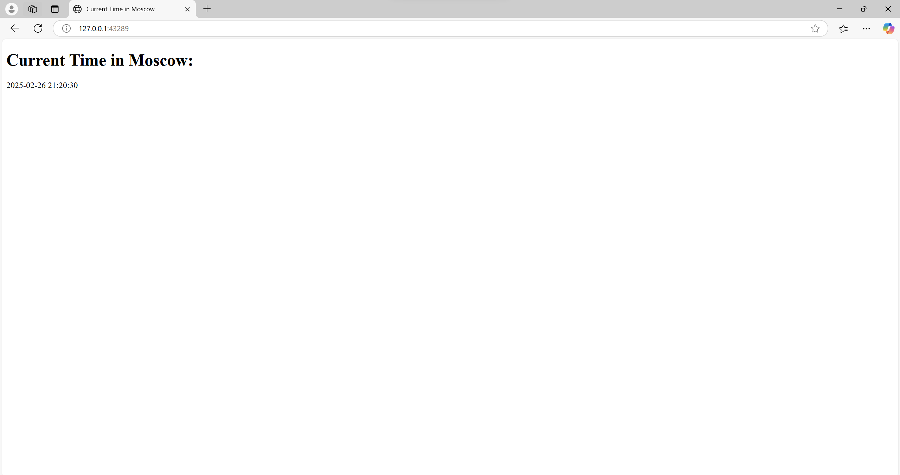

# Kubernetes Report

## Task 1: Basic Deployment

### Output of `kubectl get pods,svc`

```sh
NAME                          READY   STATUS    RESTARTS   AGE
pod/my-app-696f7667dd-d9gpp   1/1     Running   0          21m

NAME                 TYPE        CLUSTER-IP     EXTERNAL-IP   PORT(S)          AGE
service/kubernetes   ClusterIP   10.96.0.1      <none>        443/TCP          23m
service/my-app       NodePort    10.109.71.80   <none>        5000:30505/TCP   20m
```

## Task 2: Declarative Kubernetes Manifests

### Output of task 2 `kubectl get pods,svc`

```sh
NAME                          READY   STATUS    RESTARTS   AGE
pod/my-app-68546f8bcb-45t5h   1/1     Running   0          16s
pod/my-app-68546f8bcb-fb897   1/1     Running   0          16s
pod/my-app-68546f8bcb-fd22k   1/1     Running   0          16s

NAME                 TYPE        CLUSTER-IP       EXTERNAL-IP   PORT(S)          AGE
service/kubernetes   ClusterIP   10.96.0.1        <none>        443/TCP          28m
service/my-app       NodePort    10.105.152.124   <none>        5000:31497/TCP   10s
```

### Output of `minikube service --all`

```sh

|-----------|------------|-------------|--------------|
| NAMESPACE |    NAME    | TARGET PORT |     URL      |
|-----------|------------|-------------|--------------|
| default   | kubernetes |             | No node port |
|-----------|------------|-------------|--------------|
😿  service default/kubernetes has no node port
|-----------|--------|-------------|---------------------------|
| NAMESPACE |  NAME  | TARGET PORT |            URL            |
|-----------|--------|-------------|---------------------------|
| default   | my-app |        5000 | http://192.168.49.2:31497 |
|-----------|--------|-------------|---------------------------|
❗  Services [default/kubernetes] have type "ClusterIP" not meant to be exposed, however for local development minikube allows you to access this !
🏃  Starting tunnel for service kubernetes.
🏃  Starting tunnel for service my-app.
|-----------|------------|-------------|------------------------|
| NAMESPACE |    NAME    | TARGET PORT |          URL           |
|-----------|------------|-------------|------------------------|
| default   | kubernetes |             | http://127.0.0.1:41599 |
| default   | my-app     |             | http://127.0.0.1:43289 |
|-----------|------------|-------------|------------------------|
🎉  Opening service default/kubernetes in default browser...
👉  http://127.0.0.1:41599
🎉  Opening service default/my-app in default browser...
👉  http://127.0.0.1:43289
❗  Because you are using a Docker driver on linux, the terminal needs to be open to run it.
```

### Screenshot of application


