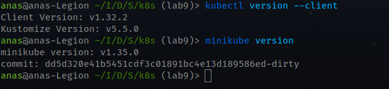
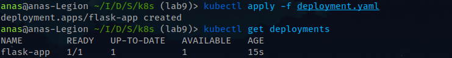
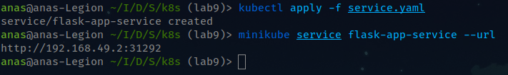
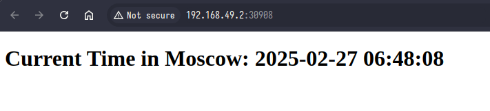
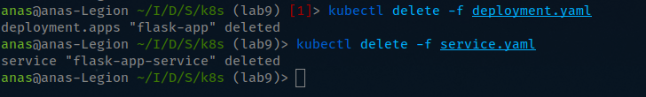
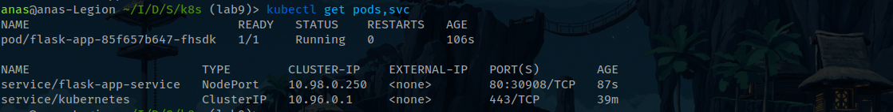
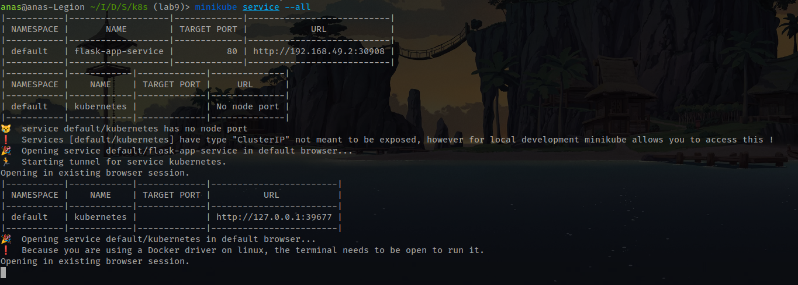

# Task 1: Kubernetes Setup and Basic Deployment

## Step 1: Install kubectl and Minikube
Following the [documentation](https://kubernetes.io/docs/tasks/tools/) I installed `kubectl` and `minikube` successfully. 


## Step 2: Deploy the Application
To create a Kubernetes Deployment for the application, I configured a [deployment.yaml](service.yaml) file.

### Apply the Deployment:
```bash
kubectl apply -f deployment.yaml
```
### Verify Deployment:
```bash
kubectl get deployments
```


## Step 3: Expose the Application with a Service
To expose the application using a Kubernetes Service, I configured a [service.yaml](service.yaml) file.

### Apply the Service:
```bash
kubectl apply -f service.yaml
```
### Verify Service:
To know the URL that we can open to access the application:
```bash
minikube service flask-app-service --url
```



## Step 5: Access the Application


## Step 6: Cleanup Kubernetes Resources

### Delete the Deployment:
```bash
kubectl delete -f deployment.yaml
```
### Delete the Service:
```bash
kubectl delete -f service.yaml
```



## Output: `kubectl get pods,svc`


## Output: `minikube service --all`
