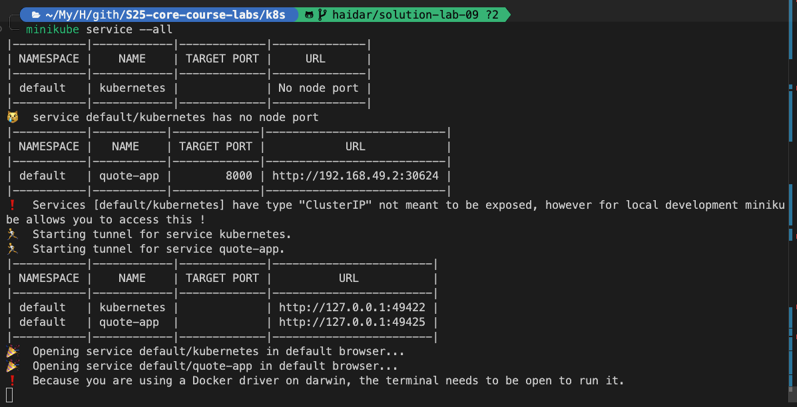
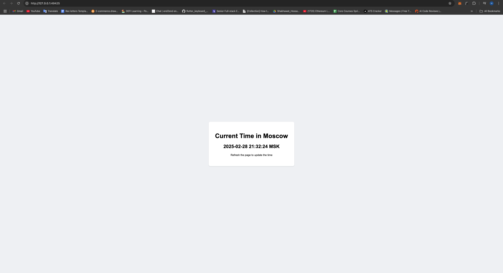

# Lab 9

## Task 1: Kubernetes Setup and Basic Deployment

### Output of `kubectl get pods,svc`

```bash
NAME                                READY             STATUS          RESTARTS         AGE
pod/quote-app-76c97898df-mb8sw      1/1               Running          0               5m44s

NAME                TYPE          CLUSTER-IP      EXTERNAL-IP   PORT(S)               AGE
service/kubernetes  ClusterIP     10.96.0.1      <none>        443/TCP              24m
service/quote-app   LoadBalancer  10.100.151.190 <pending>     8000:32024/TCP       2m53s
```

### Steps taken to complete the task

1. **Kubernetes Setup**:

   - Installed `kubectl` and `minikube` on my local machine to manage the Kubernetes cluster.

2. **Application Deployment**:

   - Created a `Deployment` resource for the Moscow Time Web Application using the command:

     ```bash
     kubectl create deployment quote-app --image=haidarjbeily/distroless-moscow-time-app
     ```

   - Verified the deployment by checking the status of the pods.

3. **Service Creation**:

   - Exposed the application to the outside world by creating a `Service` resource:

     ```bash
     kubectl expose deployment quote-app --type=LoadBalancer --port=8000
     minikube service quote-app
     ```

   - This allows external access to the application through the specified port.

4. **Verification**:

   - Used the command `kubectl get pods,svc` to confirm that the pod and service were running correctly, as shown in the output above.

5. **Cleanup**:

   - After testing, I removed the `Deployment` and `Service` resources to maintain a clean Kubernetes environment:

     ```bash
     kubectl delete deployment quote-app
     kubectl delete service quote-app
     ```

## Task 2: Declarative Kubernetes Manifests

### Output of `kubectl get pods,svc` after running the manifests with `kubectl apply`

```bash
NAME                                   READY   STATUS    RESTARTS   AGE
pod/quote-app-d8bd47796-t2vr4         1/1     Running   0          31s
pod/quote-app-d8bd47796-wf428          1/1     Running   0          31s
pod/quote-app-d8bd47796-wx4pd          1/1     Running   0          31s

NAME                TYPE          CLUSTER-IP      EXTERNAL-IP   PORT(S)               AGE
service/kubernetes  ClusterIP     10.96.0.1      <none>        443/TCP              40m
service/quote-app   LoadBalancer  10.109.191.197 <pending>     8000:30624/TCP       4s
```

### Screenshot of the output of `minikube service --all`



### Screenshot of the Browser



## Bonus Task

### Output of `curl` commands to verify application availability

1. **Accessing the Time Application**:

   ```bash
   curl --resolve "apps.local:80:127.0.0.1" -i http://apps.local/time
   ```

   **Response**:

   ```bash
    HTTP/1.1 200 OK
    Date: Fri, 28 Feb 2025 19:14:55 GMT
    Content-Type: text/html; charset=utf-8
    Content-Length: 892
    Connection: keep-alive

    <!DOCTYPE html>
    <html>
        <head>
            <title>Moscow Time</title>
            <style>
                body {
                    font-family: Arial, sans-serif;
                    display: flex;
                    justify-content: center;
                    align-items: center;
                    height: 100vh;
                    margin: 0;
                    background-color: #f0f2f5;
                }
                .time-container {
                    text-align: center;
                    padding: 2rem;
                    background-color: white;
                    border-radius: 8px;
                    box-shadow: 0 2px 4px rgba(0, 0, 0, 0.1);
                }
            </style>
        </head>
        <body>
            <div class="time-container">
                <h1>Current Time in Moscow</h1>
                <h2>2025-02-28 22:14:55 MSK</h2>
                <p><small>Refresh the page to update the time</small></p>
            </div>
        </body>
    </html>
   ```

2. **Accessing the Quotes Application**:

   ```bash
   curl --resolve "apps.local:80:127.0.0.1" -i http://apps.local/quotes
   ```

   **Response**:

   ```bash
   HTTP/1.1 200 OK
   Date: Fri, 28 Feb 2025 19:15:12 GMT
   Content-Type: text/html
   Content-Length: 1213
   Connection: keep-alive

    <!DOCTYPE html>
    <html>
        <head>
            <title>Random Quote</title>
            <style>
                body {
                    font-family: Arial, sans-serif;
                    display: flex;
                    justify-content: center;
                    align-items: center;
                    height: 100vh;
                    margin: 0;
                    background-color: #f5f5f5;
                }
                .quote-container {
                    text-align: center;
                    padding: 2rem;
                    background-color: white;
                    border-radius: 8px;
                    box-shadow: 0 2px 4px rgba(0, 0, 0, 0.1);
                    max-width: 600px;
                }
                .quote {
                    font-size: 24px;
                    color: #333;
                    margin-bottom: 1rem;
                }
                .author {
                    font-style: italic;
                    color: #666;
                }
            </style>
        </head>
        <body>
            <div class="quote-container">
                <div class="quote">"First, solve the problem. Then, write the code."</div>
                <div class="author">- John Johnson</div>
                <p><small>Refresh the page for a new quote</small></p>
            </div>
        </body>
    </html>
   ```

3. **Attempting to Access a Non-Existent Route**:

   ```bash
   curl --resolve "apps.local:80:127.0.0.1" -i http://apps.local/qoutes
   ```

   **Response**:

   ```bash
   HTTP/1.1 404 Not Found
   Date: Fri, 28 Feb 2025 19:15:03 GMT
   Content-Type: text/html
   Content-Length: 146
   Connection: keep-alive

    <html>
    <head><title>404 Not Found</title></head>
    <body>
    <center><h1>404 Not Found</h1></center>
    <hr><center>nginx</center>
    </body>
    </html>
   ```

These commands confirm that the applications are accessible and functioning as expected, with the time application returning a 200 OK status and the quotes application also returning a 200 OK status. The 404 error for the misspelled route indicates proper error handling.
