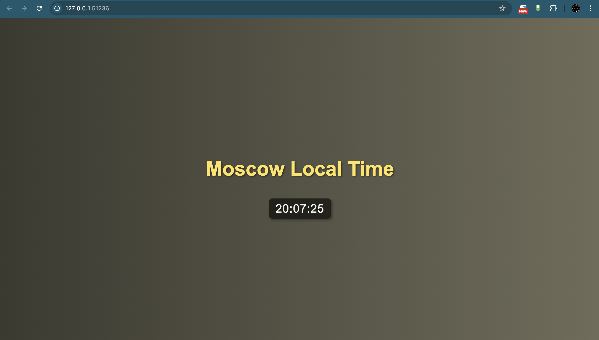

# Kubernetes

## Setup and Basic Deployment

### `kubectl create deployment app-python --image=2imt/app_python:latest`

```console
deployment.apps/app-python created
```

### `kubectl get deployments`

```console
NAME         READY   UP-TO-DATE   AVAILABLE   AGE
app-python   1/1     1            1           104s
```

### `kubectl expose deployment app-python --type=NodePort --port=8000`

```console
service/app-python exposed
```

### `minikube service app-python --url`

```console
http://192.168.49.2:31700
```

### `minikube service app-python`

```console
|-----------|------------|-------------|---------------------------|
| NAMESPACE |    NAME    | TARGET PORT |            URL            |
|-----------|------------|-------------|---------------------------|
| default   | app-python |        8000 | http://192.168.49.2:31700 |
|-----------|------------|-------------|---------------------------|
🎉  Opening service default/app-python in default browser...
```

### `kubectl get pods,svc`

```console
NAME                              READY   STATUS    RESTARTS   AGE
pod/app-python-6b44c54d75-f9g25   1/1     Running   0          6m12s

NAME                 TYPE        CLUSTER-IP      EXTERNAL-IP   PORT(S)          AGE
service/app-python   NodePort    10.110.129.44   <none>        8000:31700/TCP   3m10s
service/kubernetes   ClusterIP   10.96.0.1       <none>        443/TCP          7m43s
```

### `kubectl delete deployment app-python`

```console
deployment.apps "app-python" deleted
```

### `kubectl delete service app-python`

```console
service "app-python" deleted
```

## Declarative Manifests

### `kubectl apply -f .`

```console
deployment.apps/app-python created
service/app-python created
```

### `kubectl get pods,svc`

```console
NAME                             READY   STATUS    RESTARTS   AGE
pod/app-python-b68d7c67d-8t67z   1/1     Running   0          66s
pod/app-python-b68d7c67d-94q8k   1/1     Running   0          66s
pod/app-python-b68d7c67d-pgjkd   1/1     Running   0          66s

NAME                 TYPE        CLUSTER-IP      EXTERNAL-IP   PORT(S)        AGE
service/app-python   NodePort    10.97.192.203   <none>        80:31925/TCP   66s
service/kubernetes   ClusterIP   10.96.0.1       <none>        443/TCP        13m
```

### `minikube service --all`

```console
|-----------|------------|-------------|---------------------------|
| NAMESPACE |    NAME    | TARGET PORT |            URL            |
|-----------|------------|-------------|---------------------------|
| default   | app-python |          80 | http://192.168.49.2:31925 |
|-----------|------------|-------------|---------------------------|
|-----------|------------|-------------|--------------|
| NAMESPACE |    NAME    | TARGET PORT |     URL      |
|-----------|------------|-------------|--------------|
| default   | kubernetes |             | No node port |
|-----------|------------|-------------|--------------|
😿  service default/kubernetes has no node port
❗  Services [default/kubernetes] have type "ClusterIP" not meant to be exposed, however for local development minikube allows you to access this !
🎉  Opening service default/app-python in default browser...
🏃  Starting tunnel for service kubernetes.
|-----------|------------|-------------|------------------------|
| NAMESPACE |    NAME    | TARGET PORT |          URL           |
|-----------|------------|-------------|------------------------|
| default   | kubernetes |             | http://127.0.0.1:34071 |
|-----------|------------|-------------|------------------------|
🎉  Opening service default/kubernetes in default browser...
❗  Because you are using a Docker driver on linux, the terminal needs to be open to run it.
```

### Kubernetes



### app_python


