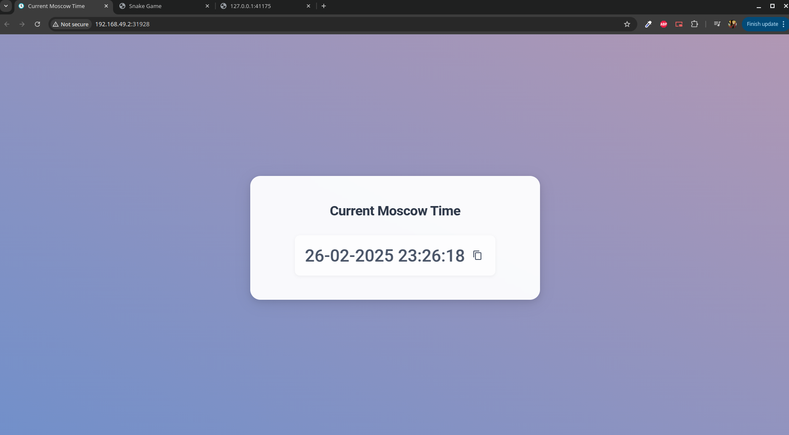
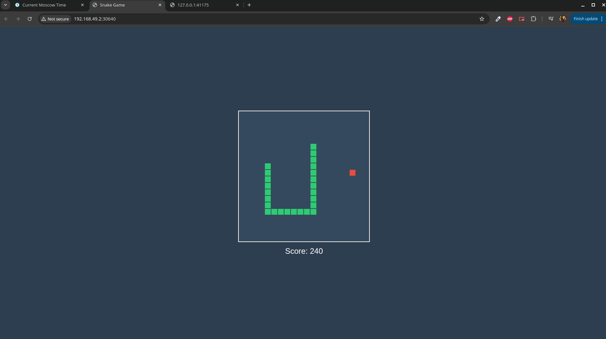

# Kubernetes

## Task 1

First, we start the `minikube` (and enable `metrics-server`):

```bash
❯ minikube start
😄  minikube v1.35.0 on Arch
✨  Using the docker driver based on existing profile
👍  Starting "minikube" primary control-plane node in "minikube" cluster
🚜  Pulling base image v0.0.46 ...
🏃  Updating the running docker "minikube" container ...
🐳  Preparing Kubernetes v1.32.0 on Docker 27.4.1 ...
🔎  Verifying Kubernetes components...
    ▪ Using image docker.io/kubernetesui/metrics-scraper:v1.0.8
    ▪ Using image gcr.io/k8s-minikube/storage-provisioner:v5
    ▪ Using image docker.io/kubernetesui/dashboard:v2.7.0
💡  Some dashboard features require the metrics-server addon. To enable all features please run:

        minikube addons enable metrics-server

🌟  Enabled addons: storage-provisioner, dashboard, default-storageclass
🏄  Done! kubectl is now configured to use "minikube" cluster and "default" namespace by default
❯ minikube addons enable metrics-server
💡  metrics-server is an addon maintained by Kubernetes. For any concerns contact minikube on GitHub.
You can view the list of minikube maintainers at: https://github.com/kubernetes/minikube/blob/master/OWNERS
    ▪ Using image registry.k8s.io/metrics-server/metrics-server:v0.7.2
🌟  The 'metrics-server' addon is enabled
```

Then, we deploy the python application with port 8000 (and check the deployment/logs):

```bash
❯ kubectl create deployment moscow-time-app --image=gendiro/moscow-time-app:latest --port=8000
deployment.apps/moscow-time-app created

❯ kubectl get deployments
NAME              READY   UP-TO-DATE   AVAILABLE   AGE
moscow-time-app   1/1     1            1           14s

❯ kubectl get pods
NAME                              READY   STATUS    RESTARTS   AGE
moscow-time-app-cb98bc4f8-c56s7   1/1     Running   0          52s

❯ kubectl logs moscow-time-app-cb98bc4f8-c56s7
INFO:     Started server process [1]
INFO:     Waiting for application startup.
INFO:     Application startup complete.
INFO:     Uvicorn running on http://0.0.0.0:8000 (Press CTRL+C to quit)
```

After that, we create a service and check that everything is ok:

```bash
❯ kubectl expose deployment moscow-time-app --type=LoadBalancer --port=8000
service/moscow-time-app exposed

❯ kubectl get services
NAME              TYPE           CLUSTER-IP     EXTERNAL-IP   PORT(S)          AGE
kubernetes        ClusterIP      10.96.0.1      <none>        443/TCP          3h14m
moscow-time-app   LoadBalancer   10.97.57.107   <pending>     8000:31220/TCP   6s

❯ minikube service moscow-time-app
|-----------|-----------------|-------------|---------------------------|
| NAMESPACE |      NAME       | TARGET PORT |            URL            |
|-----------|-----------------|-------------|---------------------------|
| default   | moscow-time-app |        8000 | http://192.168.49.2:31220 |
|-----------|-----------------|-------------|---------------------------|
🎉  Opening service default/moscow-time-app in default browser...

❯ kubectl get pods,svc
NAME                                  READY   STATUS    RESTARTS   AGE
pod/moscow-time-app-cb98bc4f8-c56s7   1/1     Running   0          3m2s

NAME                      TYPE           CLUSTER-IP     EXTERNAL-IP   PORT(S)          AGE
service/kubernetes        ClusterIP      10.96.0.1      <none>        443/TCP          3h15m
service/moscow-time-app   LoadBalancer   10.97.57.107   <pending>     8000:31220/TCP   57s
```

Now that we've done everything, we can do the cleanup:

```bash
❯ kubectl delete deployments moscow-time-app
deployment.apps "moscow-time-app" deleted
❯ kubectl delete service moscow-time-app
service "moscow-time-app" deleted
```

## Task 2 + Bonus Task

### Deployment

First, we run the `*_deployment.yml` and `*_service.yml` files. We can run all of them at the same type by specifying folder instead of a specific file:

```bash
❯ kubectl apply -f k8s
deployment.apps/app-javascript-deployment created
service/app-javascript-service created
deployment.apps/app-python-deployment created
service/app-python-service created
```

Then, we get all of the deployments/services up and running:

```bash
❯ kubectl get pods,svc
NAME                                             READY   STATUS    RESTARTS   AGE
pod/app-javascript-deployment-857f6f4d8c-kmbjf   1/1     Running   0          2m12s
pod/app-javascript-deployment-857f6f4d8c-kmrvh   1/1     Running   0          2m12s
pod/app-javascript-deployment-857f6f4d8c-s27g9   1/1     Running   0          2m12s
pod/app-python-deployment-6bf4c8974d-jtdqv       1/1     Running   0          2m12s
pod/app-python-deployment-6bf4c8974d-t8wwp       1/1     Running   0          2m12s
pod/app-python-deployment-6bf4c8974d-vswrk       1/1     Running   0          2m12s

NAME                             TYPE           CLUSTER-IP      EXTERNAL-IP   PORT(S)          AGE
service/app-javascript-service   LoadBalancer   10.97.137.160   <pending>     3000:30640/TCP   2m12s
service/app-python-service       LoadBalancer   10.97.12.18     <pending>     8000:31928/TCP   2m12s
service/kubernetes               ClusterIP      10.96.0.1       <none>        443/TCP          4h36m
```

And now we can see the result for ourselves using following:

```bash
❯ minikube service --all
|-----------|------------------------|-------------|---------------------------|
| NAMESPACE |          NAME          | TARGET PORT |            URL            |
|-----------|------------------------|-------------|---------------------------|
| default   | app-javascript-service |        3000 | http://192.168.49.2:30640 |
|-----------|------------------------|-------------|---------------------------|
|-----------|--------------------|-------------|---------------------------|
| NAMESPACE |        NAME        | TARGET PORT |            URL            |
|-----------|--------------------|-------------|---------------------------|
| default   | app-python-service |        8000 | http://192.168.49.2:31928 |
|-----------|--------------------|-------------|---------------------------|
|-----------|------------|-------------|--------------|
| NAMESPACE |    NAME    | TARGET PORT |     URL      |
|-----------|------------|-------------|--------------|
| default   | kubernetes |             | No node port |
|-----------|------------|-------------|--------------|
😿  service default/kubernetes has no node port
❗  Services [default/kubernetes] have type "ClusterIP" not meant to be exposed, however for local development minikube allows you to access this !
🎉  Opening service default/app-javascript-service in default browser...
🎉  Opening service default/app-python-service in default browser...
🏃  Starting tunnel for service kubernetes.
|-----------|------------|-------------|------------------------|
| NAMESPACE |    NAME    | TARGET PORT |          URL           |
|-----------|------------|-------------|------------------------|
| default   | kubernetes |             | http://127.0.0.1:41175 |
|-----------|------------|-------------|------------------------|
🎉  Opening service default/kubernetes in default browser...
❗  Because you are using a Docker driver on linux, the terminal needs to be open to run it.
```

Kubernetes opened the window in browser for us, so we can see that everying is working properly.

First python:



Then Javascript:



### Ingress

Now we can implement Ingress:

```bash
❯ minikube addons enable ingress
💡  ingress is an addon maintained by Kubernetes. For any concerns contact minikube on GitHub.
You can view the list of minikube maintainers at: https://github.com/kubernetes/minikube/blob/master/OWNERS
    ▪ Using image registry.k8s.io/ingress-nginx/kube-webhook-certgen:v1.4.4
    ▪ Using image registry.k8s.io/ingress-nginx/controller:v1.11.3
    ▪ Using image registry.k8s.io/ingress-nginx/kube-webhook-certgen:v1.4.4
🔎  Verifying ingress addon...
🌟  The 'ingress' addon is enabled
❯ kubectl get pods -n ingress-nginx
NAME                                        READY   STATUS      RESTARTS   AGE
ingress-nginx-admission-create-nk4cg        0/1     Completed   0          2m39s
ingress-nginx-admission-patch-xnpms         0/1     Completed   0          2m39s
ingress-nginx-controller-56d7c84fd4-4vsj6   1/1     Running     0          2m39s
```

And apply it (it won't rerun the already-deployed ones in the folder):

```bash
❯ kubectl apply -f k8s
ingress.networking.k8s.io/ingress created
deployment.apps/app-javascript-deployment unchanged
service/app-javascript-service unchanged
deployment.apps/app-python-deployment unchanged
service/app-python-service unchanged
```

### Availability Check

And now we can check the availability with curl, starting with python:

```bash
❯ curl --resolve "app-python:80:$( minikube ip )" -i http://app-python
HTTP/1.1 200 OK
Date: Wed, 26 Feb 2025 22:16:17 GMT
Content-Type: text/html; charset=utf-8
Content-Length: 1208
Connection: keep-alive

<!DOCTYPE html>
<html lang="en">

<head>
  <meta charset="UTF-8">
  <meta name="viewport" content="width=device-width, initial-scale=1.0">
  <title>Current Moscow Time</title>
  <link rel="icon" href="/static/images/clock.png" sizes="any">
  <link href="https://fonts.googleapis.com/css2?family=Roboto:wght@300;400;500;700&display=swap" rel="stylesheet">
  <link rel="stylesheet" href="/static/css/index.css">
</head>

<body>
  <div id="main-content">
    <h1>Current Moscow Time</h1>
    <div id="time-display">
      <span class="time-text">time=&#39;2025-02-27 01:16:17&#39; timestamp=1740608177.928654</span>
      <button id="copy-btn" aria-label="Copy to clipboard">
        <svg class="copy-icon" xmlns="http://www.w3.org/2000/svg" viewBox="0 0 24 24">
          <path
            d="M19 21H8V7h11m0-2H8a2 2 0 0 0-2 2v14a2 2 0 0 0 2 2h11a2 2 0 0 0 2-2V7a2 2 0 0 0-2-2m-3-4H4a2 2 0 0 0-2 2v14h2V3h12V1z" />
        </svg>
        <svg class="check-icon" xmlns="http://www.w3.org/2000/svg" viewBox="0 0 24 24">
          <path d="M21 7L9 19l-5.5-5.5 1.41-1.41L9 16.17 19.59 5.59 21 7z" />
        </svg>
      </button>
    </div>
  </div>
  <script src="/static/js/index.js"></script>
</body>


</html>
```

And then the javascript one:

```bash
❯ curl --resolve "app-javascript:80:$( minikube ip )" -i http://app-javascript
HTTP/1.1 200 OK
Date: Wed, 26 Feb 2025 22:17:37 GMT
Content-Type: text/html; charset=UTF-8
Content-Length: 307
Connection: keep-alive
X-Powered-By: Express
Accept-Ranges: bytes
Cache-Control: public, max-age=0
Last-Modified: Sun, 23 Feb 2025 20:58:07 GMT
ETag: W/"133-195349a5f18"

<!DOCTYPE html>
<html>

<head>
  <title>Snake Game</title>
  <link rel="stylesheet" href="style.css">
</head>

<body>
  <div class="game-container">
    <canvas id="gameCanvas" width="400" height="400"></canvas>
    <div id="score">Score: 0</div>
  </div>
  <script src="game.js"></script>
</body>

</html>
```
