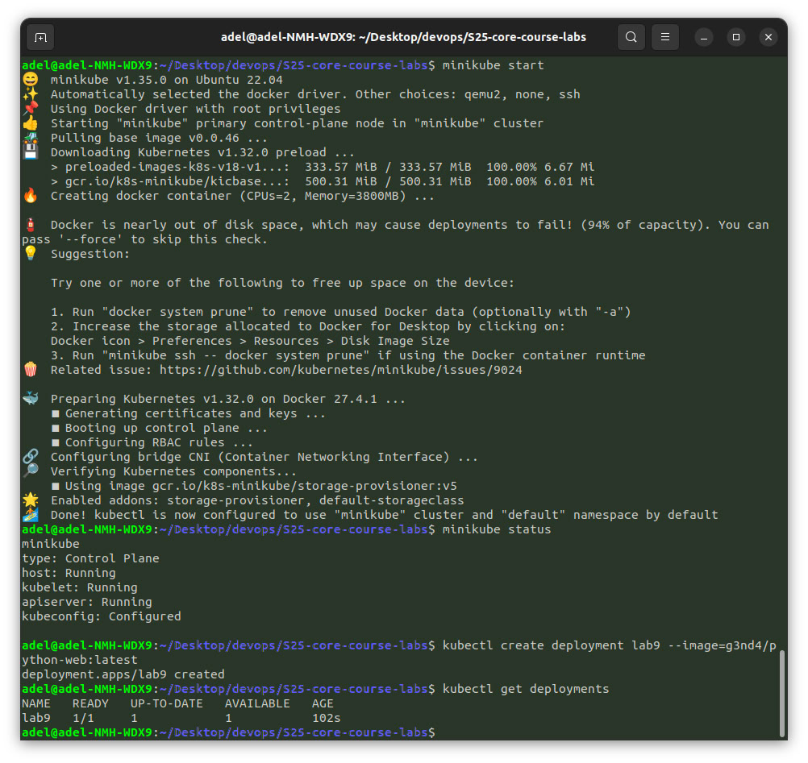
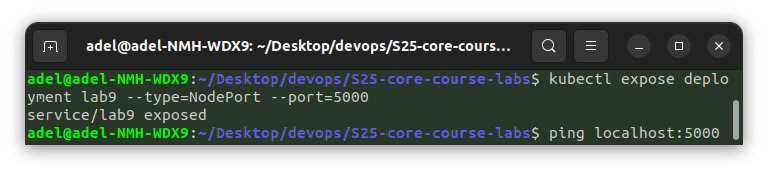
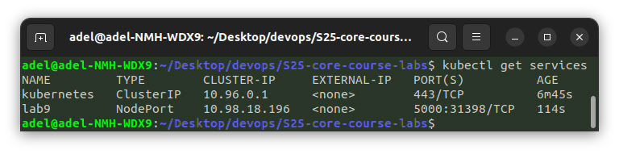
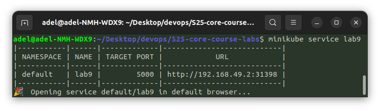
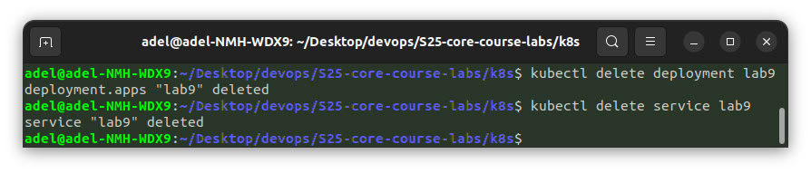
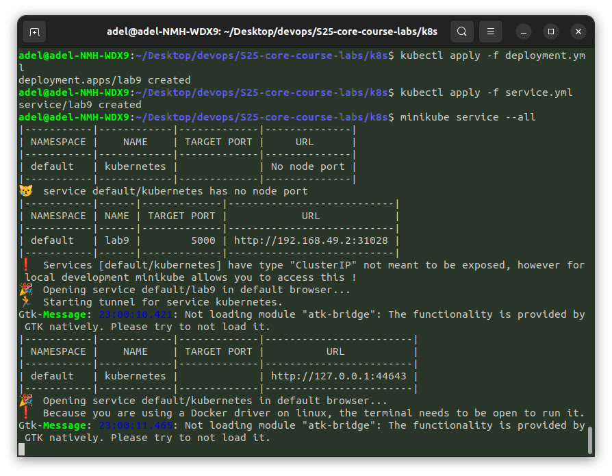
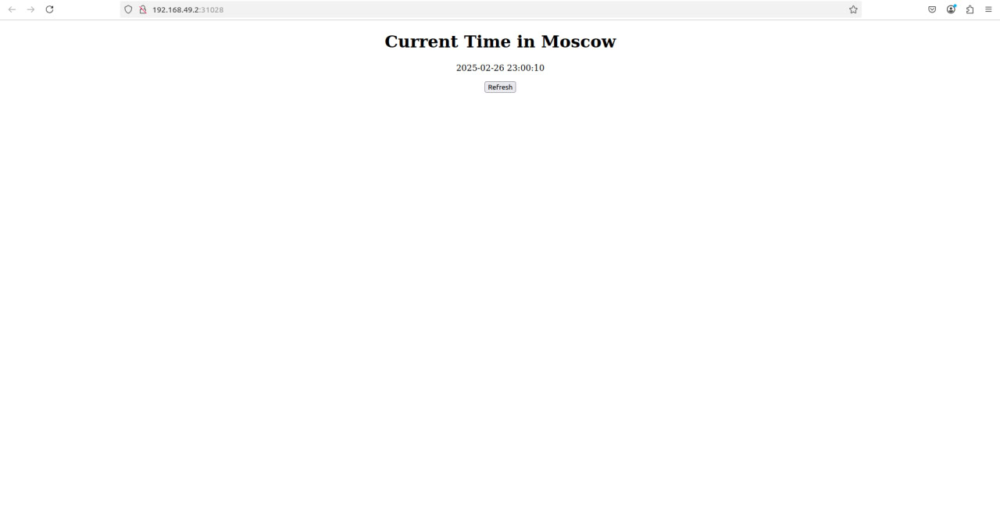
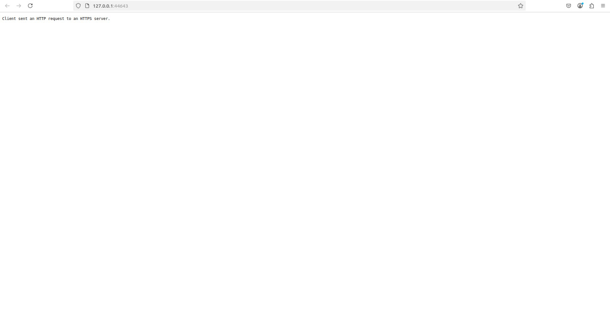

# Lab 9. K8S

## Task 1.

- Install kubectl and minikube, start minikube, create `lab9` deployment for my app with `g3nd4/python-web:latest` image, get deployments:




- Create service to access app from outside k8s cluster network:





- Output of kubectl get pods,svc:

```plaintext
NAME                      READY   STATUS    RESTARTS   AGE
pod/lab9-ccffc8f5-v2qrm   1/1     Running   0          13m

NAME                 TYPE        CLUSTER-IP     EXTERNAL-IP   PORT(S)          AGE
service/kubernetes   ClusterIP   10.96.0.1      <none>        443/TCP          14m
service/lab9         NodePort    10.98.18.196   <none>        5000:31398/TCP   9m25s
```

- Clear:


## Task 2.

- Create Deployment and Service via manifest files:





- Output of kubectl get pods,svc:
```plaintext
NAME                     READY   STATUS    RESTARTS   AGE
pod/lab9-58f5c76-5dfpc   1/1     Running   0          116s
pod/lab9-58f5c76-86ng8   1/1     Running   0          116s
pod/lab9-58f5c76-x8qch   1/1     Running   0          116s

NAME                 TYPE        CLUSTER-IP     EXTERNAL-IP   PORT(S)          AGE
service/kubernetes   ClusterIP   10.96.0.1      <none>        443/TCP          37m
service/lab9         NodePort    10.96.91.137   <none>        5000:31028/TCP   109s
```

